This document outlines the monitoring program and water level correction methodology applied across the study sites.

## Monitoring Locations

Loggers were deployed at multiple intertidal sites across **Giralia** (@fig-sample-locations) and **Urala** (@fig-sample-locations1). Monitoring spanned across a cross-shore gradient, capturing distinct hydrodynamic zones including lower channel/mouth locations, mid-creek reaches, upper tidal zones, and algal mat edges.(@fig-sample-locations-detail and @fig-sample-locations-detail1) shows the detailed spatial configuration of logger deployments across the lower, mid, and upper reaches of both estuaries.

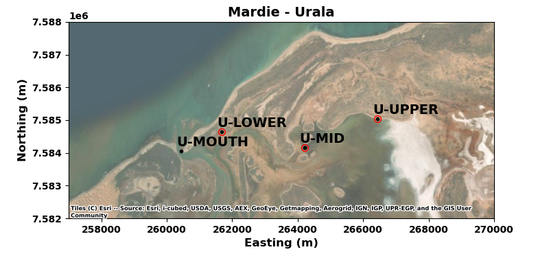{#fig-sample-locations}

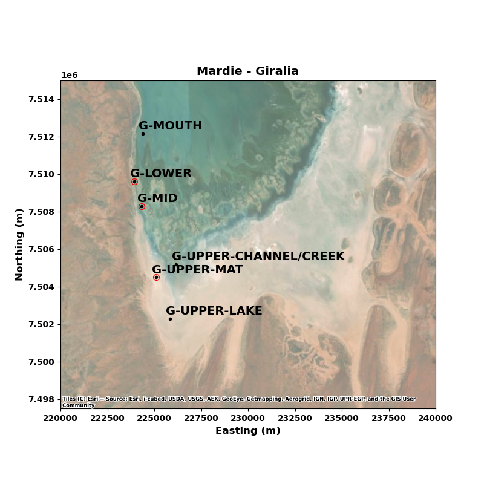{#fig-sample-locations1}

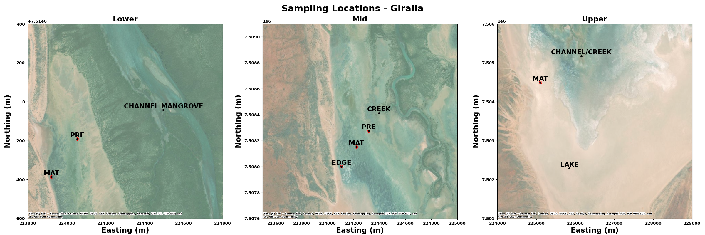{#fig-sample-locations-detail}

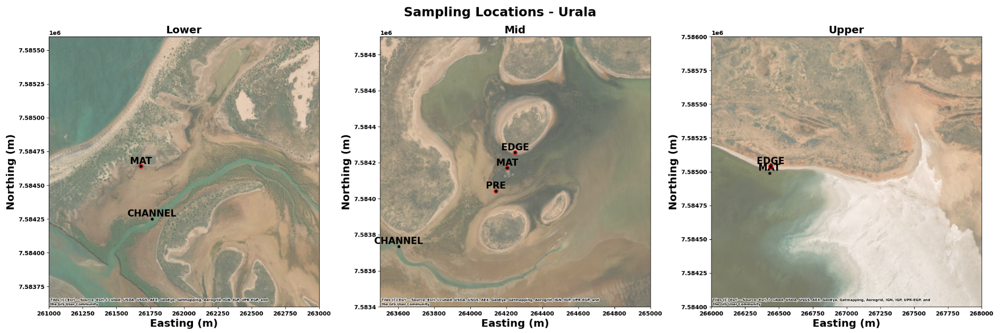{#fig-sample-locations-detail1}

## Sampling Program

Logger deployment commenced on **31 October 2023** and concluded on **9 February 2025**. A maintenance and data recovery check was conducted in **April 2024**, during which select loggers were retrieved, redeployed, or added to the array. 

The complete spatial configuration and record durations are summarized in @tbl-sample-locations and @tbl-datapoint-counts.

::: {#tbl-sample-locations}
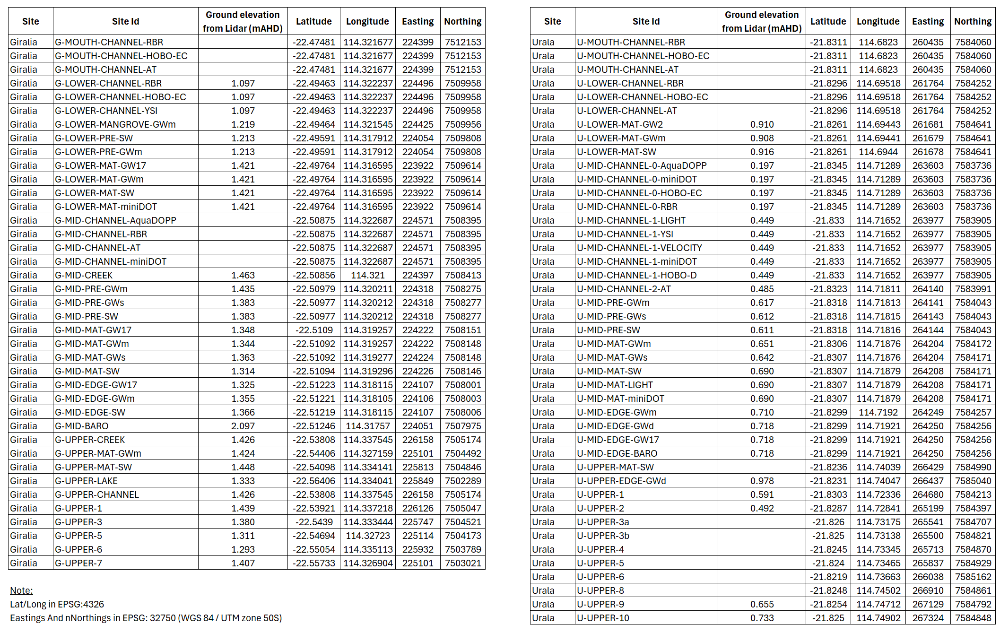

Sample locations and baseline elevations.
:::

::: {#tbl-datapoint-counts}
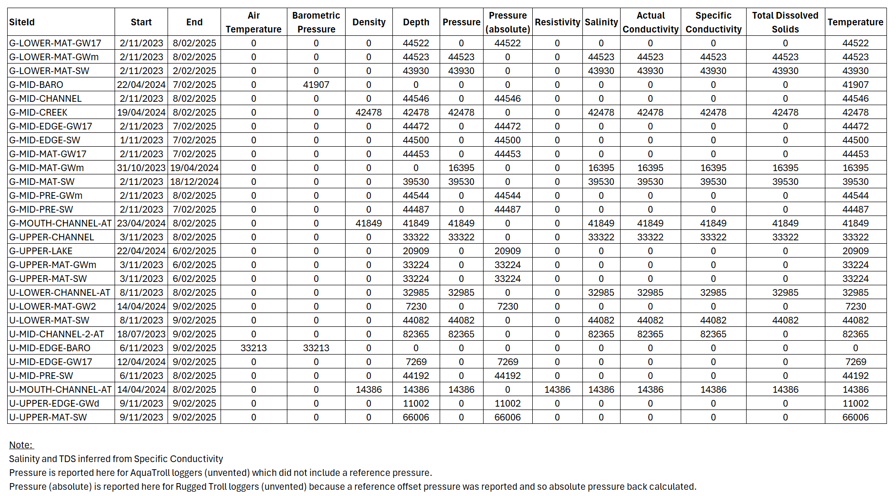

Number of recorded datapoints for each Site ID and monitored variable.
:::

---

## Water Level Correction Methodology

To convert raw pressure recorded by submerged loggers into accurate water surface elevations, a three-stage correction pipeline was applied:

1. **Barometric Correction**
2. **Density Correction**
3. **Datum Correction**

### Barometric Correction

Because non-vented pressure loggers were used, total recorded pressure required adjustment for atmospheric pressure fluctuations. Continuous barometric pressure was measured at both Giralia and Urala (@fig-barometric-pressure). 

To fill missing data during periods when the Giralia barometric logger was offline, an empirical linear regression model was established using Urala barometric observations (@fig-baro-correlation). All barometric pressure series were interpolated to a 15-minute interval prior to subtraction.

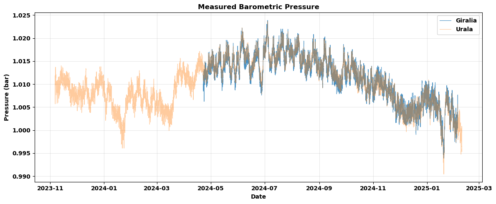{#fig-barometric-pressure}

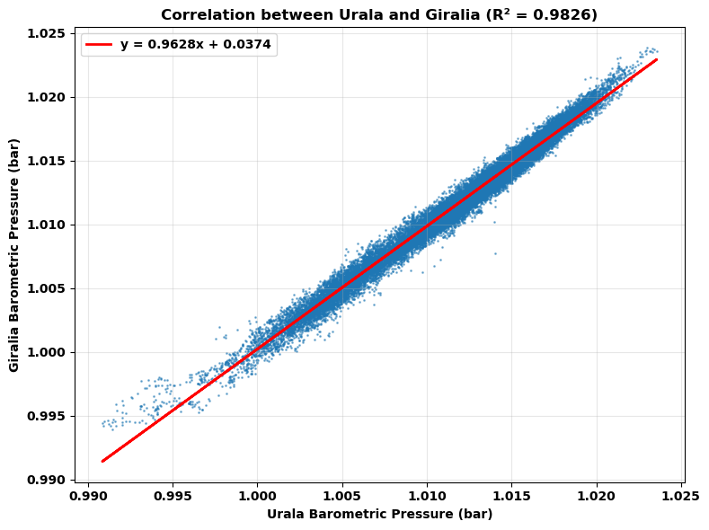{#fig-baro-correlation}

#### Rugged Troll Loggers

Rugged Troll loggers record total pressure ($P_{\text{logger\_RT}}$) with a factory-assigned constant barometric offset ($P_{\text{constant\_offset}}$). Absolute pressure ($P_{\text{absolute}}$) was calculated via:

$$P_{\text{absolute}} = P_{\text{logger\_RT}} + P_{\text{constant\_offset}}$$

Net water pressure ($P_{\text{water\_RT}}$) was subsequently isolated by subtracting interpolated barometric pressure ($P_{\text{barometric}}$):

$$P_{\text{water\_RT}} = P_{\text{absolute}} - P_{\text{barometric}}$$

An example of the Rugged Troll correction sequence is shown in @fig-rugged-troll-example.

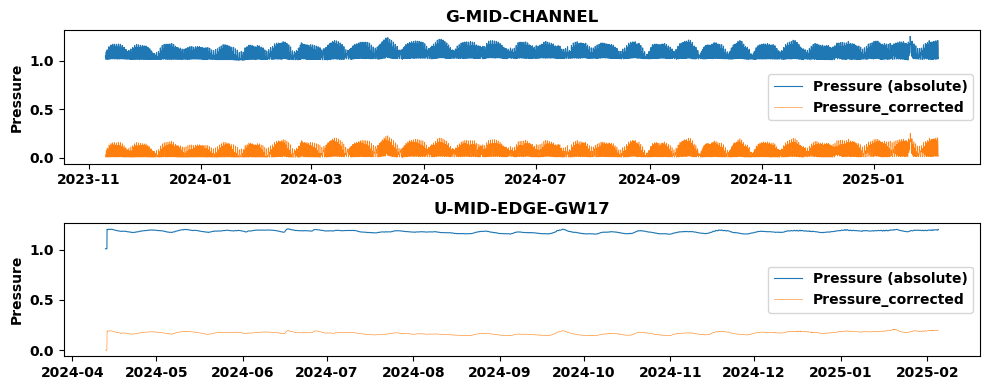{#fig-rugged-troll-example}

#### AquaTroll Loggers

AquaTroll loggers ($P_{\text{logger\_AT}}$) do not store the static offset internally. Net water pressure ($P_{\text{water\_AT}}$) was derived relative to average barometric conditions ($P_{\text{barometric\_average}}$):

$$P_{\text{water\_AT}} = P_{\text{logger\_AT}} + (P_{\text{barometric}} - P_{\text{barometric\_average}})$$

*Note: This formulation assumes initial logger baseline setup occurred near mean atmospheric pressure.* An example correction is shown in @fig-aquatroll-example.

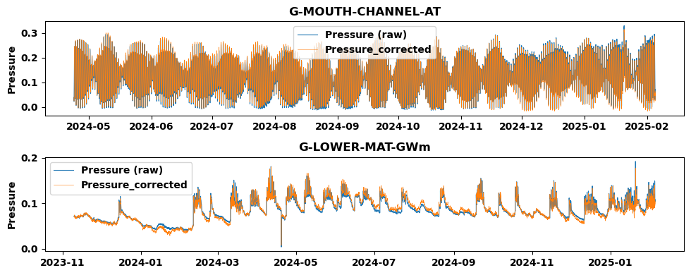{#fig-aquatroll-example}

---

### Density Correction

Corrected water pressure ($P_{\text{corrected}}$ in bar) was converted to water depth ($H_{\text{corrected}}$ in metres) using variable water density ($\rho$ in $\text{g/cm}^3$). Density was calculated at 15-minute time steps as a function of salinity ($S$, PSU) and water temperature ($T$, °C):

$$\rho = 1000 + 0.75 \cdot S - 0.2 \cdot (T - 4)$$

While temperature was continuously recorded across all sites, missing salinity records were reconstructed using a hierarchical fallback sequence:

1. Mean salinity observed at the same `SiteId`.
2. Mean salinity from a assigned fallback site (`Fallback_Salinity_SiteId`, @tbl-fallback-sites).
3. Mean salinity across the local geomorphic location category.
4. Mean regional salinity (Giralia vs. Urala).

| Target SiteId | Fallback Salinity SiteId |
| :--- | :--- |
| *Fallback mappings* | ... |

: Fallback salinity site assignments for density calculations. {#tbl-fallback-sites}

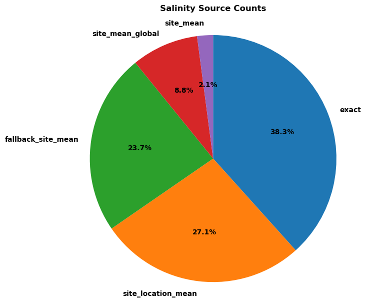{#fig-salinity-sources}

Calculated densities showed strong agreement ($r^2 > 0.94$) against sites equipped with direct density sensors (@fig-density-validation and @fig-density-time-series).

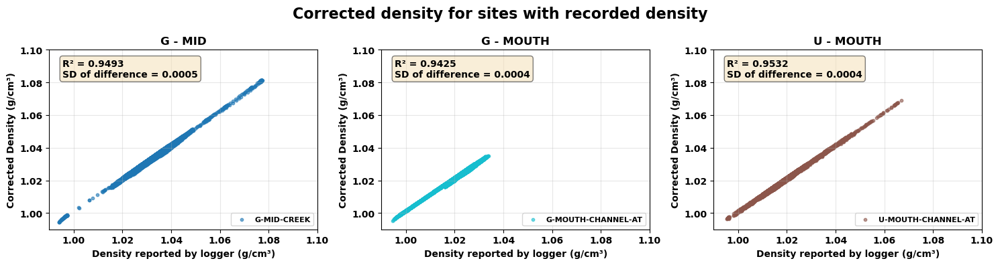{#fig-density-validation}

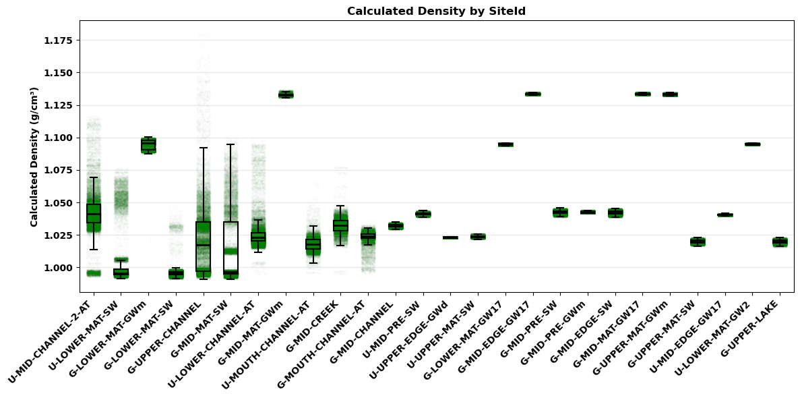{#fig-density-time-series}

Corrected water depth above the logger was calculated via:

$$H_{\text{corrected}} = \frac{P_{\text{corrected}} \cdot 10.1972}{\rho}$$

Linear regression between $H_{\text{corrected}}$ and $P_{\text{corrected}}$ yielded a correlation coefficient of $0.996$ (@fig-depth-vs-pressure). Residual analysis comparing logger-reported depth versus density-corrected depth revealed a residual standard deviation of $7.3\text{ cm}$ (@fig-depth-residuals), which represents a notable magnitude in shallow intertidal systems.

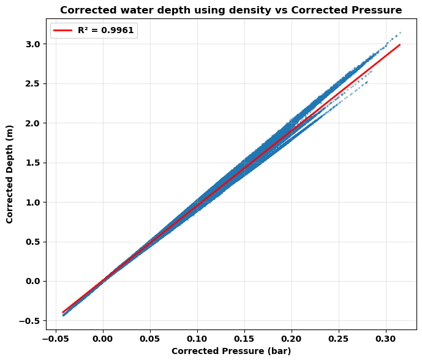{#fig-depth-vs-pressure}

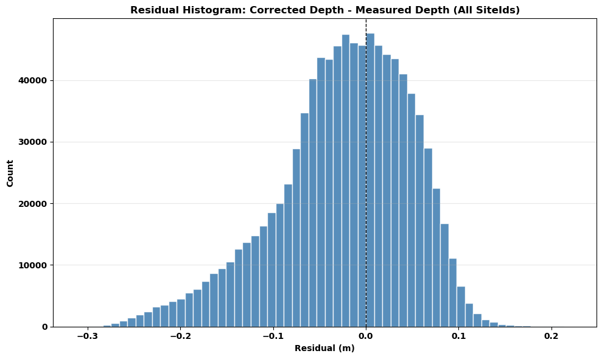{#fig-depth-residuals}

---

### Datum Correction

Because initial logger sensor elevations were un-surveyed, elevations were referenced to Australian Height Datum (mAHD) using LiDAR ground elevation baselines (@tbl-sample-locations) and regional tide gauge calibrations.

1. **Estuarine Mouth Calibration:** Submerged loggers at the Giralia and Urala river mouths were calibrated against mAHD tidal observations from the Exmouth tide gauge by matching peak spring tide elevations (@fig-exmouth-calibration and @fig-mouth-scatter).

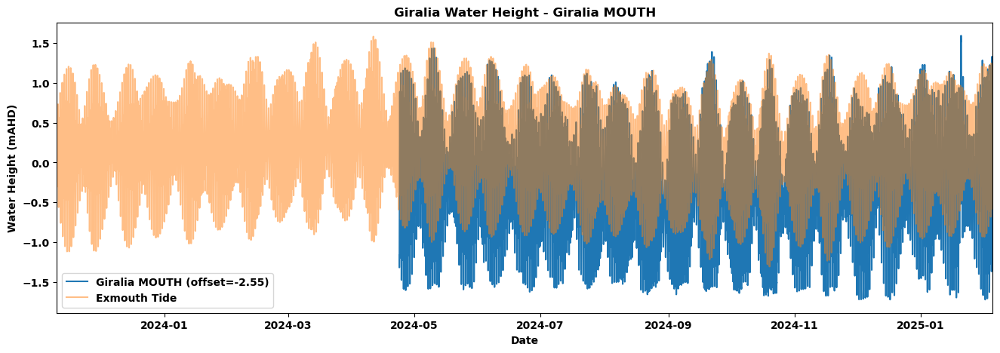{#fig-exmouth-calibration}

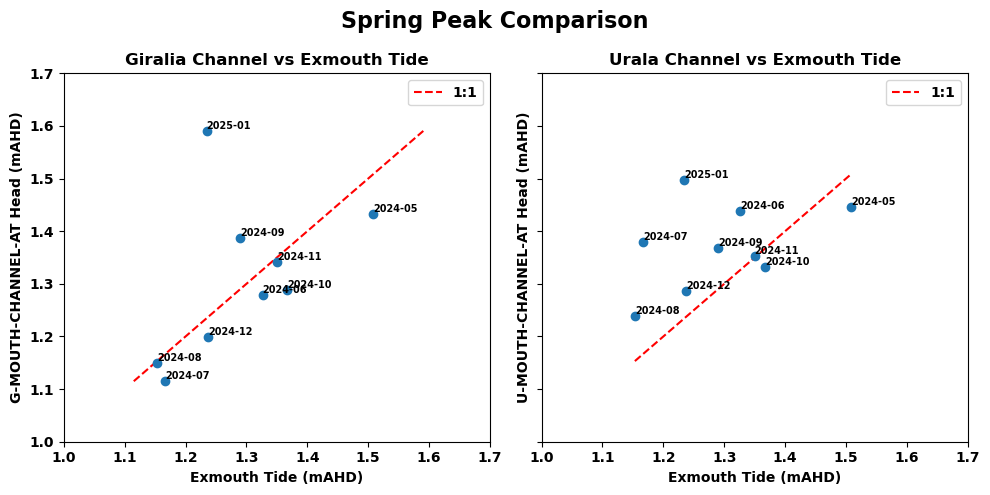{#fig-mouth-scatter}

2. **Upstream Hydraulic Calibration:** Upstream loggers were sequentially adjusted to match monthly peak water levels along primary hydraulic conveyances (e.g., Mouth Channel $\rightarrow$ Mid Channel $\rightarrow$ Mid Creek $\rightarrow$ Upper Channel $\rightarrow$ Algal Mat). Peak correlations along connected flow paths are shown in @fig-giralia-peaks and @fig-urala-peaks.

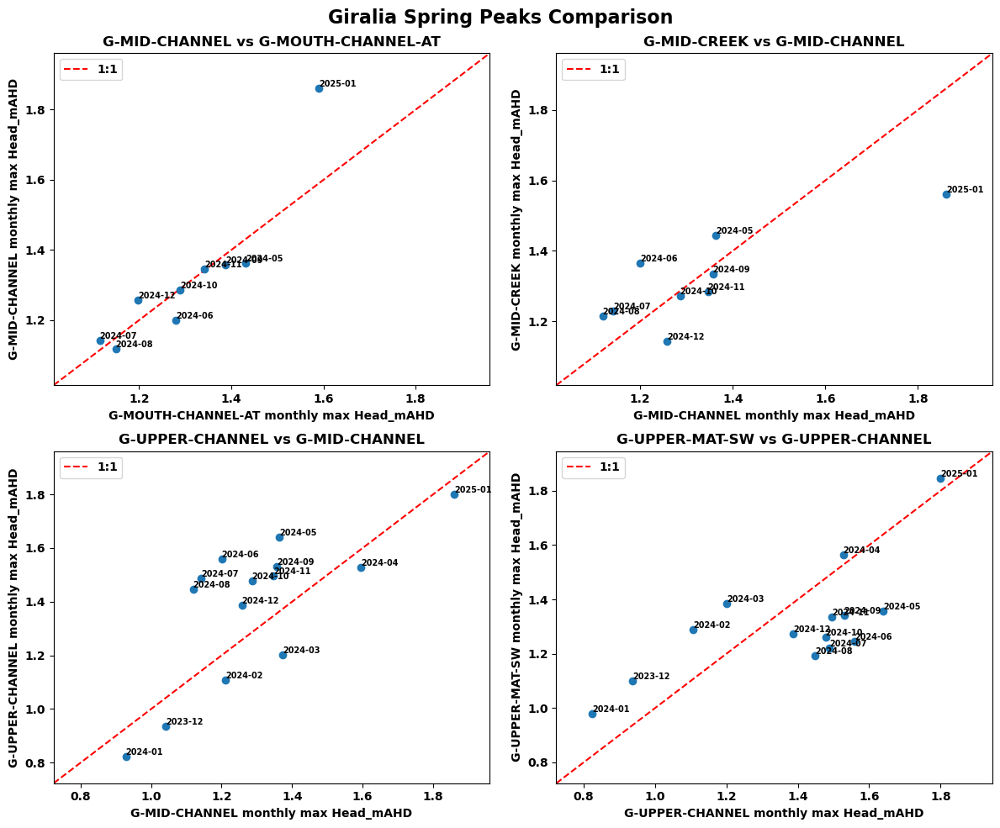{#fig-giralia-peaks}

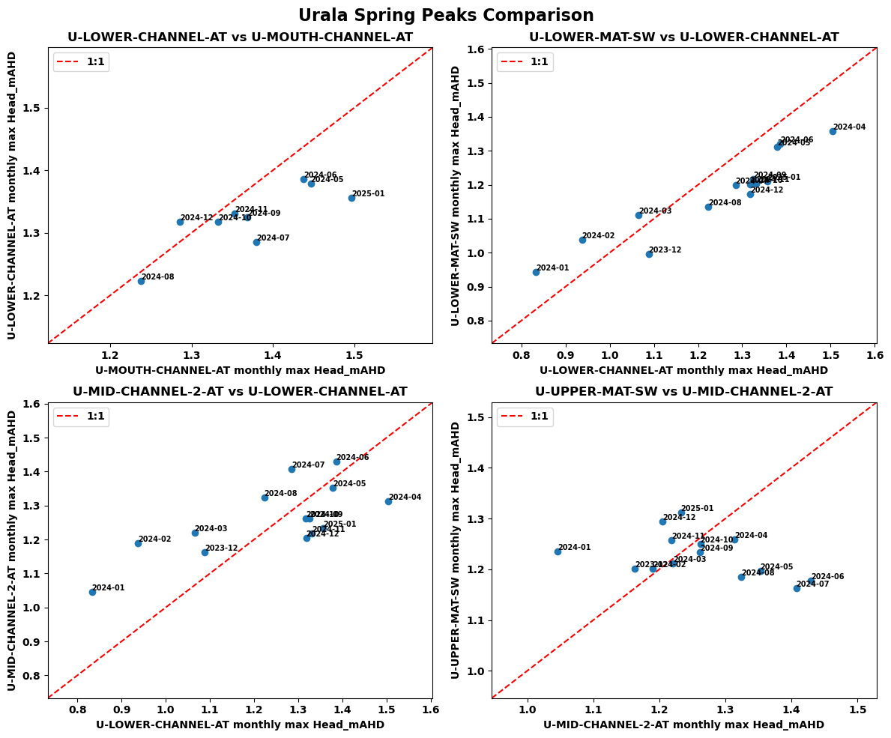{#fig-urala-peaks}

The impact of datum adjustments on raw water elevation series during a representative period (December 2024) is illustrated in @fig-giralia-datum and @fig-urala-datum.

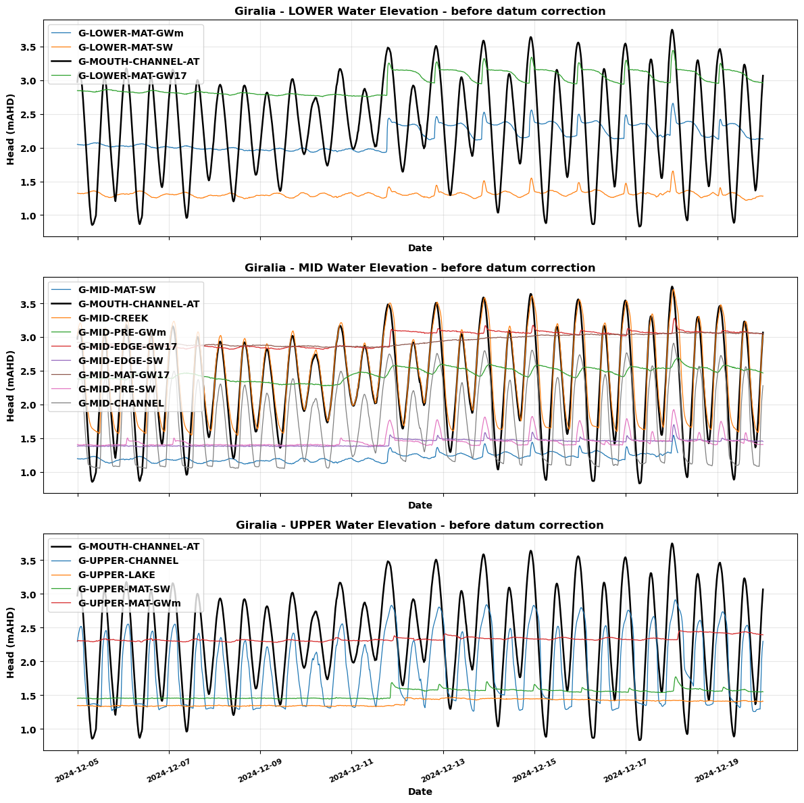{#fig-giralia-datum}

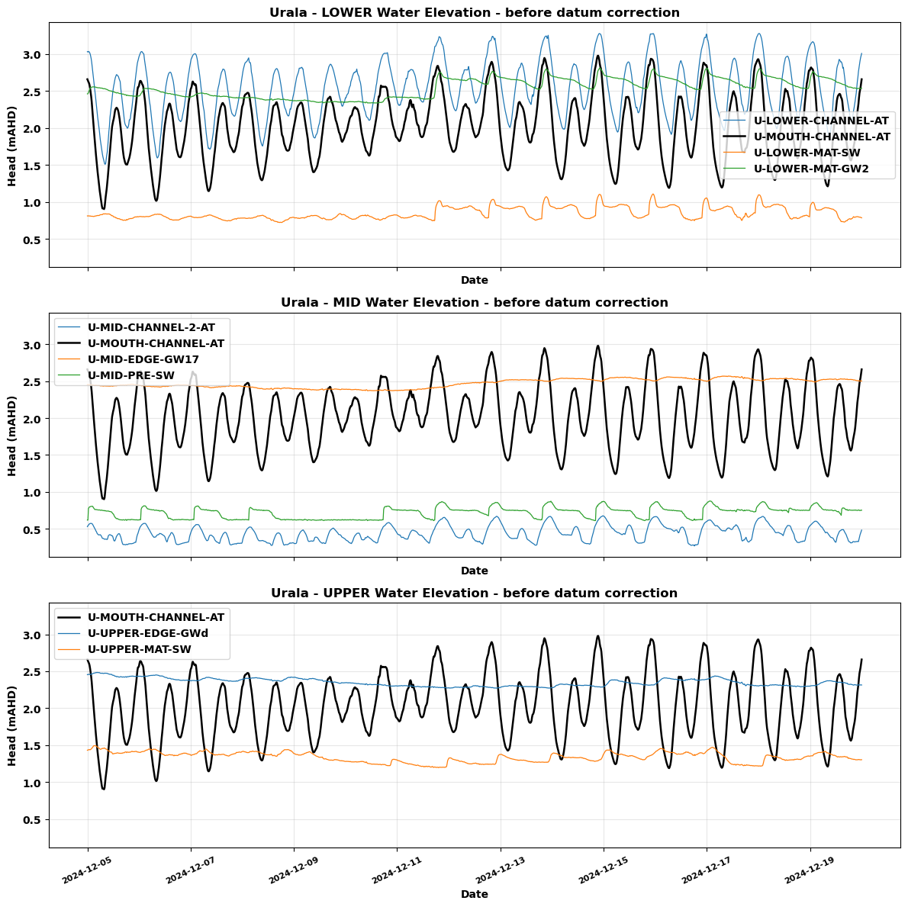{#fig-urala-datum}

---

## Results & Hydraulic Dynamics

The calibrated water level dataset enables spatial and temporal cross-sectional analyses across both estuaries. 

Response during extreme events—such as the **11 April 2024 storm event**—highlights cross-shore head gradients and inundation extent across the intertidal platform (@fig-giralia-storm and @fig-urala-storm).

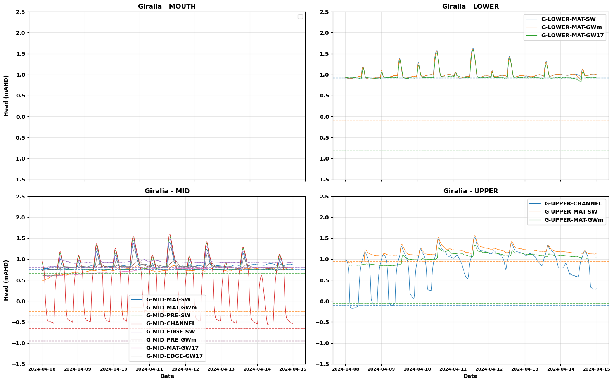{#fig-giralia-storm}

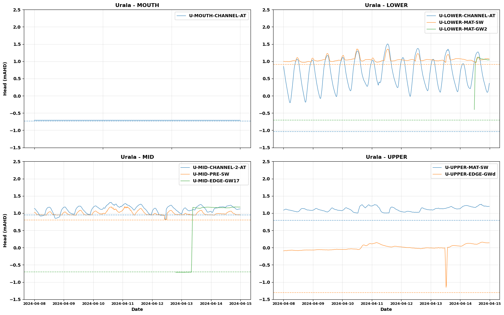{#fig-urala-storm}

### Spatial Cross-Sections and Groundwater Dynamics

Cross-sectional profiles reveal distinct spatial-temporal hydroperiod trends from the primary channels to the upper algal mats (@fig-cross-sections). 

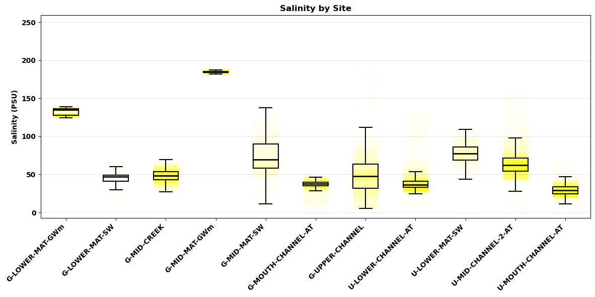{#fig-cross-sections}

Analysis of paired surface-water and groundwater monitoring loggers enables derivation of local hydraulic gradients. These gradients govern subsurface porewater exchange, hypersaline groundwater discharge, and ecohydrological feedback loops within the intertidal mangrove-mat transition zone.