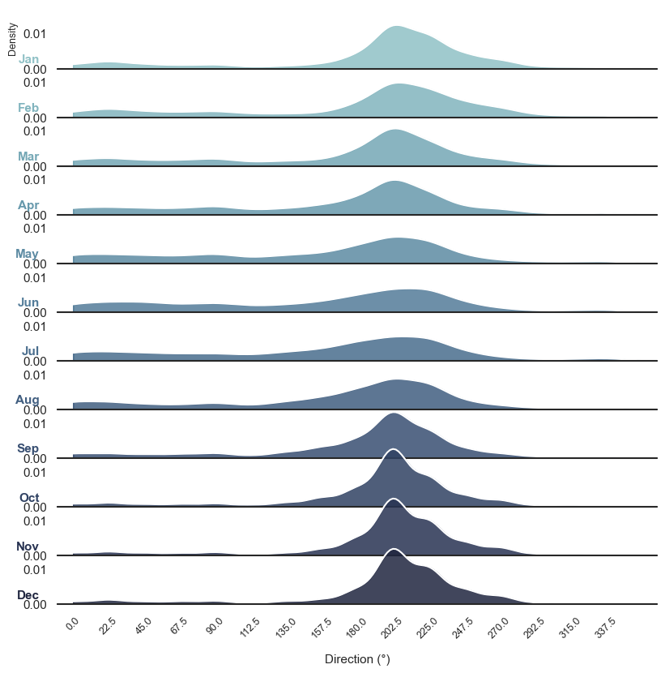

# Controls on Coastal Ecosystems in Pilbara
## Intertidal Habitats of the Pilbara Region

The northwest Pilbara region, and Exmouth Gulf in particular, is characterised by extremely low-gradient topography, with much of the surrounding land occurring at less than 5 m elevation. As a consequence, the high intertidal zone is unusually extensive, extending 10 km or more landward in places — far broader than the narrow fringing zones typical of steeper coastlines. This broad, low-relief intertidal zone supports a mosaic of habitats, including mangroves, cyanobacterial (algal) mats, saltmarsh, bright salt-dominated flats, high intertidal salt flats, and open water areas, bordered landward by higher-elevation terrestrial vegetation and unvegetated sand/dune systems [@Hickey2025].

These habitats rarely occur as discrete, sharply bounded units. Instead, they co-occur or grade into one another transitionally: saltmarsh, for example, commonly occupies the boundary between the landward extent of mangroves and the seaward extent of cyanobacterial mats, and again between the landward extent of the mats and the high intertidal salt flats further inland. Vegetated habitats within this zone also vary considerably in density, from dense, closed-canopy mangrove stands to sparse, low-density saltmarsh and cyanobacterial mat cover scattered across the high intertidal salt flats.

This study focuses on the two dominant vegetated habitats of the high intertidal zone — mangroves and cyanobacterial (algal) mats. The high intertidal salt flats where places covered by cyanobacterial mats are the most extensive landform in the northwest Pilbara and Exmouth Gulf intertidal zone, covering a greater area than mangroves, yet they remain comparatively understudied relative to the mangrove fringe. Where present, cyanobacterial mats occur landward of the fringing mangroves and seaward of the dune systems, and contribute to a range of ecosystem functions including salt production and exchange, carbon sequestration, nutrient cycling, vertical sediment accretion, and support for fisheries [@Hickey2025]. These habitats face two principal pressures — climate change and direct anthropogenic disturbance (e.g. land development and reclamation) — with the greatest uncertainty and risk arising where these pressures overlap and interact cumulatively [@Hickey2022].

The distribution, zonation, and persistence of these habitats are governed by a combination of hydrodynamic drivers — tides, sea level variability, waves, and storm surge — and climatic drivers, including rainfall, temperature, and wind. The sections below examine each of these controls in turn and detail their specific implications for the intertidal habitats described above.

## Sea level variability

Sea level variability is a dynamic phenomenon influenced by a range of oceanic, atmospheric, and geophysical processes operating across multiple temporal and spatial scales ( @fig-sea-level-variability). These processes include short-term fluctuations such as tides, storm surges, and wave setup, as well as longer-term drivers such as seasonal variability, interannual climate oscillations, and long-term sea-level rise. The interaction of these processes results in complex patterns of water level variability that directly influence coastal environments.

Variations in sea level play a fundamental role in shaping coastal ecosystems by controlling the distribution and magnitude of hydrodynamic energy across the inner shelf and shoreline. Changes in water level alter wave transformation processes, influencing wave breaking, energy dissipation, and ultimately the exposure of coastal habitats to hydrodynamic forcing. This has direct implications for sediment transport pathways and the redistribution of sediments across coastal zones.

At the interface between marine and terrestrial systems such as beach-dune systems, tidal flats, and estuary-floodplain environments-sea level variability governs sediment dynamics by influencing erosion, deposition, and sediment exchange processes. Fluctuations in water levels determine the extent and duration of inundation, which in turn affects sediment resuspension, transport capacity, and the stability of geomorphic features.

In estuarine and shallow coastal environments, sea level variability is the primary driver of hydrological connectivity and water quality conditions. It regulates tidal exchange, salinity intrusion, and residence times, thereby influencing key ecological processes. For coastal ecosystems such as mangroves in the Pilbara region, sea level variability directly controls hydroperiod (frequency, duration, and depth of inundation), which is a critical determinant of mangrove distribution, productivity, and resilience.

Understanding sea level variability across different time scales is therefore essential for predicting the response of coastal ecosystems to environmental change, particularly in the context of accelerating sea-level rise and changing climate conditions.

{#fig-sea-level-variability fig-cap="Sea level variability as a function of time scales, illustrating the range of processes influencing sea level from short-term (waves and tides) to long-term (climate variability and sea-level rise). Source: CSIRO."}

## Tides

Water levels in the Pilbara region are predominantly controlled by tidal processes, characterised by mixed, mainly semi-diurnal tides with meso-tidal amplitudes. These tidal conditions give rise to several cyclical patterns operating across different temporal scales. The most prominent is the fortnightly spring–neap cycle, which governs the periodic amplification and reduction of tidal ranges. In addition, a biannual cycle linked to the latitudinal tilt of the Earth influences tidal characteristics, alongside a 4.4-year cycle associated with variations in the lunar orbital plane.

At longer time scales, tidal ranges are further modulated by the 18.6-year lunar nodal cycle. While this modulation is particularly significant in south-west Western Australia where it can alter tidal ranges by up to approximately 10 cm (equivalent to 20–30% of the mean tidal range), its influence is comparatively less pronounced in the north-west, including the Pilbara region [@Eliot2012; @Lowe2021]. Nevertheless, even modest variations in tidal range have important implications for coastal processes and intertidal ecosystem dynamics.

### Implication for Benthic Habitats
Regular tidal inundation is the primary driver establishing the characteristic zonation of benthic coastal habitats across the West Pilbara Coast. Daily semi-diurnal tides maintain adequate pore-water flushing and salinity balance in the lower-to-mid intertidal zone, creating suitable conditions for mangrove establishment (e.g., *Avicennia marina*). Conversely, high intertidal and supratidal areas experience tidal inundation only during peak spring tide phases. In these hyper-saline upper flats, infrequent tidal flushing limits mangrove survival and instead favours drought- and salt-tolerant cyanobacterial (algal) mats and samphire communities. The predictable frequency of spring–neap wetting and drying cycles thereby dictates soil oxygenation, sediment accretion, and local salinity gradients required to sustain these distinct habitat zones.

---

## Seasonal and Interannual Variability

Off the coast of Western Australia in the southeast Indian Ocean, regional surface circulation is dominated by the unique poleward-flowing, downwelling-favourable Leeuwin Current [@Lowe2012]. Large seasonal and interannual mean sea level variations are driven by steric effects (thermal expansion and contraction) and Ekman setup associated with alongshelf Leeuwin Current transport [@Eliot2010]. Non-tidal water level fluctuations contribute up to ~0.2 m in seasonal amplitude and ~0.3 m in interannual variance, superimposed onto astronomical tides.

{#fig-tide-variance}

@fig-tide-variance shows the measured monthly mean water level variations from 2006 to 2022 at the Exmouth (panel a) and Onslow (panel b) tide stations, plotted year-wise. Both locations exhibit a clear, synchronised seasonal signal: mean water levels peak during autumn (April–May) at values reaching up to ~0.25 to 0.30 m AHD on average (solid red line), driven by seasonal shifts in Leeuwin Current intensity, before falling to a seasonal minimum in late winter and early spring (August–September) at approximately 0.0 to 0.05 m AHD [@SeashoreEngineering2022]. 

In addition to this annual cycle, @fig-tide-variance highlights substantial interannual variability across individual years (indicated by the spread of colored lines). The vertical variance band (up to ~0.4 m during early months like January and February) demonstrates how climate oscillations such as El Niño–Southern Oscillation (ENSO) phases drive multi-year sea level variability above and below the baseline mean. Notably, Exmouth and Onslow track each other closely in terms of seasonal timing, multi-year means, and overall variance envelope, reflecting strong regional coherence across the West Pilbara Coast.

### Implication for Benthic Habitats
These seasonal and interannual water level shifts dictate the prolonged inundation and exposure windows of upper-intertidal habitats. The seasonal sea level high during autumn provides crucial inundation to high intertidal algal mats, delivering nutrients, flushing accumulated salts, and triggering microbial growth and primary productivity. Conversely, prolonged low water level anomalies associated with strong El Niño events (or suppressed Leeuwin Current flow) can leave upper-zone mangroves and algal mats desiccated for extended periods. When combined with elevated temperatures, these interannual sea level drops induce severe hypersalinity and heat stress in the root zone, which can trigger widespread mangrove dieback and disrupt the biological health of cyanobacterial mat crusts.

## Storm surge and coastally-trapped waves

Storm surge refers to deviations in mean sea level driven by atmospheric forcing, primarily associated with changes in barometric pressure and wind stress. These weather-induced fluctuations occur over time scales ranging from minutes to several days and can significantly elevate coastal water levels. The most substantial surges are typically generated by intense weather systems characterised by low atmospheric pressure and strong winds, and are therefore commonly referred to as storm surges.

In addition to locally generated surge, free surge responses can propagate beyond the region of direct atmospheric forcing. These include surface gravity waves, Kelvin waves, and coastally-trapped waves, which are generated by synoptic-scale systems and travel along the coastline [@Trenberth1991]. As these waves approach the coast, boundary constraints and decreasing water depth modify their behaviour. Shallowing conditions reduce propagation speeds and enhance water level responses, leading to the amplification of surge through shoaling processes. In semi-enclosed coastal environments, these boundary effects may also give rise to oscillatory motions such as seiches [@SeashoreEngineering2016].

Tropical cyclones are a major driver of extreme storm surge events in the Pilbara region. These systems are characterised by intense low-pressure centres and high wind speeds, with cyclone classification beginning at sustained winds of 63 km/h and reaching up to 276 km/h in extreme cases along the Western Australian coastline [@SeashoreEngineering2016]. Tropical cyclones generate both large waves and significant storm surges, particularly as they approach and cross the coastline.

An important characteristic of cyclone-driven surge in this region is the role of coastally-trapped waves, which enable water level anomalies to propagate alongshore over large distances. As a result, cyclone-induced water level fluctuations can affect coastal areas far removed from the point of landfall. The magnitude and spatial distribution of surge are strongly influenced by cyclone track orientation. In the Pilbara, the highest surge events are typically associated with coast-crossing cyclones that generate strong onshore winds. Further west along the coast, however, extreme surge events are more commonly linked to cyclones travelling parallel to the coastline, which enhance the generation of coastally-trapped waves.

These processes are illustrated in @fig-cyclone-paths, which shows the tracks of tropical cyclones responsible for the highest observed surges along the Western Australian coast. Understanding the combined influence of atmospheric forcing, coastal geometry, and wave dynamics is critical for accurately assessing extreme water levels and their impacts on coastal ecosystems.

{#fig-cyclone-paths fig-cap="Tropical cyclone tracks associated with the highest observed storm surge events along the Western Australian coastline, highlighting the influence of storm trajectory on surge generation (Seashore Engineering, 2016)."}

### Implications for Mangroves and Algal Mats
In addition to baseline tidal inundation, extreme sea-level anomalies driven by storm surges and coastally-trapped waves act as critical pulse drivers for intertidal habitats along the Pilbara coastline.

Extreme Inundation and Hypersalinity Relief: Storm surge and coastally-trapped waves significantly elevate sea surface heights above astronomical high tides, driving deep seawater penetration into the highest reaches of the intertidal flat. This temporary, deep flooding flushes hyper-saline upper-flat substrates, lowering porewater salinity across the cyanobacterial algal mat zones and high-intertidal *Avicennia marina* and algal mat fringes that are otherwise rarely inundated.

Sediment Reworking and Accretion Pulses: High-energy surge events combined with cyclone-induced waves drive major sediment movement. While extreme wave energy can physically scour established algal mats and undermine shallow mangrove root networks, the accompanying surge deposits sediment high on the tidal flat. This episodic terrigenous and marine sediment delivery is also a crucial mechanism supplying the accretion budget needed for mangroves and algal mats to maintain vertical elevation relative to long-term sea-level rise.

Hydrodynamic Stress and Seedling Mortality: On the exposed seaward margins, the combined force of cyclone surge and wind-sea wave action generates severe shear stress. This hydrodynamic force can uproot juvenile mangrove recruits, break canopy branches, and resuspend fine sediments. The resulting high-turbidity water column temporarily restricts light availability (PAR), limiting photosynthetic recovery following the storm.

Far-Field Ecological Impacts: Because coastally-trapped waves allow water-level anomalies to propagate hundreds of kilometers away from a cyclone's direct landfall location, non-local storm systems can trigger unexpected inundation and erosion events in sheltered mangrove embayments without locally severe weather.

## Wave Climate

The hydrodynamic energy across the West Pilbara coast and Exmouth Gulf is overwhelmingly dominated by tidal and wind-driven processes, with ambient wave energy playing a minor, secondary role under normal conditions. Open ocean swell waves originating from the Southern Ocean and Indian Ocean are effectively blocked and sheltered by the landmass of the Exmouth. 

![Mean significant wave height ($H_s$) across the West Pilbara region derived from the Australian Climate Service Wave Hindcast (WHACS) dataset (1980–2023) [@Smith2025]. White contours denote mean $H_s$ intervals (m), highlighting severe wave energy attenuation moving from deep offshore waters into sheltered embayments.](images/pilbara_wave_climate.png){#fig-wave-climate}

@fig-wave-climate illustrates the long-term regional mean significant wave height ($H_s$) derived from the Wave Hindcast for Australian Coastal Seas (WHACS) dataset (1980–2023) [@Smith2025]. The spatial distribution clearly highlights the extreme wave energy gradients across the region:

* **Offshore and Western Margins:** Moderate mean wave heights of 1.5 to >2.0 m persist in exposed deepwater areas west of the Exmouth Peninsula.
* **Sheltered Embayments and Nearshore Lands:** As waves propagate past the peninsula into Exmouth Gulf and along the low-gradient inner shelf near Giralia, Urala, and Cape Preston, depth-induced breaking and fetch constraints reduce mean significant wave heights to $<0.5$ m (dark purple zone in @fig-wave-climate).

Ambient wave conditions within Exmouth Gulf and adjacent coastal flats are primarily locally generated wind-sea waves. Driven by seasonal wind regimes across the available fetches of the Gulf, these short-period ambient waves typically reach significant wave heights of less than 1.5 m. Consequently, regular, day-to-day ambient waves are not a dominant physical driver shaping the intertidal coastal landforms of this region.

### Extreme Wave Conditions

While ambient wave energy is low, wave processes become highly significant during rare, extreme meteorological events. Long-term offshore waverider buoy deployments (2006–2012) recorded extreme wave events directly linked to severe tropical cyclones, such as TC Nicholas (February 2008), which generated offshore significant wave heights of 5.7 m with peak periods of 12 seconds [@SeashoreEngineering2022]. 

During severe tropical storms, extreme gale-force winds aligned with the north-facing mouth of Exmouth Gulf can drive substantial wave energy directly into the inner Gulf. Numerical modelling suggests cyclone-generated waves within the Gulf can reach 2.0–4.0 m significant height. However, the actual impact of extreme wave energy at inner-shelf locations (such as Giralia and Urala) is heavily modulated and attenuated by broad, shallow intertidal bathymetry and complex fringing reef/flat systems.

### Implication for Benthic Habitats

The predominantly low-energy wave climate across the inner West Pilbara coast is a primary prerequisite for the establishment and persistence of sensitive benthic coastal habitats (BCH):

* **Mangrove Establishment and Retention:** Lower intertidal mangrove communities (*Avicennia marina*) are highly vulnerable to wave-induced dislodgement and sediment scouring. The sheltered conditions provided by the Exmouth Peninsula and wide shallow flats shield young saplings from high shear stress, allowing dense fringing mangrove forests to stabilise fine sediments along creek banks.
* **Cyanobacterial (Algal) Mat Preservation:** Supratidal algal mats rely on extremely low hydrodynamic energy to form cohesive, multi-layered organic crusts over broad salt flats. Under ambient conditions, wave action is negligible across these upper zones. However, during cyclonic extreme wave events, the combination of elevated storm surge and wave run-up can physically strip, tear, or bury these delicate mats under mobilised sediment sheets, forcing multi-year recovery cycles.

## Weather and climate variability

To characterise the meteorological baseline of the Pilbara region, this study draws upon comprehensive regional climate assessments by CSIRO [@Charles2015] and site-specific coastal engineering evaluations [@SeashoreEngineering2022]. The Pilbara experiences an arid to tropical semi-arid climate characterised by high ambient temperatures, spatial rainfall variability driven by convective and cyclonic systems, and a wind regime dominated by the trade wind belt and localised coastal sea breezes.

### Rainfall

Mean annual rainfall across the Pilbara decreases along a north-to-south gradient from 300–350 mm down to less than 250 mm. Topography exerts a strong orographic influence, with elevated inland areas such as the Hamersley Ranges averaging over 500 mm annually (@fig-pilbara-annual-rainfall). High land surface temperatures and coastal moisture convergence interact with this relief to promote intense convective thunderstorm activity.

![Mean annual rainfall (mm/year) across the Assessment area for the period 1911–2012, highlighting the spatial gradient and elevated inland precipitation [@Charles2015].](images/pilbara_mean_annual_rainfall.png){#fig-pilbara-annual-rainfall}

Nearshore southwestern sub-regions display a distinct double peak in monthly rainfall distribution (@fig-onslow-monthly-rainfall), where early summer tropical/cyclonic falls are augmented by early winter frontal systems prior to the late-spring dry period.

![Monthly rainfall distribution at Onslow Airport (Station 5017) spanning 1911 to 2012, illustrating the mean monthly values and the 20th–80th percentile range [@Charles2015].](images/onslow_monthly_rainfall.png){#fig-onslow-monthly-rainfall}

As illustrated in @fig-onslow-monthly-rainfall, precipitation near Onslow is episodic and highly variable, governed by cyclonic tracks and early winter troughs.

### Temperature

Thermal conditions across the Pilbara directly drive high atmospheric evaporative demand. January is typically the hottest month, though northern coastal and inland locations often record maximums in December (@fig-pilbara-temp-cycle).

![Monthly means of daily minimum ($T_{min}$), mean ($T_{mean}$), and maximum ($T_{max}$) temperatures across the Assessment area for the period 1911–2012 [@Charles2015].](images/pilbara_monthly_temperatures.png){#fig-pilbara-temp-cycle}

The regional temperature profile highlighted in @fig-pilbara-temp-cycle is defined by the following characteristics:

* **Summer Maximums:** Monthly mean daily maximums in January exceed 39°C across southwestern and eastern sectors, peaking at an average of 41°C at Marble Bar. Near-coastal sites near Onslow experience lower maximums due to sea-breeze moderation, though temperatures consistently exceed 35°C.
* **Extreme Records:** Maximums above 45°C occur regularly between November and February. The state maximum temperature record of 50.5°C was recorded locally along the coast at Mardie on 19 February 1998.
* **Winter Minimums:** July is the coldest month, with mean daily minimums ranging from 5–6°C in the south to 13–15°C along the northern coast. Sub-zero temperatures remain confined to inland southern areas (e.g., Nullagine recording -2.2°C).

### Wind Regime

The baseline wind climate in the vicinity of Learmonth and the Onslow region transitions between seasonal trade wind systems and localised coastal circulations throughout the year.

* **Prevailing Direction:** The region is anchored by a persistent southerly-to-southwesterly wind vector year-round. Across all 12 months, the dominant wind directions fall between **202.5° (SSW)** and **225° (SW)**, which consistently record the highest directional frequencies in the dataset.
* **Spring to Late Summer Peak (October–March):** As the inland heat low develops during warmer months, this southerly-to-southwesterly flow intensifies, reinforced by strong afternoon sea breezes. The dominance of 202.5° winds peaks sharply in **October (37.2%)** and **November (36.3%)**, remaining exceptionally high through December (35.7%) and January (30.5%).
* **Winter Shift (May–August):** During cooler months, the trade wind regime exerts a stronger influence, introducing a secondary peak from the easterly to southeasterly sector (**135°–180°**). From May through August, frequencies across 135°, 157.5°, and 180° increase significantly (e.g., 180° reaches 12.5%–13.1% in July–August), reflecting morning trade wind surges before shifting around to the south-southwest later in the day.
* **Transition Months (April & September):** April and September represent transitional periods. April exhibits a broader spread across east, south, and south-southwest directions as summer sea breezes decline, while September marks the rapid re-establishment of the dominant south-southwesterly flow (31.7% at 202.5°).

{#fig-learmonth-wind-dir}

As illustrated in @fig-learmonth-wind-dir, while the overall wind regime is dominated by a year-round southerly-to-southwesterly corridor, the 12-month evolution is characterised by strong late-spring/summer amplification from coastal sea breezes and a secondary easterly trade component during winter.

### Implications for Mangroves and Algal Mats
The intense solar radiation and high ambient temperatures elevate atmospheric evaporative demand to generate severe porewater hypersalinity across upper-intertidal algal flats and mangrove fringes—a stress mechanism only partially alleviated by brief, episodic rainfall pulses that flush nutrients, drop substrate salinity, and deliver terrigenous sediment via ephemeral creeks. Beyond evaporative stress, acute thermal spikes above canopy photosynthesising thresholds directly trigger mangrove dieback and canopy stress, while the dominant southerly-to-southwesterly wind regime and afternoon sea breezes generate localised, short-period wind-sea waves that resuspend fine sediments in shallow embayments, elevating turbidity, restricting light availability (PAR) for seedling establishment, and driving localised shoreline shear stress that scours cyanobacterial mats.