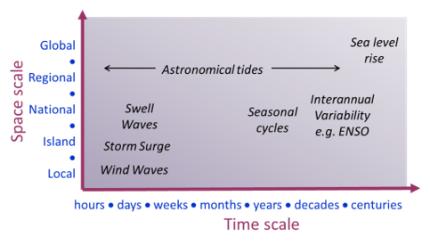
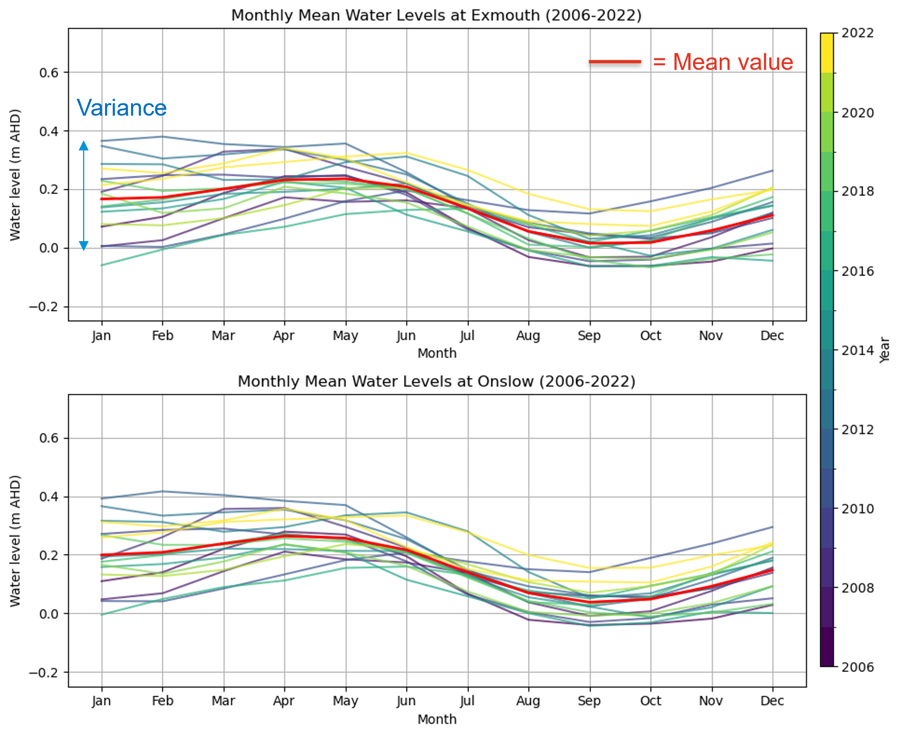
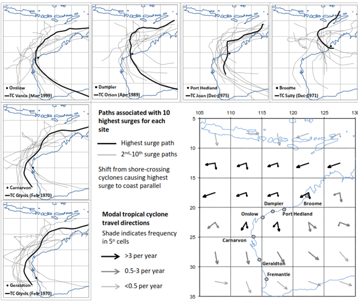

# Controls on Coastal Ecosystems in Pilbara

## Sea level variability

Sea level variability is a dynamic phenomenon influenced by a range of oceanic, atmospheric, and geophysical processes operating across multiple temporal and spatial scales ( @fig-sea-level-variability). These processes include short-term fluctuations such as tides, storm surges, and wave setup, as well as longer-term drivers such as seasonal variability, interannual climate oscillations, and long-term sea-level rise. The interaction of these processes results in complex patterns of water level variability that directly influence coastal environments.

Variations in sea level play a fundamental role in shaping coastal ecosystems by controlling the distribution and magnitude of hydrodynamic energy across the inner shelf and shoreline. Changes in water level alter wave transformation processes, influencing wave breaking, energy dissipation, and ultimately the exposure of coastal habitats to hydrodynamic forcing. This has direct implications for sediment transport pathways and the redistribution of sediments across coastal zones.

At the interface between marine and terrestrial systems—such as beach-dune systems, tidal flats, and estuary-floodplain environments—sea level variability governs sediment dynamics by influencing erosion, deposition, and sediment exchange processes. Fluctuations in water levels determine the extent and duration of inundation, which in turn affects sediment resuspension, transport capacity, and the stability of geomorphic features.

In estuarine and shallow coastal environments, sea level variability is the primary driver of hydrological connectivity and water quality conditions. It regulates tidal exchange, salinity intrusion, and residence times, thereby influencing key ecological processes. For coastal ecosystems such as mangroves in the Pilbara region, sea level variability directly controls hydroperiod (frequency, duration, and depth of inundation), which is a critical determinant of vegetation distribution, productivity, and resilience.

Understanding sea level variability across different time scales is therefore essential for predicting the response of coastal ecosystems to environmental change, particularly in the context of accelerating sea-level rise and changing climate conditions.

{#fig-sea-level-variability fig-cap="Sea level variability as a function of time scales, illustrating the range of processes influencing sea level from short-term (waves and tides) to long-term (climate variability and sea-level rise). Source: CSIRO."}

## Tides

Water levels in the Pilbara region are predominantly controlled by tidal processes, characterised by mixed, mainly semi-diurnal tides with meso-tidal amplitudes. These tidal conditions give rise to several cyclical patterns operating across different temporal scales. The most prominent is the fortnightly spring–neap cycle, which governs the periodic amplification and reduction of tidal ranges. In addition, a biannual cycle linked to the latitudinal tilt of the Earth influences tidal characteristics, alongside a 4.4-year cycle associated with variations in the lunar orbital plane.

At longer time scales, tidal ranges are further modulated by the 18.6-year lunar nodal cycle. While this modulation is particularly significant in south-west Western Australia—where it can alter tidal ranges by up to approximately 10 cm (equivalent to 20–30% of the mean tidal range)—its influence is comparatively less pronounced in the north-west, including the Pilbara region [@Eliot2012; @Lowe2021]. Nevertheless, even modest variations in tidal range have important implications for coastal processes and intertidal ecosystem dynamics.

### Implication for Benthic Habitats
Regular tidal inundation is the primary driver establishing the characteristic zonation of benthic coastal habitats across the West Pilbara Coast. Daily semi-diurnal tides maintain adequate pore-water flushing and salinity balance in the lower-to-mid intertidal zone, creating suitable conditions for mangrove establishment (e.g., *Avicennia marina*). Conversely, high intertidal and supratidal areas experience tidal inundation only during peak spring tide phases. In these hyper-saline upper flats, infrequent tidal flushing limits mangrove survival and instead favours drought- and salt-tolerant cyanobacterial (algal) mats and samphire communities. The predictable frequency of spring–neap wetting and drying cycles thereby dictates soil oxygenation, sediment accretion, and local salinity gradients required to sustain these distinct habitat zones.

---

## Seasonal and Interannual Variability

Off the coast of Western Australia in the southeast Indian Ocean, regional surface circulation is dominated by the unique poleward-flowing, downwelling-favourable Leeuwin Current [@Lowe2012]. Large seasonal and interannual mean sea level variations are driven by steric effects (thermal expansion and contraction) and Ekman setup associated with alongshelf Leeuwin Current transport [@Eliot2010]. Non-tidal water level fluctuations contribute up to ~0.2 m in seasonal amplitude and ~0.3 m in interannual variance, superimposed onto astronomical tides.

{#fig-tide-variance}

Figure @fig-tide-variance shows the measured monthly mean water level variations from 2006 to 2022 at the Exmouth (panel a) and Onslow (panel b) tide stations, plotted year-wise. Both locations exhibit a clear, synchronized seasonal signal: mean water levels peak during autumn (April–May) at values reaching up to ~0.25 to 0.30 m AHD on average (solid red line), driven by seasonal shifts in Leeuwin Current intensity, before falling to a seasonal minimum in late winter and early spring (August–September) at approximately 0.0 to 0.05 m AHD [@SeashoreEngineering2022]. 

In addition to this annual cycle, Figure @fig-tide-variance highlights substantial interannual variability across individual years (indicated by the spread of colored lines). The vertical variance band (up to ~0.4 m during early months like January and February) demonstrates how climate oscillations—such as El Niño–Southern Oscillation (ENSO) phases—drive multi-year sea level departures above and below the baseline mean. Notably, Exmouth and Onslow track each other closely in terms of seasonal timing, multi-year means, and overall variance envelope, reflecting strong regional coherence across the West Pilbara Coast.

### Implication for Benthic Habitats
These seasonal and interannual water level shifts dictate the prolonged inundation and exposure windows of upper-intertidal habitats. The seasonal sea level high during autumn provides crucial inundation to high intertidal algal mats, delivering nutrients, flushing accumulated salts, and triggering microbial growth and primary productivity. Conversely, prolonged low water level anomalies associated with strong El Niño events (or suppressed Leeuwin Current flow) can leave upper-zone mangroves and algal mats desiccated for extended periods. When combined with elevated temperatures, these interannual sea level drops induce severe hypersalinity and heat stress in the root zone, which can trigger widespread mangrove dieback and disrupt the structural integrity of cyanobacterial mat crusts.

## Storm surge and coastally-trapped waves

Storm surge refers to deviations in mean sea level driven by atmospheric forcing, primarily associated with changes in barometric pressure and wind stress. These weather-induced fluctuations occur over time scales ranging from minutes to several days and can significantly elevate coastal water levels. The most substantial surges are typically generated by intense weather systems characterised by low atmospheric pressure and strong winds, and are therefore commonly referred to as storm surges.

In addition to locally generated surge, free surge responses can propagate beyond the region of direct atmospheric forcing. These include surface gravity waves, Kelvin waves, and coastally-trapped waves, which are generated by synoptic-scale systems and travel along the coastline [@Trenberth1991]. As these waves approach the coast, boundary constraints and decreasing water depth modify their behaviour. Shallowing conditions reduce propagation speeds and enhance water level responses, leading to the amplification of surge through shoaling processes. In semi-enclosed coastal environments, these boundary effects may also give rise to oscillatory motions such as seiches [@SeashoreEngineering2016].

Tropical cyclones are a major driver of extreme storm surge events in the Pilbara region. These systems are characterised by intense low-pressure centres and high wind speeds, with cyclone classification beginning at sustained winds of 63 km/h and reaching up to 276 km/h in extreme cases along the Western Australian coastline [@SeashoreEngineering2016]. Tropical cyclones generate both large waves and significant storm surges, particularly as they approach and cross the coastline.

An important characteristic of cyclone-driven surge in this region is the role of coastally-trapped waves, which enable water level anomalies to propagate alongshore over large distances. As a result, cyclone-induced water level fluctuations can affect coastal areas far removed from the point of landfall. The magnitude and spatial distribution of surge are strongly influenced by cyclone track orientation. In the Pilbara, the highest surge events are typically associated with coast-crossing cyclones that generate strong onshore winds. Further west along the coast, however, extreme surge events are more commonly linked to cyclones travelling parallel to the coastline, which enhance the generation of coastally-trapped waves.

These processes are illustrated in @fig-cyclone-paths, which shows the tracks of tropical cyclones responsible for the highest observed surges along the Western Australian coast. Understanding the combined influence of atmospheric forcing, coastal geometry, and wave dynamics is critical for accurately assessing extreme water levels and their impacts on coastal ecosystems.

{#fig-cyclone-paths fig-cap="Tropical cyclone tracks associated with the highest observed storm surge events along the Western Australian coastline, highlighting the influence of storm trajectory on surge generation (Seashore Engineering, 2016)."}

## Wave Climate

The hydrodynamic energy across the West Pilbara coast and Exmouth Gulf is overwhelmingly dominated by tidal and wind-driven processes, with ambient wave energy playing a minor, secondary role under normal conditions. Open ocean swell waves originating from the Southern Ocean and Indian Ocean are effectively blocked and sheltered by the landmass of the Exmouth. 

![Mean significant wave height ($H_s$) across the West Pilbara region derived from the Australian Climate Service Wave Hindcast (WHACS) dataset (1980–2023) [@Smith2025]. White contours denote mean $H_s$ intervals (m), highlighting severe wave energy attenuation moving from deep offshore waters into sheltered embayments.](images/pilbara_wave_climate.png){#fig-wave-climate}

@fig-wave-climate illustrates the long-term regional mean significant wave height ($H_s$) derived from the Wave Hindcast for Australian Coastal Seas (WHACS) dataset (1980–2023) [@Smith2025]. The spatial distribution clearly highlights the extreme wave energy gradients across the region:

* **Offshore and Western Margins:** Moderate mean wave heights of 1.5 to >2.0 m persist in exposed deepwater areas west of the Exmouth Peninsula.
* **Sheltered Embayments and Nearshore Lands:** As waves propagate past the peninsula into Exmouth Gulf and along the low-gradient inner shelf near Giralia, Urala, and Cape Preston, depth-induced breaking and fetch constraints reduce mean significant wave heights to $<0.5$ m (dark purple zone in @fig-wave-climate).

Ambient wave conditions within Exmouth Gulf and adjacent coastal flats are primarily locally generated wind-sea waves. Driven by seasonal wind regimes across the available fetches of the Gulf, these short-period ambient waves typically reach significant wave heights of less than 1.5 m. Consequently, regular, day-to-day ambient waves are not a dominant physical driver shaping the intertidal coastal landforms of this region.

### Extreme Wave Conditions

While ambient wave energy is low, wave processes become highly significant during rare, extreme meteorological events. Long-term offshore waverider buoy deployments (2006–2012) recorded extreme wave events directly linked to severe tropical cyclones, such as TC Nicholas (February 2008), which generated offshore significant wave heights of 5.7 m with peak periods of 12 seconds [@SeashoreEngineering2022]. 

During severe tropical storms, extreme gale-force winds aligned with the north-facing mouth of Exmouth Gulf can drive substantial wave energy directly into the inner Gulf. Numerical modelling suggests cyclone-generated waves within the Gulf can reach 2.0–4.0 m significant height. However, the actual impact of extreme wave energy at inner-shelf locations (such as Giralia and Urala) is heavily modulated and attenuated by broad, shallow intertidal bathymetry and complex fringing reef/flat systems.

### Implication for Benthic Habitats

The predominantly low-energy wave climate across the inner West Pilbara coast is a primary prerequisite for the establishment and persistence of sensitive benthic coastal habitats (BCH):

* **Mangrove Establishment and Retention:** Lower intertidal mangrove communities (*Avicennia marina*) are highly vulnerable to wave-induced dislodgement and sediment scouring. The sheltered conditions provided by the Exmouth Peninsula and wide shallow flats shield young saplings from high shear stress, allowing dense fringing mangrove forests to stabilize fine sediments along creek banks.
* **Cyanobacterial (Algal) Mat Preservation:** Supratidal algal mats rely on extremely low hydrodynamic energy to form cohesive, multi-layered organic crusts over broad salt flats. Under ambient conditions, wave action is negligible across these upper zones. However, during cyclonic extreme wave events, the combination of elevated storm surge and wave run-up can physically strip, tear, or bury these delicate mats under mobilized sediment sheets, forcing multi-year recovery cycles.

## Weather and climate variability

TO-DO