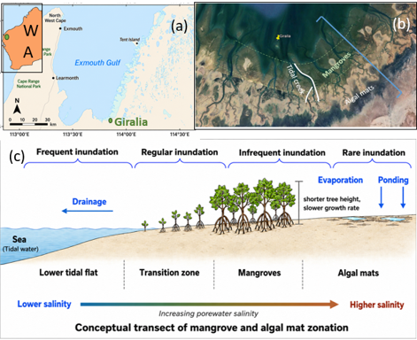
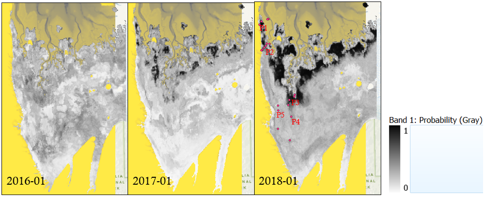
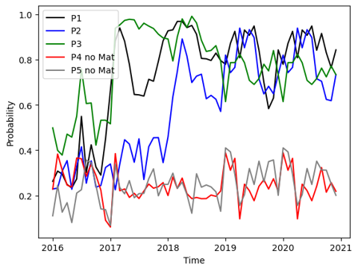
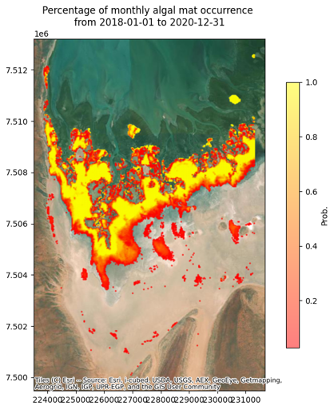
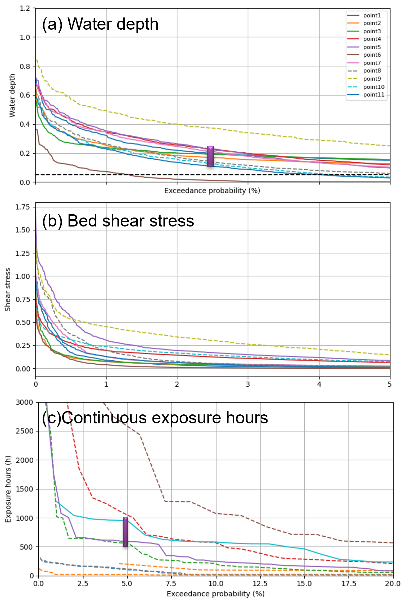
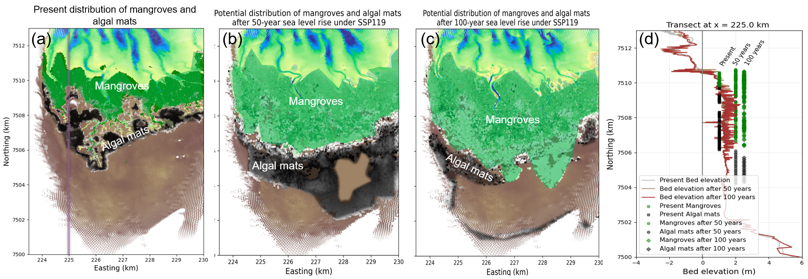
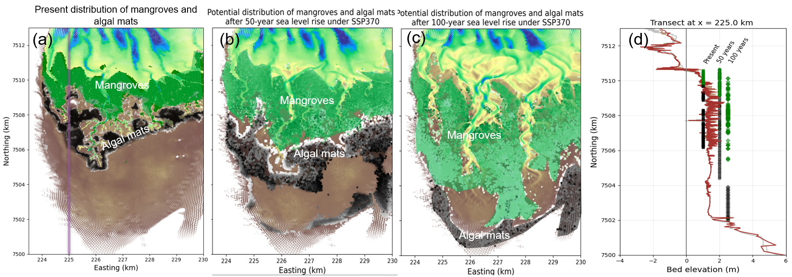
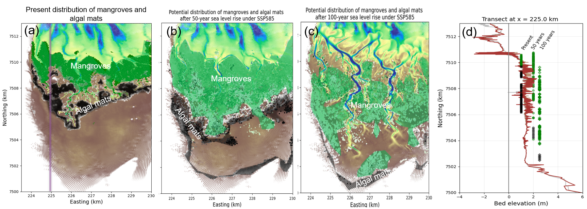

# Algal (cyanobacteria) mats prediction under future sea level rise

## Introduction

Algal mats in Giralia Bay predominantly occur at elevations of 230–270 cm above lowest astronomical tide [@Lovelock2009], where they experience infrequent inundation and prolonged desiccation. They are among the most competitive communities in the high intertidal zone and are widely distributed across these upper tidal flats [@Adame2012]. These algal mats are highly opportunistic and dynamic, taking advantage of episodic inundation events. They respond rapidly and become metabolically active when submerged during spring tides [@chennu2015], but enter a dormant state during extended periods of desiccation. Because they already operate close to their physiological limits, their persistence and potential redistribution under future climate change and sea-level rise remain uncertain. It is therefore important to understand how key environmental drivers regulate their occurrence. Given their highly dynamic physiological response, the presence of algal mats considered here refers to relatively persistent zones where mats occur over extended periods, rather than their short-term active or dormant state.

Although previous studies have shown that algal mats preferentially occupy high intertidal flats, no general quantitative relationship has yet been established between hydrodynamic conditions and their spatial occurrence. Moreover, algal mats comprise complex communities of both aerobic and anaerobic microorganisms, and their taxonomic and functional composition can vary substantially among sites. Such differences are likely to result in site-specific responses in growth, survival, and colonization under different hydrodynamic conditions. This ecological variability complicates the development of a generic relationship linking algal-mat occurrence to hydrodynamic forcing.

Therefore, based on Giralia regional hydromorphological model, we first relate hydrodynamic to the persistent algal mats and then predict the survival and migration of these persistent zone under different sea level rises.

{fig-align="center"}

## Methodology

### Persistent algal mats zone

The persistent algal-mat distribution used in this report was derived from the Project A output, which provides monthly averaged probabilities of algal-mat presence. We selected the period 2016–2020, during which algal mats were initially scarce in Giralia Bay (due to cyclone in 2015) and subsequently expanded before reaching a relatively stable distribution. To determine an appropriate probability threshold for identifying persistent algal mats, we randomly selected points across the domain and examined their probability time series. Figure 3 shows that locations with persistent algal mats generally exhibited increasing probabilities during the first two years, followed by relatively stable values with seasonal fluctuations over the subsequent three years. Based on this pattern, a probability threshold of 0.5 was adopted to identify algal-mat presence. The persistence of algal mats during 2018–2020 is shown in Figure 4. Areas shown in yellow represent locations where algal mats occurred consistently throughout the period, whereas red areas indicate locations with less frequent occurrence.

{fig-align="center"}

{fig-align="center"}

### Algal mats zone hydrodynamics: Single points

To understand the persistent zone hydrodynamics, we random selected points and analyzed the exceedance probability curve of water depth, bed shear stress and continuous exposure hours. Points located in the persistent zone (solid lines) are within a limited range of water depth at high exceedance, for example range between 0.15 to 0.3 m at 2.5% exceedance. The similar trend is observed in terms of bed shear stress and continuous exposure hours that range from 500 to 1000 hours at 5% exceedance. Points in the mangrove zone or bright salt zones (dashed lines) are either featured with too depth water or too long exposure hours. Therefore, we hypotheses that persistent algal mats favor shallow water inundation and moderate exposure hours.

{fig-align="center" width="525"}

### Algal mats zone hydrodynamics: Calibration over the whole domain

Based on the hypothesis of shallow water inundation is the primary control on the persistence of algal mats, we combined the inundation frequency (P), water depth (D) and continuous exposure hours (Exp) to calibrate the potential distribution of persistent algal mats. After several round of calibration, the following thresholds were adopted.

- 0\<P\<25%

- 0.03 \<$97.5^{th}$D \< 0.22m

- $97^{th}$Exp\<1000 hours

Figure 6 compares the simulated potential distribution of algal mats with satellite images, and persistent algal mats distribution, and dynamic algal mats distribution. The simulated distribution captures approximately 75.5% of the observed persistent algal-mat zone, although it tends to extend more broadly across the higher intertidal flat. Given that algal-mat occurrence is controlled not only by hydrodynamic conditions but also by spatial variability in mat composition and other environmental factors, this approach provides a reasonable first-order representation of the persistent algal-mat zone.

{fig-align="center"}

## Results

### Prediction of habitats under future scenarios

Figures 7–9 show the present-day, 50-year, and 100-year distributions of mangrove forests and persistent algal mats under low, intermediate, and high sea-level-rise scenarios (SSP1-1.9, SSP3-7.0, and SSP5-8.5, respectively). As sea level rises, both mangroves and persistent algal mats migrate landward under all scenarios, although the magnitude and spatial pattern of migration differ among scenarios.

Under the low sea-level-rise scenario ($50^{th}$ percentile SSP1-1.9; Figure 7), both mangroves and persistent algal mats shift landward and expand substantially after 50 years. Only limited mangrove loss occurs along the seaward fringe. After 100 years, mangroves continue to migrate landward and gain area, whereas persistent algal mats are displaced farther inland toward the margins of hills and cliffs, resulting in a reduction in their total area.

Under the intermediate sea-level-rise scenario ($50^{th}$ percentile SSP3-7.0; Figure 8), both mangroves and persistent algal mats also migrate landward and expand during the first 50 years. Compared with SSP1-1.9, however, persistent algal mats migrate farther inland and reach the cliff boundary within 50 years, whereas this transition takes approximately 100 years under SSP1-1.9. After 100 years, substantial widening and landward extension of tidal channels lead to mangrove loss along the seaward fringe and compress the mangrove habitat toward the higher intertidal flat, where persistent algal mats were previously distributed. Consequently, persistent algal mats are increasingly constrained by both mangrove encroachment and sea-level rise and become largely restricted to areas near the cliff boundary.

Under the high sea-level-rise scenario ($50^{th}$ percentile SSP5-8.5; Figure 9), mangroves migrate even farther landward after 50 years. Persistent algal mats also shift landward, but their expansion is more limited than under the low and intermediate sea-level-rise scenarios. After 100 years, extensive lengthening, widening, and deepening of tidal channels fragment the mangrove forest into more discrete patches and cause substantial retreat along the seaward fringe. Persistent algal mats are compressed against the cliff boundary, with only a limited area remaining.

{fig-align="center"}

{fig-align="center"}