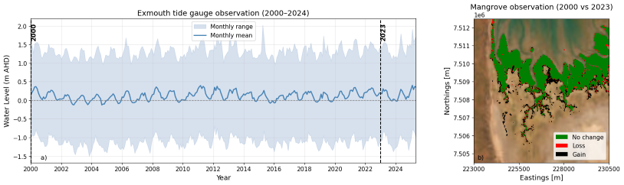
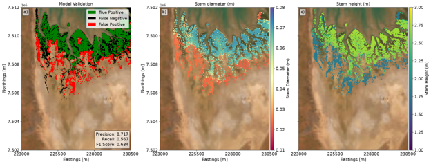

## Overview

To establish a baseline for assessing future changes in mangrove ecosystems in the Giralia region, it is crucial to understand the observed mangrove dynamics under present environmental conditions and to evaluate the model's ability to reproduce the current mangrove extent. 

### Historical Mangrove Observations (2000–2023)

We utilized monthly mangrove maps derived from Landsat imagery by @Hickey2025 to examine the temporal variability in mangrove distribution. Although the Landsat-derived dataset provides monthly observations over the available satellite record, the mangrove extents in 2000 and 2023 are compared in @fig-giralia-obs to illustrate longer-term shifts in mangrove distribution alongside the corresponding water-level variability recorded at the Exmouth tide station over the same period.

Overall, the Landsat observations indicate that mangrove extent in the Giralia region has remained relatively stable over the past two decades, with only minor changes in the spatial distribution. Seasonal variations in water level did not result in substantial changes in the mapped mangrove extent. However, a closer examination reveals that prolonged interannual environmental variations can produce more pronounced localized changes. For instance, mangrove dieback is evident in parts of the upper intertidal region during extended El Niño–Southern Oscillation (ENSO) periods [@Lovelock2017], suggesting that prolonged periods of lower inundation relative to typical hydrodynamic conditions can adversely influence mangrove survival. 

Despite these episodic changes, the overall mangrove extent has remained broadly consistent over the approximately 20-year observation period. This relative stability provides a suitable present-day baseline against which future changes under altered environmental conditions can be assessed.

::: {#fig-giralia-obs}
{fig-align="center" width="95%"}

Water level observations and historical mangrove extent in the Giralia region. **(a)** Water level recorded at the Exmouth tide station ([WA Data Catalogue](https://catalogue.data.wa.gov.au/dataset/tide-stations)) displaying monthly range and monthly mean. **(b)** Comparison of Landsat-derived mangrove extents between 2000 and 2023 [@Hickey2025].
:::

---

### Model Initialization & Performance Evaluation

@fig-giralia-val shows the modeled mangrove distribution under present environmental conditions. Because the objective was to reproduce the stable mangrove extent representative of the current environmental regime, the model simulations were forced using the MSKO tidal constituents (optimised via harmonic analysis). 

The spatial agreement between the modeled and observed mangrove extents was evaluated by categorizing grid cells:
* **True Positives (Green):** Correctly predicted mangrove areas.
* **False Negatives (Black):** Observed mangrove areas missed by the model.
* **False Positives (Red):** Areas predicted as mangrove where none were observed.

To quantitatively evaluate spatial performance, precision, recall, and the $F_1$ score were computed:

| Statistic | Definition | Formula | Model Performance |
| :--- | :--- | :--- | :--- |
| **Precision** | Proportion of modeled mangrove cells corresponding to true observed mangroves | $\text{Precision} = \frac{TP}{TP + FP}$ | Moderate Agreement |
| **Recall** | Proportion of observed mangrove cells correctly reproduced by the model | $\text{Recall} = \frac{TP}{TP + FN}$ | Moderate Agreement |
| **$F_1$ Score** | Harmonic mean of precision and recall | $F_1 = 2 \cdot \frac{\text{Precision} \cdot \text{Recall}}{\text{Precision} + \text{Recall}}$ | Moderate Agreement |

The resulting statistics indicate moderate-to-good agreement between the modeled and observed mangrove distributions, demonstrating that the model accurately captures the spatial characteristics of present-day mangrove extent while retaining subtle spatial boundary differences.

---

### Modeled Vegetation Structural Parameters

In addition to spatial extent, the model predicts key structural attributes of the mangrove canopy:

* **Stem Diameter ($d$):** Predicted spatial distributions (@fig-giralia-val-b) indicate relatively mature mangroves within the stable core of the mangrove distribution, characterized by larger stem diameters.
* **Stem Height ($h$):** Corresponding spatial distributions (@fig-giralia-val-c) reflect taller individuals within core zones and smaller, shorter individuals transitioning toward the margins of the habitat.

This spatial gradient aligns with expected ecological development—progressing from established, dense mangrove stands to less stable transition zones—and confirms that the model captures both spatial extent and internal structural dynamics of the present-day mangrove ecosystem.

::: {#fig-giralia-val}
{fig-align="center" width="100%"}

Mangrove validation and vegetation structural parameter distributions across the Giralia study area. **(a)** Spatial confusion map highlighting true positives, false negatives, and false positives alongside quantitative performance metrics ($F_1$ score, precision, recall). **(b)** Spatial distribution of modeled stem diameter ($d$). **(c)** Spatial distribution of modeled stem height ($h$).
:::