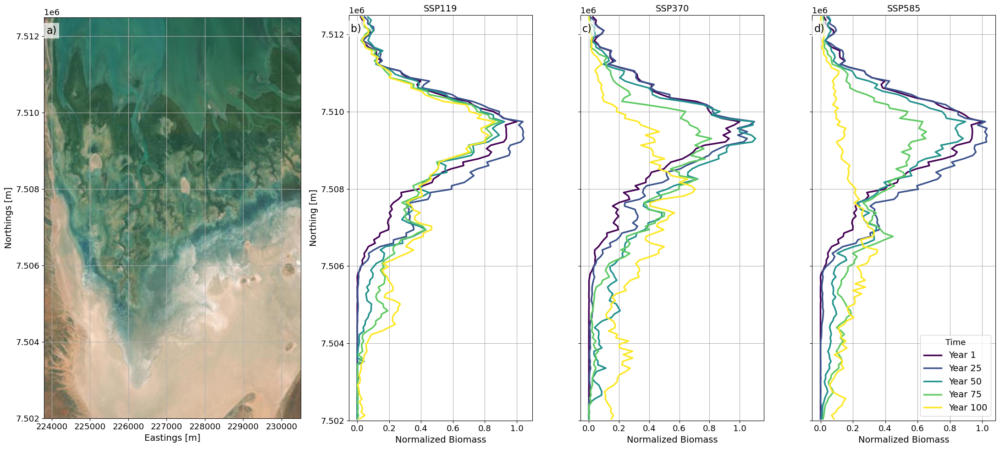
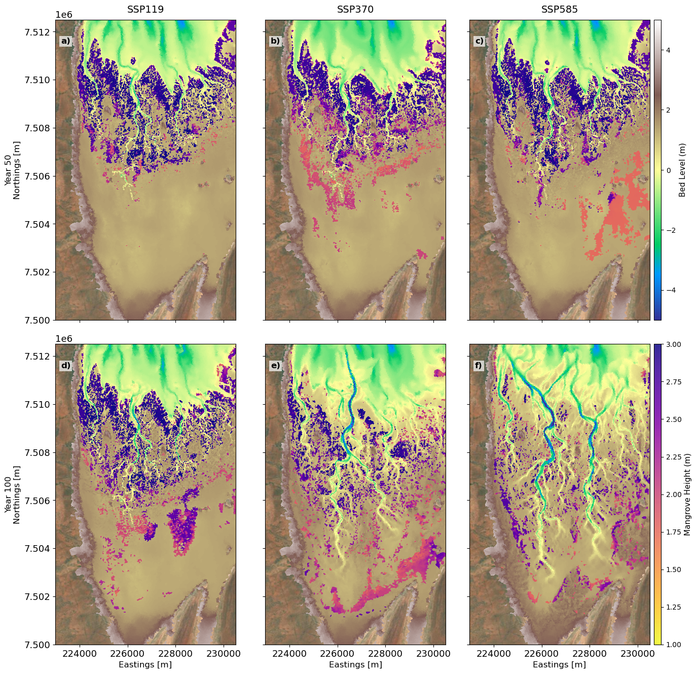
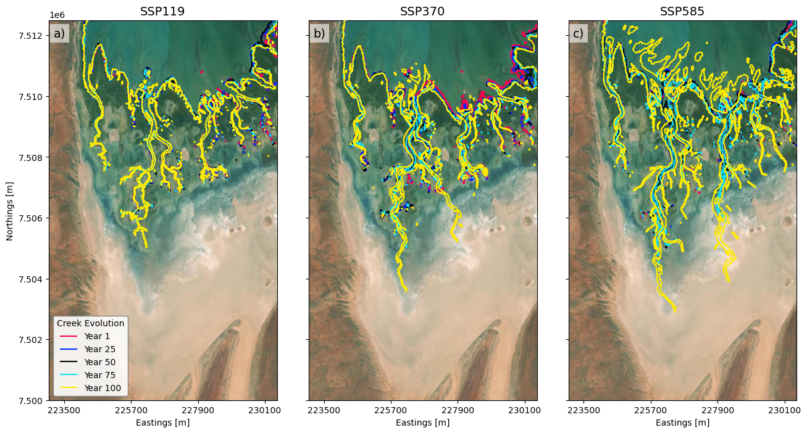
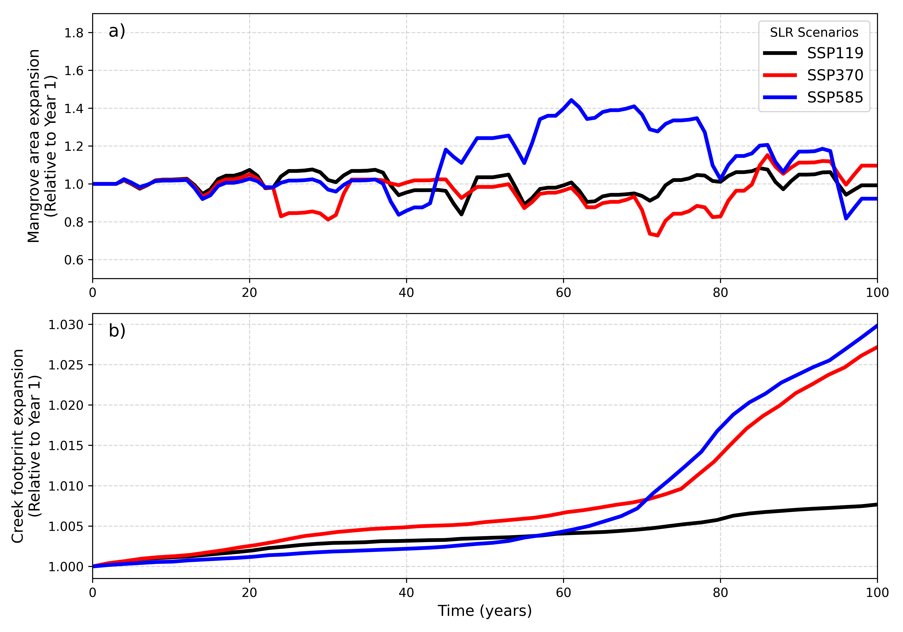
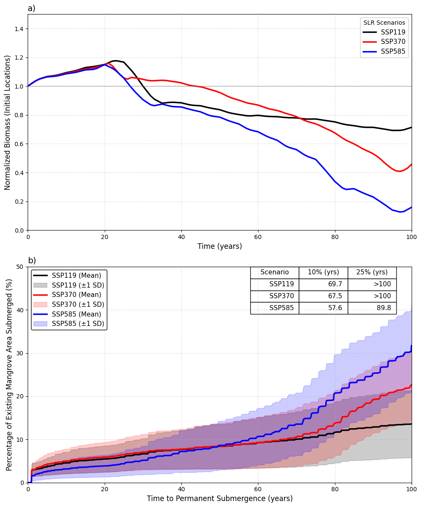
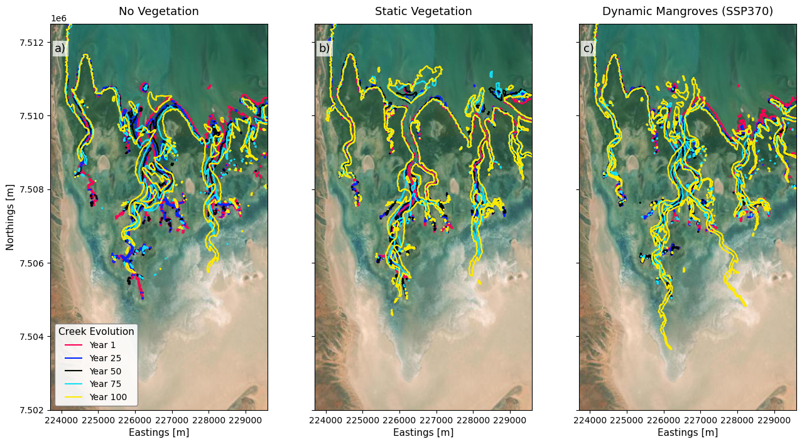

## Sea Level Rise Response

In this section, we present the response of mangroves to different sea-level-rise (SLR) scenarios. As described in Section 2.3, the predicted mangrove extent under present-day environmental conditions was used as the initial condition, and simulations were subsequently performed under a range of SLR scenarios representing low, medium, and high sea-level-rise conditions. The SLR simulations were carried out over a 100-year projection period to assess the long-term response of the mangrove ecosystem to rising sea levels. The results were analysed to investigate changes in mangrove extent and biomass under each SLR scenario and to identify trends in mangrove migration, rates of habitat loss, and potential thresholds beyond which landward migration and ecosystem persistence are no longer possible.

@fig-mangrove-slr-response-animation shows the temporal evolution of mangrove canopy height ($h$) and bed elevation ($z$) across the Giralia Bay study site under three Sea Level Rise (SLR) scenarios: **SSP119 (0.5 m SLR)**, **SSP370 (0.9 m SLR)**, and **SSP585 (1.25 m SLR)** over the 100-year simulation period. The animation illustrates the dynamic interplay between rising sea levels, tidal inundation regimes, and mangrove growth, highlighting spatial and temporal patterns of mangrove expansion, dieback, and landward migration.

As sea level rise progresses, increased hydroperiod and depth along lower-elevation seaward fringes exceed physiological tolerances, triggering dieback and seaward edge drowning—most prominently under high SLR rates. Concurrently, newly inundated supratidal zones create favorable hydrodynamic conditions, facilitating landward encroachment and redistribution of mangrove canopy height across the intertidal gradient.

::: {.callout-note}
## Key Findings: Mangrove SLR Response Dynamics
* **Low-SLR Scenario (SSP119 – 0.5 m):** Mangroves maintain dynamic equilibrium, showing localized expansion along tidal channels with minimal seaward dieback.
* **Moderate-SLR Scenario (SSP370 – 0.9 m):** Progressive drown-out initiates along the lower seaward fringe, partially compensated by landward migration into newly flooded accommodation space.
* **High-SLR Scenario (SSP585 – 1.25 m):** Severe seaward fringe dieback and rapid landward retreat take place, resulting in substantial spatial shifts in canopy height ($h$) distribution across the estuary.
:::

::: {#fig-mangrove-slr-response-animation}
{fig-align="center" width="95%"}

Spatial and temporal evolution of mangrove canopy height ($h$, right colorbar) overlaid on bed level elevation ($z$, left colorbar) across the Giralia Bay study site for three Sea Level Rise scenarios: SSP119 (0.5 m), SSP370 (0.9 m), and SSP585 (1.25 m).
:::

@fig-biomass_norm shows the temporal evolution of the alongshore-integrated mangrove biomass, normalized relative to initial conditions ($\frac{B}{B_0}$), evaluated across 25-year intervals over a 100-year projection period under different Sea Level Rise (SLR) scenarios. Given that the Giralia Bay system exhibits a distinct habitat zonation, initial mangrove biomass displays a unimodal spatial distribution centered within the mid-to-fringing intertidal zone. 

Under the **SSP119** scenario, the system undergoes a gradual transition characterized by a modest decline in seaward fringe biomass alongside a progressive landward migration driven by increased inundation frequency. 

Conversely, the medium to higher-emission scenarios (**SSP370** and **SSP585**) exhibit a two-phase response:

* **Phase 1 (Years 1–50):** Relative stability over the first 50 years.
* **Phase 2 (Years 50–100):** Rapid non-linear reorganization. 

Beyond Year 50, extensive dieback occurs along the seaward fringe, accompanied by significant mangrove expansion into newly suitable landward high-intertidal habitats. Notably, by Year 100, landward biomass accumulation under **SSP370** exceeds that of **SSP585**. This divergence indicates that the rate of SLR under SSP585 outpaces the maximum physiological or ecological colonization rate of the mangroves, leading to net habitat drowning despite available inland migration space.

::: {#fig-biomass_norm}
{fig-align="center" width="95%"}

Alongshore integrated biomass for different SLR scenarios. Panel a) shows the basemap for illustrative purposes. Panels b), c), and d) show the alongshore integrated biomass for SLR SSP119, SSP370, and SSP585 scenarios.
:::

@fig-Giralia_mangrove_evolution shows the spatial distributions of mangroves for Year 50 and Year 100, highlighting the diverging long-term trajectory of mangrove extent across SSP119, SSP370, and SSP585 scenarios. During the initial ~40 years of simulation across all climate projections, differences in predicted mangrove coverage remain relatively subtle, as sea-level rise (SLR) rates remain within thresholds that permit localized bed level equilibration and persistence along established intertidal zones.

Spatially, baseline mangrove distribution is heavily governed by tidal inundation and bed elevation, originally dominating the seaward and central channel networks. However, progressive SLR triggers a distinct landward transgression alongside substantial dieback along the seaward boundaries:

* **SSP119 (Low Emission):** At Year 50 (@fig-Giralia_mangrove_evolution a), the mangrove fringe maintains structural stability with negligible loss along the lower intertidal zone and initial establishment in the southern high-intertidal flats. By Year 100 (@fig-Giralia_mangrove_evolution d), a modest landward expansion occurs into high-elevation flats characterized by shorter, newly established mangrove foliage ($h < 1\text{ m}$), while the core seaward forest retains canopy heights exceeding $2\text{ m}$.
* **SSP370 (Intermediate Emission):** By Year 50 (@fig-Giralia_mangrove_evolution b), subtle fragmentation emerges along the seaward margin. By Year 100 (@fig-Giralia_mangrove_evolution e), rapid landward migration dominates the southern boundary, where extensive, tall mangrove stands ($h > 2\text{ m}$) establish across newly inundated supratidal areas. Concurrent expansion also tracks along newly widened inner tidal channels.
* **SSP585 (High Emission):** At Year 50 (@fig-Giralia_mangrove_evolution c), shows a similar pattern to SSP370. However, by Year 100 (@fig-Giralia_mangrove_evolution f), the system undergoes widespread coastal squeeze and seaward dieback. While mangroves colonize the far-southern landward fringe, the total footprint is diminished compared to SSP370. Higher inundation rates lead to channel drowning and permanent submergence of the seaward mudflats, causing significant loss of historical habitat without an equivalent gain in landward area.

::: {.callout-note}
## Key Findings: Non-Linear Tipping Points
Overall, spatial modelling highlights a **non-linear tipping point past Year 50** under moderate-to-high Sea Level Rise (SLR). 

Landward expansion temporarily compensates for seaward loss; however, under extreme SLR (**SSP585**), the rate of sea-level rise outpaces landward colonization capacity, resulting in net habitat contraction.
:::

::: {#fig-Giralia_mangrove_evolution}
{fig-align="center" width="95%"}

Modelled spatial evolution of bed elevation ($z$) and mangrove canopy height ($h$) across the study site at Year 50 (top row) and Year 100 (bottom row) under three climate projections: (a, d) SSP119, (b, e) SSP370, and (c, f) SSP585.
:::

---

### Morphological Response

To isolate and track the morphological response of the tidal network to sea-level rise (SLR), the active creek network was extracted using the $-0.5\text{ m}$ bed elevation contour at 25-year intervals (Years 1, 25, 50, 75, and 100) in @fig-Giralia_creek_evolution. Across all scenarios, increased tidal prism volumes driven by rising sea levels induce pronounced bed scour, channel widening, and headward erosion. This forces the main tidal channels to extend progressively landward into previously supratidal salt flats over time.

The magnitude of this landward channel extension varies significantly across climate forcings:

1. **SSP119:** Primary tidal channels experience limited headward migration, extending southward by approximately $0.5\text{ km}$ beyond their baseline position, with morphological changes mostly confined to localized lateral adjustments.
2. **SSP370:** Accelerated SLR drives substantial channel deepening and landward elongation, pushing the main creeks approximately $2.5\text{ km}$ southward by Year 100 alongside extensive secondary branching.
3. **SSP585:** Massive headward erosion causes the main creeks to extend $>4\text{ km}$ landward, accompanied by severe channel widening along the seaward reaches due to extreme estuarine drowning.

::: {#fig-Giralia_creek_evolution}
{fig-align="center" width="95%"}

Spatiotemporal evolution of the tidal creek network over 100 years under (a) SSP119, (b) SSP370, and (c) SSP585 scenarios. Channels are delineated by extracting the $-0.5\text{ m}$ bed level contour at 25-year intervals (Years 1, 25, 50, 75, and 100).
:::
To assess the systemic morphological and ecological adjustments to sea-level rise (SLR), the normalized time series of total mangrove area and tidal creek planform footprint relative to initial conditions were evaluated (@fig-Giralia_temporal_evolution). 

During the first 40–50 years, both metrics exhibit a relative lag phase characterized by subtle, near-baseline fluctuations (normalized values fluctuating near $1.0$). This initial stability reflects a meta-stable equilibrium, where early hydrodynamic forcing and sea-level increments remain within ecological tolerance limits and thresholds for localized bed shear stress. Consequently, vertical accretion and minimal horizontal reconfiguration suffice to maintain system stability across all scenarios (SSP119, SSP370, and SSP585).

Beyond Year 50–60, clear non-linear divergence occurs across the projections, particularly governing channel footprint expansion (@fig-Giralia_temporal_evolution b):

* **SSP585 Channel Expansion:** Under SSP585, the tidal creek expansion rate initially lags behind SSP370 up to approximately Year 60. Extreme early SLR in SSP585 increases the tidal prism volume and ebb-jet energy, causing channel responses to be dominated by vertical bed incision and cross-sectional deepening rather than rapid headward elongation. 
* **Post-Year 60 Inflection:** Past Year 60, an inflection point is reached as increased inundation frequency drowns intertidal margins, causing tidal shear stress to breach headward erosion thresholds. This initiates a sharp acceleration in landward channel extension and network branching through Year 100, reaching a relative footprint expansion $>2.5$, compared to more moderate trajectories under SSP119 ($<1.2$).

Similarly, normalized mangrove surface area (@fig-Giralia_temporal_evolution a) shows complex non-monotonic behaviour driven by competing mechanisms of seaward edge drowning and landward opportunistic colonization:

* **SSP585 Surge & Collapse:** Under SSP585, mangrove footprint surges past Year 45, peaking at nearly $1.4\times$ initial coverage around Year 60 due to rapid inland expansion across previously dry supratidal flats. However, between Years 70 and 80, catastrophic seaward fringe dieback and channel drowning cause a rapid decline back toward baseline values ($1.0$). 
* **Spatial Displacement by Year 100:** By Year 100, while net normalized mangrove area under SSP585 rebounds close to $1.1$, a critical spatial displacement occurs: the historical low-intertidal forest is entirely lost to estuarine drowning, and survival is maintained solely because mangroves progressively climb the steeper, elevated terrain along the western margins of the basin.

::: {#fig-Giralia_temporal_evolution}
{fig-align="center" width="95%"}

Temporal evolution of normalized (a) total mangrove area and (b) tidal creek planform footprint relative to initial conditions over a 100-year simulation under SSP119 (black), SSP370 (red), and SSP585 (blue) scenarios.
:::
---

### Implications of Sea-Level Rise on the Present Mangrove Footprint

To evaluate the long-term viability of existing mangroves under different SLR scenarios, we restricted our analysis to the initial spatial footprint of mangroves and deliberately excluded landward migration. @fig-Giralia_temporal_evolution_existing_location shows the temporal trajectory of total normalized biomass retained strictly within the initial mangrove extent over a 100-year simulation period (@fig-Giralia_temporal_evolution_existing_location a) and the cumulative percentage of the initial mangrove footprint subjected to permanent inundation (@fig-Giralia_temporal_evolution_existing_location b). 

Permanent submergence is defined as continuous 14-day water depth exceeding site-specific tolerance thresholds:

$$z_{\text{submergence}} = \mu_{\text{threshold}} \pm 1\sigma$$

Across all three SLR scenarios, normalized biomass in original locations initially increases during the first two decades, reaching a peak near year 20 to 25 at approximately $1.1\text{–}1.2$ times the initial baseline (@fig-Giralia_temporal_evolution_existing_location a). This initial phase reflects early-stage canopy maturation and biomass accumulation in intertidal cells where water depth remains within tolerable physiological limits. During this same interval, permanent submergence remains low (@fig-Giralia_temporal_evolution_existing_location b), staying below $5\%$ across all scenarios.

Beyond year 25, a critical inflection point occurs as accelerating sea-level rise overwhelms intertidal elevations:

| Scenario | Submergence Trajectory (@fig-Giralia_temporal_evolution_existing_location b) | Biomass Retention Trajectory (@fig-Giralia_temporal_evolution_existing_location a) |
|:---|:---|:---|
| **SSP119** | Submergence reaches $5\%$ at Year 50; terminates at $\sim 15\%$ area loss by Year 100. | Normalized biomass stabilizes around $0.85\times$ toward end of century. |
| **SSP370** | Habitat loss accelerates after Year 60. Submergence reaches $20\%$ at Year 75, rising to $\sim 45\%$ by Year 100. | Normalized biomass declines steadily, dropping to $0.45\times$ of initial value. |
| **SSP585** | Submergence reaches $25\%$ at Year 50, $60\%$ at Year 75, and exceeds $85\%$ (upper bounds near $95\%$) by Year 100. | Rapid inundation triggers steep decline; total biomass drops to $<0.1\times$ of initial levels. |

We found a strong inverse relationship exists between the rate of permanent submergence (@fig-Giralia_temporal_evolution_existing_location) and the retention of localized biomass (@fig-Giralia_temporal_evolution_existing_location a). The onset of rapid biomass decline across all scenarios directly mirrors the temporal acceleration of continuous drowning. While biomass loss exceeds the absolute percentage of drowned surface area, this could be due to environmental stress which reduces stem density and productivity prior to complete drowning. The relative divergence among climate scenarios follows an identical sequence in both metrics, with SSP585 showing severe degradation followed by moderate and partial degradation of SSP370 and SSP119. 

> **Summary:** Without physical space for landward retreat, existing mangrove stands will experience widespread dieback and substantial standing biomass loss under moderate-to-high sea-level rise scenarios.

::: {#fig-Giralia_temporal_evolution_existing_location}
{fig-align="center" width="95%"}

The temporal trajectory of total normalized biomass retained within the initial mangrove extent over a 100-year simulation period in panel a) and the cumulative percentage of the initial mangrove footprint subjected to permanent inundation exceeding specific thresholds ranging from $0.2\text{--}0.8\text{ m}$ represented as $\text{mean} \pm 1\text{ standard deviation}$
:::
---

## Discussion

Our numerical modelling demonstrates that mangrove migration in response to sea-level rise (SLR) is an inherently non-linear process. Even under high SLR scenarios, mangroves within the fringing coast do not simply retreat uniformly; instead, they display spatial resilience, surviving and persisting within elevated coastal patches across the region. Crucially, this non-linear response can only be captured because our model incorporates the full, bi-directional coupling of hydro-morphodynamic and eco-vegetation feedbacks, allowing the landscape and vegetation to dynamically co-evolve rather than assuming passive inundation.

In this section, we discuss the broader implications of applying this fully coupled framework to sea-level rise predictions, compare its performance against traditional modelling paradigms, and evaluate the overall transferability of our Python-based workflow to other coastal systems. Finally, we address the key assumptions and limitations inherent to our modelling approach and outline critical future research directions to further refine regional-scale eco-morphodynamic forecasting.

---

### Implications of Hydro-Morphodynamic and Vegetation Feedbacks for Sea-Level Rise Predictions

In this study, we present a fully coupled approach that explicitly resolves the three-way, non-linear feedbacks between hydrodynamics, morphodynamics, and vegetation dynamics. While previous research has successfully demonstrated the significance of three-way dynamic coupling, existing frameworks have largely been restricted to idealized laboratory domains or localized site-specific applications on the order of hundreds of meters. Here, we scale up this coupled numerical framework to regional coastal scales spanning hundreds of kilometers, allowing us to evaluate multi-decadal landscape evolution under sea-level rise (SLR). 

Accounting for such a fully dynamic coupled system is paramount when predicting long-term coastal morphological response to SLR. Static or uncoupled models fail to capture the continuous bi-directional adjustments between fluid flow, sediment transport, bed level changes, and vegetation colonization or mortality—feedbacks that fundamentally dictate channel network stability, sediment trapping, and inland marsh or mangrove migration pathways.

To demonstrate the critical necessity of this integrated framework, numerical simulations were executed under identical hydrodynamic forcing and initial topographic conditions across three distinct vegetation treatments:

1. **No Vegetation:** Unvegetated morphodynamics.
2. **Static Vegetation:** Spatially fixed, passive vegetation drag without temporal adaptation.
3. **Dynamic Mangroves (SSP370):** Explicit eco-morphodynamic feedback involving establishment, growth, and dieback.

@fig-Giralia_creek_evolution_veg_vs_no_veg highlights the long-term creek evolution across these three scenarios, where tidal creek channels were delineated by extracting contours corresponding to a bed elevation threshold of $-0.5\text{ m}$ relative to datum across a 100-year simulation timeline (Year 1 to Year 100).

::: {#fig-Giralia_creek_evolution_veg_vs_no_veg}
{fig-align="center" width="95%"}

Long-term creek evolution across no vegetation (panel a), static vegetation (panel b) and dynamic vegetation (panel c) for a similar sea level rise forcing with identical initial conditions.
:::

The morphological progression of tidal creek networks exhibits fundamental differences across the three scenarios:

* **No Vegetation (@fig-Giralia_creek_evolution_veg_vs_no_veg a):** In the absence of vegetation, unconstrained flow drives widespread channel widening, severe headward incision, and erratic, unanchored creek migration over time. Lacking root-induced soil cohesion and vegetative flow resistance, channels bifurcate and avulse unpredictably, creating an over-extended, highly unstable drainage network that rapidly erodes under rising water levels.
* **Static Vegetation (@fig-Giralia_creek_evolution_veg_vs_no_veg b):** Incorporating non-adaptive, static drag element vegetation reduces local flow velocity, confining channel migration compared to the unvegetated case. However, because the vegetation cannot adaptively grow, die back, or recolonize in response to changing inundation regimes, channels become locked into fixed corridors. Sediment continuously accumulates within static drag fields without eco-morphodynamic relief, eventually forcing abrupt channel avulsions or localized drowning as the system fails to accommodate accelerating SLR.
* **Dynamic Mangroves (@fig-Giralia_creek_evolution_veg_vs_no_veg c):** The fully coupled dynamic mangrove model reveals a significantly more cohesive, resilient, and focused channel network. Dynamic feedbacks allow mangroves to continuously adjust their density and spatial distribution based on inundation frequency and bed shear stress. As mangroves colonize newly suitable elevated mudflats, flow is selectively funnelled into major drainage corridors, stabilizing channel banks while promoting landward network elongation. By Year 100, the dynamic framework predicts organized, highly continuous creek systems extending farther inland to maintain hydrological equilibrium—a trajectory completely uncaptured by static or uncoupled assumptions.

#### Comparison with Alternative Modelling Paradigms

* **Bathtub Models:** Bathtub models rely purely on passive topographic inundation based on water surface elevations, assuming fixed land contours and ignoring both sediment transport and biophysical adaptation. Consequently, bathtub approaches drastically miscalculate future mangrove migration pathways: they overestimate landward migration where steep topography or sediment deficits impede movement, while simultaneously underestimating the ability of dynamically growing mangrove systems to accrete sediment, build bed elevation, and actively carve stable tidal corridors that facilitate landward establishment.
* **Pseudo-Dynamic (Offline) Models:** Offline or multi-stage coupled approaches update hydrodynamics, morphological updates, and vegetation cover sequentially at discrete, coarse time steps, missing crucial transient feedbacks. Offline coupling fails to capture high-frequency interactions during extreme events or seasonal recruitment windows, leading to artificial stepped channel evolution, inaccurate sediment depositional footprints, and miscalculated thresholds for mangrove drowning versus survival.

---

### Transferability, Assumptions and Limitations, and Future Directions

#### System Transferability
The framework developed in this study is designed to be transferable and adaptable to a wide range of coastal ecosystems globally. The vegetation model employed is open-source and was specifically modified and calibrated here to represent an arid mangrove system. However, the parameterization can easily be tweaked to simulate other mangrove species, salt marsh plants, or alternative coastal vegetation types by adjusting bio-geomorphic thresholds such as:

* Inundation tolerance
* Drag coefficients
* Vegetative growth rates

Furthermore, the two-way dynamic coupling between the hydro-morphodynamic solver (Delft3D Flexible Mesh / DFM) and the vegetation module was executed using a custom Python-based module. Because Python is widely used across computational fields, this integrated coupling workflow can be seamlessly transferred to other coastal domains, alternative hydrodynamic engines, or expanded ecological systems with minimal modification.

#### Key Assumptions and Limitations

1. **Salinity Dynamics:** Spatial and temporal variations in surface salinity and sub-surface porewater dynamics are not explicitly accounted for in the present vegetation framework. In hyper-arid or seasonally dry estuarine environments, porewater salinity within the root zone represents a primary physiological control governing mangrove survival, zonation, and competitive dominance. Although DFM can compute salinity transport, preliminary analyses revealed difficulty replicating extreme hyper-saline conditions ($\mathcal{O}(100\text{ ppt})$) on upper supratidal flats due to the numerical wetting-and-drying scheme: when shallow cells evaporate and dry out, localized salt mass history is lost upon re-wetting.
2. **Hydrodynamic Forcing Exclusions:** Simulations were conducted strictly under tidal hydrodynamics without incorporating wind-wave action or storm surges. Omission of wave modules means wave-driven erosion, edge retreat, and extreme wave disturbance events are not captured in long-term landward progression predictions.
3. **Dimensionality (2DH Mode):** Numerical simulations were carried out in 2D depth-averaged (2DH) mode. While computationally efficient for regional scales spanning hundreds of kilometers, 2DH neglects vertical flow structures, stratification, and secondary circulation in deep channels.
4. **Propagule Transport and Hydrochory:** Mangrove establishment is evaluated dynamically based on localized physical suitability thresholds rather than explicit hydrochory. Candidate cells are determined using a window-of-opportunity (WoO) concept (relative inundation frequency and bed shear stress below critical erosion thresholds). The model assumes ever-present seed availability, omitting explicit dispersal pathways, travel times, and hydrochory dynamics [@VanderStocken2019]. Additionally, recruitment relies purely on seedling-based colonization and omits vegetative re-sprouting mechanisms [@Krauss2020; @Vizcaya-Martnez2022].
5. **Soil and Sub-Surface Processes:** Simulations account solely for inorganic surface sediment accretion with uniform substrate across 20 vertical layers. Organic accretion (refractory root production and leaf litter decay) contributes directly to vertical elevation gain [@Middleton2001; @McKee2021], particularly in sediment-starved environments. Unmodeled sub-surface processes (deep/shallow subsidence, sediment compaction, and organic decomposition) could alter net surface elevation capital [@Breda2021].

#### Future Directions

To build upon the foundation established in this work, future efforts should prioritize:

* Integrating salinity transport and its explicit physiological feedback into vegetation and hydrodynamics modules.
* Incorporating sub-surface soil modules accounting for organic root production, peat formation, compaction, and auto-subsidence alongside inorganic sediment transport.
* Enhancing the biological module to incorporate multi-species interactions, vegetative re-sprouting mechanics, and variable propagule viability windows following extreme climate events.
