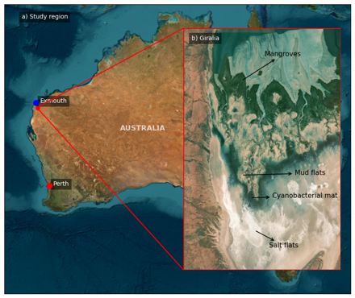

# Overview

Mangroves are salt-tolerant intertidal trees and shrubs widely distributed across tropical, subtropical, and arid coastlines [@Spalding2010; @Beselly2021]. They act as critical nursery and foraging grounds for diverse fauna [@FAO2023] while providing essential coastal protection by attenuating wave energy and stabilizing shorelines [@vanHespen2023]. Over the past decade, scientific output on mangrove ecosystems has accelerated—growing by 183% between 2015 and 2025—underscoring their recognized importance in climate adaptation, blue carbon, and coastal resilience.

Accelerating sea-level rise (SLR) and changing storm regimes pose significant threats to coastal environments [@Emanuel2005; @Knutson2010]. While mangroves exhibit inherent resilience [@Gilman2008], landward restrictions (e.g., coastal infrastructure or rocky cliffs) combined with extreme conditions can induce "coastal squeeze," leading to net habitat loss [@Almeida2025].

::: {#fig-giralia-site}
{fig-align="center" width="95%"}

Study site at Giralia Bay within the Exmouth Gulf, Northwestern Western Australia. **(a)** Regional setting. **(b)** Cross-shore intertidal zonation displaying mangroves, mudflats, cyanobacterial (algal) mats, and high-elevation salt flats.
:::

In the hyper-arid Pilbara region of Western Australia, specifically **Giralia Bay (Exmouth Gulf)**, intertidal habitats feature a distinct zonation dictated by continuous tidal forces and substrate elevation (@fig-giralia-site). The cross-shore transition moves landward from a seaward mangrove fringe to mudflats, expansive cyanobacterial (algal) mats, and high-elevation salt flats. Hydrodynamics across this region are predominantly tidally driven, with wave forcing becoming significant primarily during storm and cyclonic events.

---

## Eco-Geomorphic Modeling Approach

Predicting mangrove response to SLR requires accounting for eco-geomorphic feedbacks and tidal inundation limits [@Woodroffe2016]. While inundation dynamics depend on coastal slope, sediment supply, and hydrodynamics [@FitzGerald2008; @Passeri2015; @Xie2022], modeling approaches vary in scale and capability:

* **Tree-Scale & Lifecycle Models:** Individual-Based Models (e.g., *MesoFON*, *MANGA*) and lifecycle frameworks [@Grueters2014; @Henderson2024; @Wimmler2024] resolve fine-scale competition and biomass, but often lack dynamic hydro-morphological coupling.
* **Process-Based Hydrodynamic Models:** Engines like *Delft3D-Flexible Mesh (DFM)* simulate regional flow and sediment transport, but traditionally simplify vegetation interactions.
* **Coupled Bio-Morphodynamic Models:** Hybrid frameworks (e.g., *DFMFON*, *BASEveg*) integrate biological dynamics with physical drivers [@Willemsen2022; @Beselly2023; @Caponi2023]. However, computational constraints have largely restricted their application to idealized or small-scale domains.

To overcome these limitations, we coupled **DFM** [@Kernkamp2011] with **NBSDynamics** [@Deltares2022], a Python-based vegetation module. Optimized for parallel execution on High-Performance Computing (HPC) platforms, this framework enables regional-scale eco-geomorphic simulations while preserving process-based vegetation–hydrodynamic–morphological feedbacks.

The primary objective of this study is to quantify how projected SLR scenarios alter the spatial extent and structural resilience of mangrove forests (*Avicennia marina*) within Giralia Bay
