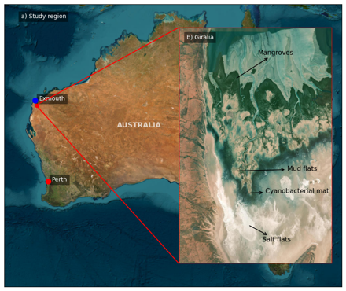

## Study Site: Giralia Bay

The study site is located in Giralia Bay, within the eastern portion of Exmouth Gulf, Western Australia ($22.4^{\circ}\text{S}$, $114.3^{\circ}\text{E}$). Exmouth Gulf is a shallow, semi-enclosed embayment approximately $75\text{ km}$ long and less than $20\text{ m}$ deep, bordered by low-relief peninsulas to the west and south. The bay lies within the onshore portion of the Carnarvon Basin and is underlain by calcarenitic rock units covered by late Holocene deposits of shales and sandstones, which are overlain by unconsolidated Quaternary deposits. The coastal plain surrounding the bay is mantled by sequences of Holocene and late Pleistocene sediments, including relict beach ridges, coral reefs, aeolian sands, and supratidal sabkha flats with extensive evaporite crusts [@Riera2023].

::: {#fig-giralia-site}
{fig-align="center" width="95%"}

Study site at Giralia Bay within the Exmouth Gulf, Northwestern Western Australia. **(a)** Regional setting. **(b)** Cross-shore intertidal zonation displaying mangroves, mudflats, cyanobacterial (algal) mats, and high-elevation salt flats.
:::

The region experiences a warm, hyper-arid climate, with a mean annual air temperature of $25\,^{\circ}\text{C}$ (mean minimum $17\,^{\circ}\text{C}$; mean maximum $32\,^{\circ}\text{C}$), and summer peaks reaching up to $47\,^{\circ}\text{C}$. Mean annual rainfall is exceptionally low at $250\text{ mm yr}^{-1}$. However, the region is periodically impacted by severe tropical cyclones every two to three years, bringing wind gusts exceeding $300\text{ km h}^{-1}$ and extreme rainfall events exceeding $600\text{ mm yr}^{-1}$ [@Santini2013].

Recognising the high ecological significance and fragile environmental values of this arid coastal landscape, the Western Australian State Government established an Indigenous Land Use Agreement (ILUA) with the Nganhurra Thanardi Garrbu Aboriginal Corporation to create [Giralia National Park](https://www.wa.gov.au/government/media-statements/Cook%20Labor%20Government/Key-milestone-reached-for-protection-of-Exmouth-Gulf-20240524) and the adjoining Boologooro Nature Reserve under the *Plan for Our Parks* initiative.

### Intertidal Habitat Zonation

Within Giralia Bay, intertidal habitats display a distinct, continuous cross-shore zonation dictated primarily by tidal inundation frequency and substrate elevation (@fig-giralia-site). Moving landward from the open water, the ecosystem transitions through four primary zones:

1. **Seaward Mangrove Fringe:** Predominantly composed of *Avicennia marina*, occupying the lower-to-mid intertidal zone where regular tidal flushing occurs.
2. **Mudflats:** Low-gradient unvegetated zones exposed during low tides.
3. **Cyanobacterial (Algal) Mats:** Expansive microbial communities covering the mid-to-high intertidal flat, thriving under episodic inundation.
4. **High-Elevation Salt Flats:** Supratidal sabkha environments characterized by hypersaline conditions and sparse or absent vegetation.

Hydrodynamics across this region are predominantly tidally driven, with wave forcing becoming significant primarily during cyclonic and severe storm events.

---

## Eco-Geomorphic Modelling Approach {#sec-giralia-approach}

Predicting coastal habitat responses to accelerating sea-level rise (SLR) requires accounting for coupled bio-geomorphic feedbacks and physiological tidal inundation limits [@Woodroffe2016]. While mangroves exhibit inherent resilience [@Gilman2008], landward restrictions combined with extreme hydrodynamic stress can induce "coastal squeeze," leading to net habitat loss [@Almeida2025].

To simulate these dynamics at a regional scale, we integrated a process-based hydrodynamic and morphodynamic engine with dynamic biological modules, see [@sec-model-overview] for more details. Refer to @sec-hydro-overview for model detailed model description.

* **Hydrodynamic & Morphodynamic Framework:** We utilised **Delft3D-Flexible Mesh (DFM)** [@Kernkamp2011] to model regional water levels, flow velocities, and bed shear stress across the complex grid geometry of Giralia Bay.
* **Mangrove Model:** Coupled directly to DFM via **NBSDynamics** [@Deltares2022], mangrove establishment, growth, and mortality (*Avicennia marina*) were dynamically evaluated based on inundation suitability and bed shear stress thresholds, as detailed in [@sec-vegetation-effects].
* **Cyanobacterial (Algal) Mat Prediction:** Using the hydro-morphodynamic outputs generated by DFM combined with the dynamically predicted spatial boundaries of the mangrove forest, cyanobacterial (algal) mat distribution was subsequently mapped and predicted across the domain.

The calibration and validation of the hydrodynamic model, mangrove and algal mats are detailed in [@sec-hydro-calibration] and [@sec-mangrove-giralia-calibration], respectively.
