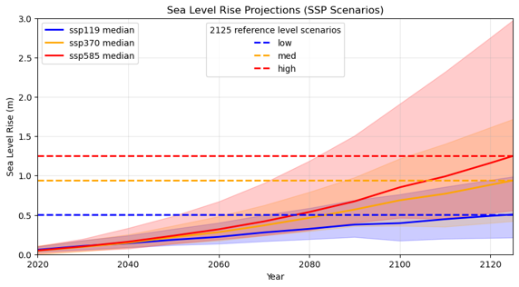

## Sea Level Rise (SLR) Forcing & Experimental Design

To evaluate the future response of mangrove ecosystems to accelerating environmental changes, we evaluated three Shared Socioeconomic Pathway (SSP) scenarios from the Intergovernmental Panel on Climate Change [@IPCC2021; @ONeill2016]: **SSP1-1.9**, **SSP3-7.0**, and **SSP5-8.5**.

These scenarios encompass a broad spectrum of global emission trajectories and corresponding sea-level rise projections:

* **SSP1-1.9 (Low SLR):** Represents a low-emission, sustainability-focused pathway that limits global warming to approximately $1.5^\circ\text{C}$, resulting in a projected reference SLR of $\approx 0.5\text{ m}$ by year 2125.
* **SSP3-7.0 (Medium SLR):** Models a medium-to-high emission future featuring regional rivalry and high radiative forcing, resulting in a reference SLR of $\approx 0.95\text{ m}$ by year 2125.
* **SSP5-8.5 (High SLR):** Projects a high-emission, fossil-fuel-intensive development strategy, resulting in a reference SLR of $\approx 1.25\text{ m}$ by year 2125.

Implementing this three-tiered approach establishes a robust envelope of potential future outcomes—spanning conservative to pessimistic pathways—which is critical for identifying thresholds of mangrove vulnerability and potential ecosystem collapse (@fig-slr-projections).

::: {#fig-slr-projections}
{fig-align="center" width="90%"}

Sea level rise (SLR) projections based on Shared Socioeconomic Pathway (SSP) scenarios (SSP1-1.9, SSP3-7.0, and SSP5-8.5), representing low, medium, and high sea-level rise trajectories projected through 2125.
:::

---

### Key Modelling Assumptions & Boundary Forcing

To evaluate long-term eco-geomorphic adaptation, two critical methodological assumptions were applied to the model setup:

#### 1. Isolation of Sea Level Rise as a Single Driver
While climate change encompasses multiple interconnected environmental drivers—including shifting wind regimes, warming temperatures, varying atmospheric humidity, intensified storm frequency, and complex root-zone salinity dynamics—this study intentionally **isolates sea level rise**. Decoupling SLR from other confounding factors allows us to evaluate its direct physical and hydrodynamic impact on landward mangrove migration and survival.

#### 2. Filtering Short-Term Noise via Harmonic Analysis
In northwestern Western Australia, short-term hydrodynamic variability on seasonal and interannual scales (1–5 years) is pronounced and heavily influenced by the El Niño–Southern Oscillation (ENSO). Shifting ENSO phases can temporarily amplify or mask local water levels. 

To prevent transient climatic fluctuations from skewing long-term morphodynamic trends, we performed **harmonic analysis** on the boundary forcing. We extracted the primary astronomical tidal constituents:
* **$M_2$** (Principal lunar semidiurnal)
* **$S_2$** (Principal solar semidiurnal)
* **$K_2$** (Lunisolar semidiurnal)
* **$O_1$** (Lunar diurnal)

By superimposing projected SLR onto these fundamental tidal constituents, high-frequency interannual noise is filtered out, ensuring that the simulations isolate true long-term ecological and morphological adaptation trends.