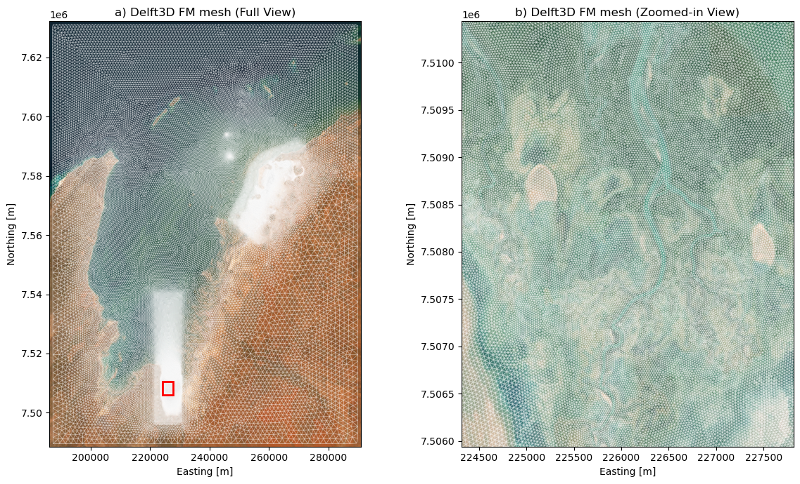
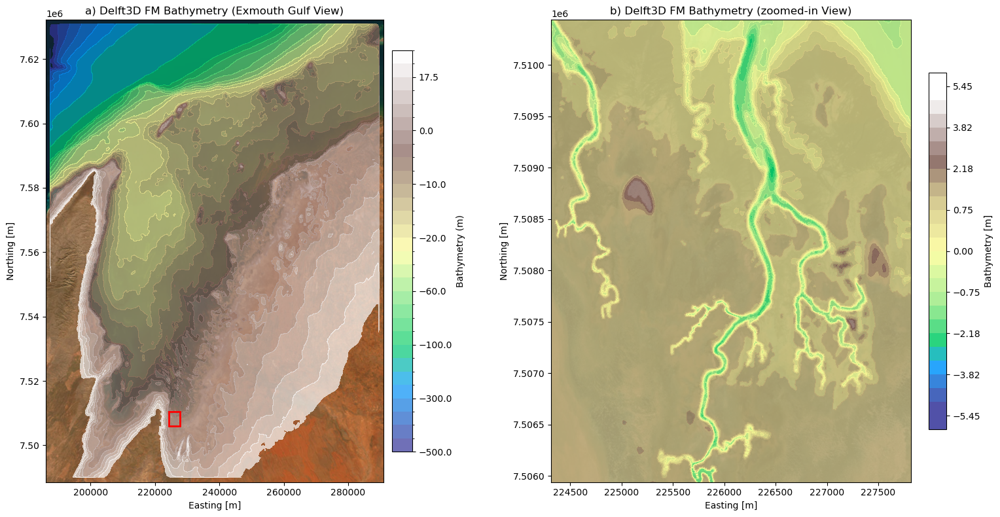
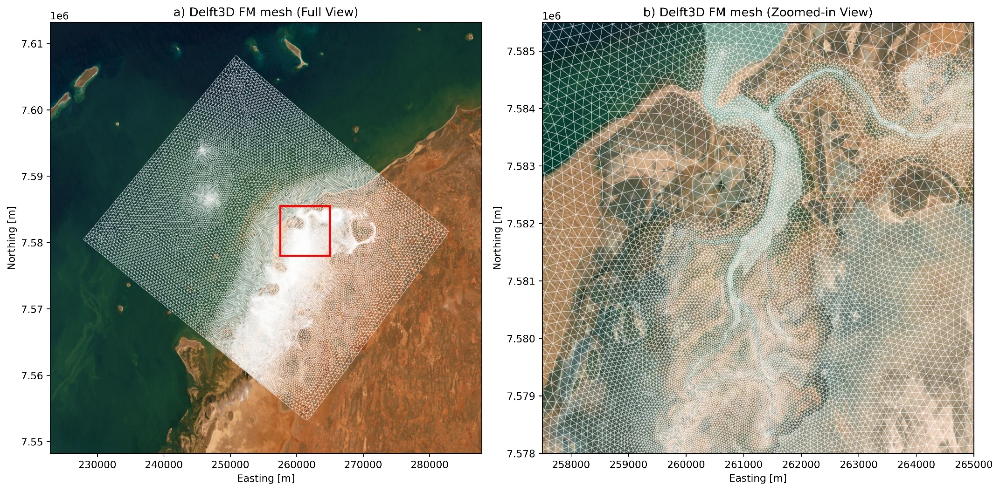
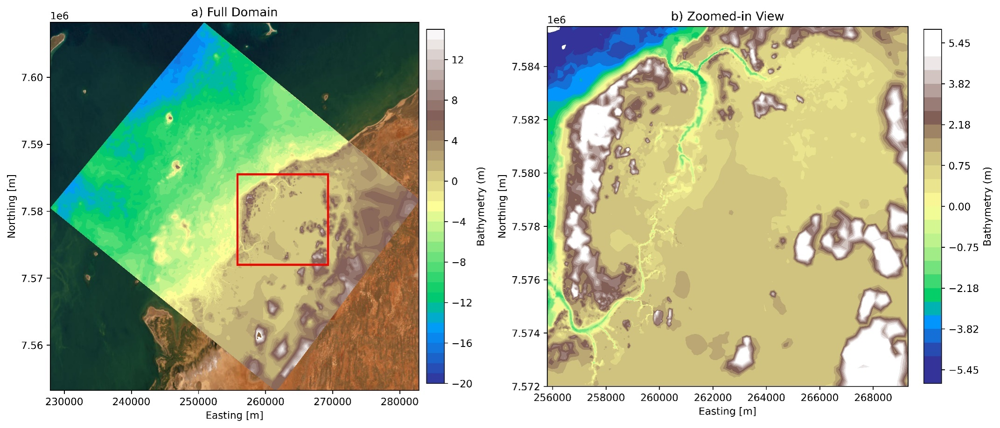
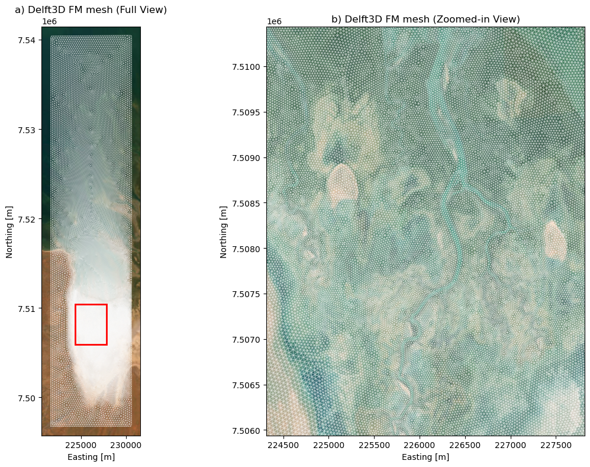
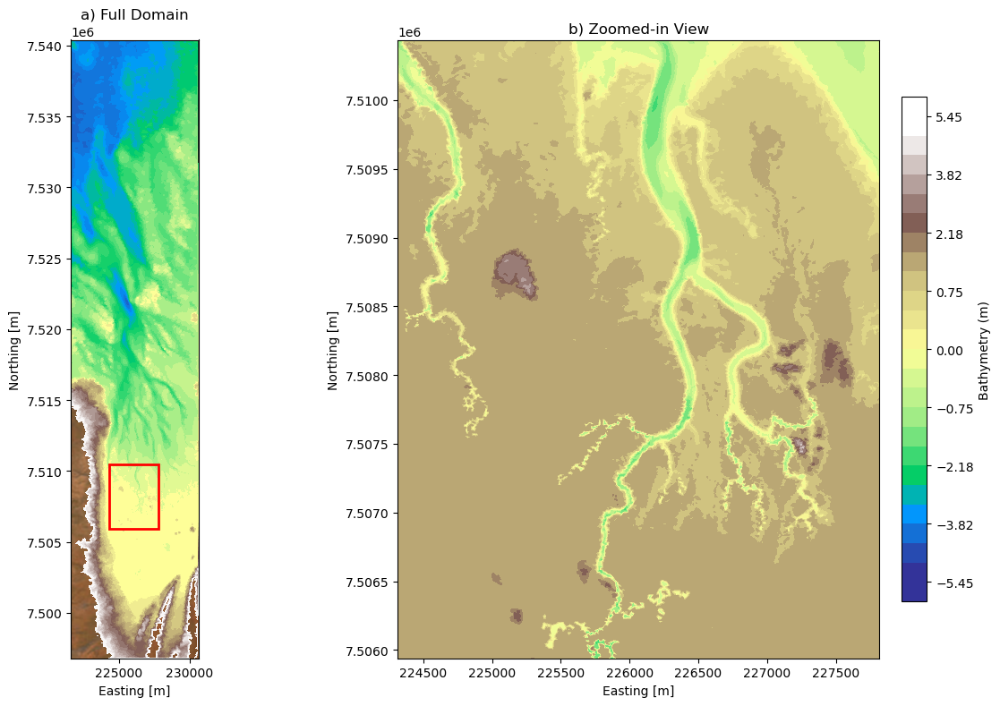
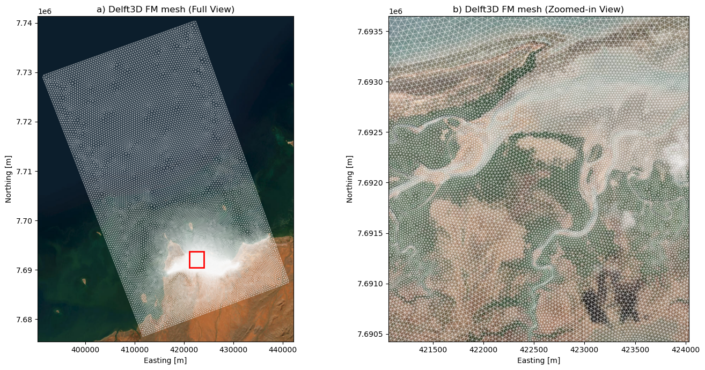
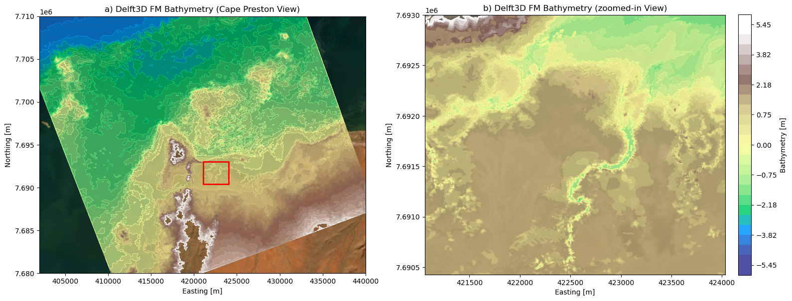
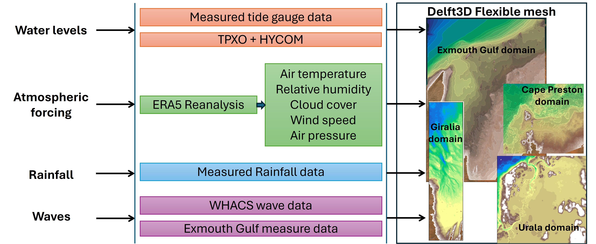
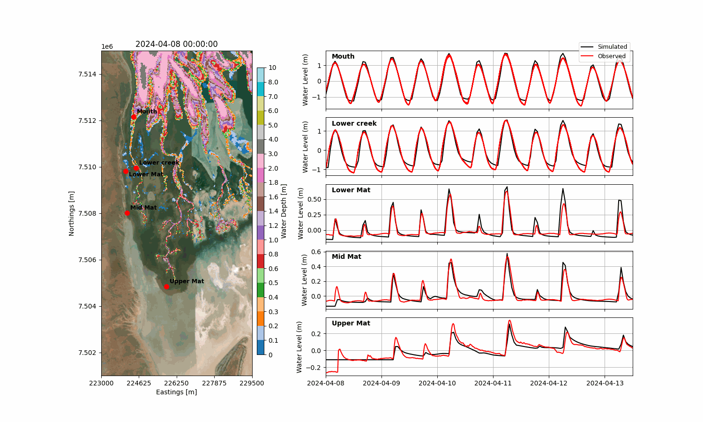

## Hydrodynamic Modelling Overview

To assess coastal and intertidal hydrodynamic processes and support habitat migration predictions, a multi-scale numerical modeling framework was developed using **Delft3D Flexible Mesh (Delft3D FM)**. 

To account for broader regional dynamics, severe weather phenomena, and open-ocean boundary influences, a **Regional Scale Model** was established for the Exmouth Gulf, covering both the Giralia and Urala domains. Operating alongside this regional domain are three high-resolution **Site-Specific Models**:

1. **Urala Domain Model**
2. **Giralia Domain Model**
3. **Cape Preston Domain Model**

## Regional Model: Exmouth Gulf

### Model Setup & Domain
The Exmouth Gulf regional model was developed to capture large-scale hydrodynamic processes, regional-scale tidal propagation, and extreme weather events (such as storm surges) affecting both the Giralia and Urala model domains. Boundary conditions for the regional scale are driven by oceanographic and atmospheric reanalysis datasets. The model domain spans approximately 110 km in width and 150 km in length to encapsulate these broader regional oceanographic dynamics.

@fig-eg-mesh a provides an overview of the full model domain, while @fig-eg-mesh b presents a zoomed-in view of the variable-resolution mesh within the highlighted red box, highlighting the refined grid spacing in critical shallow and coastal regions. The domain extent was similarly configured and verified under extreme Sea Level Rise (SLR) scenarios (+1.5 m) to ensure sufficient coverage for habitat migration predictions.

{#fig-eg-mesh}

### Bathymetry and Topography
The bathymetry and topography for the Exmouth Gulf domain were derived by integrating multiple high-resolution datasets:

* **LiDAR topography** from surveys conducted by the University of Western Australia (UWA);
* **Multibeam creek bathymetry surveys** dedicatedly conducted for the Exmouth Gulf region as part of this project;
* **Satellite-derived bathymetry** for the Exmouth Gulf sourced from Geoscience Australia;
* **Digital Earth Australia (DEA) Intertidal Bathymetry**, incorporated specifically to achieve a smooth, physically consistent transition between the terrestrial LiDAR topography and the satellite-derived bathymetry in the intertidal zones.

The integrated bathymetric map (@fig-eg-bathy a) and its detailed intertidal view (@fig-eg-bathy b) reflect iterative refinements against water level observations, particularly around creek entrances and intertidal mudflats, ensuring accurate numerical representation of wetting and drying dynamics.

{#fig-eg-bathy}

---

## Site-Specific Hydrodynamic Models

### Urala Domain Model

#### Mesh and Setup
The grid design for the Urala domain covers an area of approximately 44 km in length and 35 km in width. The grid consists entirely of triangular elements with variable resolutions, ranging from 250 m in open-water areas to 12 m near shorelines and critical locations such as creek mouths. This high-resolution approach ensures an accurate representation of hydrodynamic processes within the study area.

@fig-urala-mesh a provides an overview of the model domain, while @fig-urala-mesh b presents a zoomed-in view of the variable-resolution mesh within the highlighted red box, demonstrating finer grid spacing in critical regions.

As the focus of this study is to predict habitat migration, optimizing the domain extent is a key consideration. To achieve this, an extreme Sea Level Rise (SLR) scenario of +1.5 m was arbitrarily simulated for one year. The outer domain extent was subsequently fixed based on these hydrodynamic inundation extents, ensuring appropriateness for long-term project objectives.

{#fig-urala-mesh}

#### Bathymetry and Topography
The bathymetry and topography incorporated into the model were derived from multiple high-quality sources:

* **LiDAR topography** from surveys conducted by the University of Western Australia (UWA);
* **Creek bathymetry surveys** conducted by UWA as part of Project A (existing data);
* **Satellite-derived bathymetry** (from Geoscience Australia) for the Exmouth Gulf.

These combined datasets facilitated the development of a comprehensive, high-resolution bathymetric surface. @fig-urala-bathy a shows the bathymetry of the full domain, while @fig-urala-bathy b presents a zoomed-in view of the Urala North and South creeks along with the intertidal flats. Multiple iterations were performed, adjusting bathymetry based on comparisons with observed water level data to enhance model accuracy. Specific refinements were made at critical locations, such as the northern and southern mouths of Urala Creek, to better align simulated hydrodynamics with measured conditions.

{#fig-urala-bathy}

---

### Giralia Domain Model

#### Mesh and Setup
The grid design for the Giralia domain covers an area of approximately 44 km in length and 10 km in width. Similar to the Urala model, the grid consists entirely of triangular elements with variable resolutions, maintaining finer grid spacing near complex coastlines and creek systems to accurately resolve local hydrodynamic processes. 

@fig-giralia-mesh a provides an overview of the full model domain, while @fig-giralia-mesh b presents a zoomed-in view of the variable-resolution mesh within the highlighted red box, highlighting the refined grid spacing in critical intertidal regions. The domain extent was similarly configured and verified under extreme Sea Level Rise (SLR) scenarios (+1.5 m) to ensure sufficient coverage for habitat migration predictions.

{#fig-giralia-mesh}

#### Bathymetry and Topography
The bathymetry and topography for the Giralia domain were derived by integrating multiple high-resolution datasets:

* **LiDAR topography** from surveys conducted by the University of Western Australia (UWA);
* **Multibeam creek bathymetry surveys** dedicatedly conducted for the Giralia domain as part of this project;
* **Satellite-derived bathymetry** for the Exmouth Gulf sourced from Geoscience Australia;
* **Digital Earth Australia (DEA) Intertidal Bathymetry**, incorporated specifically to achieve a smooth, physically consistent transition between the terrestrial LiDAR topography and the satellite-derived bathymetry in the intertidal zones.

The integrated bathymetric map (@fig-giralia-bathy a) and its detailed intertidal view (@fig-giralia-bathy b) reflect iterative refinements against water level observations, particularly around creek entrances and intertidal mudflats, ensuring accurate numerical representation of wetting and drying dynamics.

{#fig-giralia-bathy}

---

### Cape Preston Domain Model

#### Mesh and Setup
The grid design for the Cape Preston domain covers an area of approximately 34 km in width and 58 km in length. Following the design principles of the Giralia and Urala models, the grid consists entirely of triangular elements with variable resolutions. Finer grid spacing is maintained near complex coastlines and intertidal creek systems to accurately resolve local hydrodynamic processes and boundary interactions.

@fig-cp-mesh a provides an overview of the full model domain, while @fig-cp-mesh b presents a zoomed-in view of the variable-resolution mesh within the highlighted red box, showcasing the refined grid spacing across the nearshore and creek network. The domain extent was configured and verified under extreme Sea Level Rise (SLR) scenarios (+1.5 m) to ensure sufficient coverage for habitat migration predictions.

{#fig-cp-mesh}

#### Bathymetry and Topography
The bathymetry and topography for the Cape Preston domain were developed using a similar combination of spatial elevation and bathymetric datasets as the Giralia and Urala models to construct a seamless elevation surface.

Unlike the Giralia and Urala domains, no dedicated field creek bathymetry surveys were carried out for this site. Instead, the intertidal creek channels were manually carved into the digital elevation model. The spatial extents and widths of the creeks were derived from satellite imagery, while channel depths were assigned based on average cross-sectional profile conditions observed in the Giralia domain.

The resulting integrated bathymetric map (@fig-cp-bathy a) and its detailed view (@fig-cp-bathy b) reflect iterative refinements to ensure physically consistent transitions across the intertidal mudflats and accurately capture wetting and drying dynamics during tidal cycles.

{#fig-cp-bathy}

---

## Simulation Periods and Boundary Conditions

### Simulation Period
The modeling period across all domains was established based on the availability of hydrodynamic validation data and satellite-derived habitat mapping. Field-collected data from a comprehensive monitoring campaign conducted between November 2023 and mid-April 2024 (Phase 1) were used for calibration and validation.

To establish a representative period for habitat predictive simulations, the complete calendar year of 2023 was selected. This period encompasses part of the calibration window and aligns with satellite-derived baseline habitat maps from Project A.

| Modelling Task | Simulation Period | Primary Objective |
|:---|:---|:---|
| **Calibration & Validation** | November 2023 – April 2024 | Model parameter tuning & verification against field gauge data |

: Modeling Periods Summary {#tbl-sim-periods}

### Model Boundary Conditions & Environmental Forcings

An overview of the spatial domains and numerical model forcing datasets is illustrated in @fig-bc-2023.

* **Water Level & Tidal Forcing:** Tidal boundaries were forced using measured water level data from the Onslow tide gauge station (Western Australia). Initial sensitivity evaluations demonstrated that local measured water levels outperformed regional/global tide models (TPXO global tide model and HYCOM sea surface height anomalies) by inherently capturing episodic, non-tidal extremes such as storm surges.
* **Atmospheric Forcing & Heat Flux:** Surface meteorological forcing parameters—including air temperature, relative humidity, cloud cover, surface wind speed, and atmospheric pressure—were extracted from the **ERA5 reanalysis dataset**. 
* **Evaporation** Delft3D FM calculates surface heat dynamics and evaporation dynamically using a composite heat flux model. Latent heat exchange and evaporation rates are derived via bulk aerodynamic formulations based on atmospheric pressure, wind speed, and surface-to-air humidity gradients. Solar radiation fluxes are calculated internally as a function of geographical position, time of day, and cloud cover.
* **Rainfall Dynamics:** Local measured rainfall data were included during the model calibration phase (November 2023 – April 2024) to account for flash-runoff events and localized salinity fluctuations. For predictive 2023 habitat simulations, only tidal and wind/atmospheric forces were applied.
* **Waves:** Wave conditions across the target domains (**Exmouth Gulf**, **Giralia**, **Cape Preston**, and **Urala**) were incorporated using **WHACS wave model outputs**, complemented by local measured dataset observations in Exmouth Gulf for boundary validation.

{#fig-bc-2023}

### Bed Roughness (Manning's n)
Flow resistance across diverse intertidal and benthic habitats was parameterized using 2023 mapped habitat distributions. Specific Manning’s roughness coefficients ($n$) were assigned per habitat type, as summarized in @tbl-roughness.

| Habitat / Topographic Type | Manning's Roughness Coefficient ($n$) |
|:---|:---:|
| **Water & Offshore Region** | 0.023 |
| **Cyanobacterial Mat** | 0.030 |
| **Salt Flat** | 0.045 |
| **High Intertidal Flat** | 0.050 |
| **Unvegetated Sand** | 0.060 |
| **Mangrove** | 0.120 |

: Adopted Manning's Roughness Coefficients across Habitat Types {#tbl-roughness}

---

## Hydrodynamic Model Calibration & Validation

Hydrodynamics serve as the primary physical driver shaping intertidal habitats. Consequently, achieving accurate hydrodynamic predictions is crucial for assessing both baseline conditions and potential future environmental changes. 

Hydrodynamic calibration was conducted by comparing simulated water surface elevations against field-measured water level time series across key monitoring stations representing diverse habitat zones.

The model was calibrated primarily by iteratively adjusting **bottom roughness parameters** (Manning's $n$ coefficients tailored to specific habitat types) and refining lateral boundary configurations:
* **Manning's Roughness ($n$):** Spatially varied to reflect vegetation cover and bed substrate resistance across different intertidal zones.
* **Lateral Boundary Conditions:** Tested and refined using Neumann (flux/flow gradient) lateral boundaries, prescribed water level boundaries, and closed boundaries (implicit no-slip wall condition).

### Urala Domain Calibration

Hydrodynamics serve as the primary physical driver governing intertidal habitat dynamics. Consequently, obtaining accurate hydrodynamic predictions is essential for assessing baseline conditions as well as forecasting future changes. 

While salinity and temperature are important factors influencing habitat migration, the primary driver in this study is water level. Due to inherent uncertainties in simulated salinity and temperature data, habitat migration predictions are based solely on hydrodynamic conditions (i.e., inundation and flow parameters).

Model calibration was conducted by comparing simulated water surface elevations against field-measured water level time series across key monitoring locations representing diverse habitat zones, including:
* **Urala Creek North Mouth**
* **Lower Creek**
* **Mud Flat**
* **Mid Mat (Lower Algal Mat)**
* **Upper Mat (Upper Algal Mat)**

Calibration was achieved by iteratively tuning **bottom roughness parameters** (spatially variable Manning's $n$ coefficients tailored to specific habitat bed types) and evaluating **lateral boundary conditions** (testing Neumann lateral boundaries vs. prescribed water level boundaries vs. closed wall boundaries). Other key calibration parameters typically adjusted during this process include turbulence/eddy viscosity, wind drag coefficients, bathymetric/bed smoothing, and wetting/drying depth thresholds.

#### Quantitative Performance Evaluation

The model achieved a strong overall agreement between measured and simulated water level time series:

* **Mouth & Lower Creek:** The model exhibited excellent agreement with field measurements, achieving an RMSE of $\approx 0.068\text{ m}$, a bias of $-0.07\text{ m}$, a slope of $0.99$, a scatter index of $\approx 0.17$, and a correlation coefficient ($R$) of $\approx 0.98$.
* **Lower & Upper Algal Mats / Mud Flats:** Surface water levels showed moderate accuracy in amplitude; however, the model demonstrated robust performance when analyzing the amplitude and frequency of inundation—capturing approximately **70% of observed inundation events**.
* **Spatial Inundation:** Comparisons between simulated inundation extent and satellite-derived water coverage during representative high and low tides showed a strong spatial match, reinforcing confidence in the model's ability to accurately simulate hydrodynamic processes and provide a reliable foundation for predicting future Habitat changes under Sea Level Rise (SLR) scenarios.

#### Dynamic Inundation Animation

The animation below illustrates the dynamic water depth variations, tidal propagation, and wetting/drying cycles across the specified monitoring locations within the Urala domain during the calibration period.

::: {#fig-urala-anim}

  

Dynamic hydrodynamic simulation of water depth across Urala intertidal habitat zones.
:::

### Giralia Domain Calibration

The hydrodynamic model for the Giralia domain was calibrated and validated against comprehensive field observations collected between November 2023 and February 2025, covering ambient, moderate, and storm event conditions. While the field campaign recorded pressure, temperature, water level, and salinity, water level was used as the principal variable for calibration and validation given its primary role in controlling mangrove habitat dynamics.

To account for hydrodynamic resistance in vegetated areas, existing mangrove vegetation was explicitly modeled using the Baptist vegetation formulation. Key physical parameters, including tree height and stem density, were derived from field LiDAR observations and applied across the vegetated domain.

#### Quantitative Performance Evaluation

Model performance was evaluated across multiple monitoring stations representing diverse habitat zones by comparing simulated water surface elevations against field measurements:

* **Overall Fit:** The model demonstrated strong agreement across all monitoring locations and hydrodynamic conditions, consistently achieving high correlation coefficients (**$R > 0.90$**).
* **Slope & Bias:** The regression slope exceeded **$0.90$** across nearly all locations (with a reasonable value of **$0.74$** at the Upper Mat site). Absolute bias remained exceptionally low (**$< 0.007\text{ m}$**).
* **Error Metrics:** Root Mean Square Error (**RMSE**) values remained below **$0.20\text{ m}$** across all monitoring stations.

These statistical results confirm that the model accurately captures both temporal variability and peak magnitudes of water levels under varying hydrodynamic regimes. Because inundation frequency, duration, and depth are the principal controls on mangrove habitat suitability, this calibrated setup provides a robust foundation for predicting future habitat response under Sea Level Rise (SLR) scenarios.

#### Dynamic Inundation Animation

The animation below displays the spatial and temporal hydrodynamic calibration results across the Giralia domain monitoring stations:

::: {#fig-giralia-anim}

  

Dynamic hydrodynamic simulation and water level time series comparison across monitoring stations in the Giralia domain.
:::
---

### Cape Preston Domain Application

Unlike the Urala and Giralia domains, a separate site-specific hydrodynamic calibration and validation was not carried out for Cape Preston. Instead, Cape Preston serves as a **demonstrative site** where the key hydrodynamic parameterizations, bed roughness settings, and vegetation flow resistance formulations calibrated and validated in the Urala and Giralia domains were directly applied.

By transferring these field-validated parameters to the Cape Preston domain, the model effectively simulates the baseline hydrodynamic processes—including tidal propagation, inundation depth, and flow velocities—providing a strong foundation for assessing habitat dynamics and predicting future coastal impacts under Sea Level Rise (SLR) scenarios.

The video below demonstrates the spatial hydrodynamic processes, tidal inundation cycles, and flow conditions across the Cape Preston domain:

::: {#fig-capepreston-video}
{fig-align="center" width="100%"}

Hydrodynamic simulation demonstrating tidal propagation and inundation dynamics across the Cape Preston demonstrative site.
:::
Hydrodynamic simulation demonstrating tidal propagation and inundation dynamics across the Cape Preston demonstrative site.

## Summary of Model Reliability

The calibration and validation results across the regional model and individual site-specific domains demonstrate strong predictive accuracy for tidal elevations, phase, and intertidal inundation patterns. The hydrodynamics extracted from these validated models establish a robust baseline for assessing habitat migration dynamics under future Sea Level Rise (SLR) scenarios.