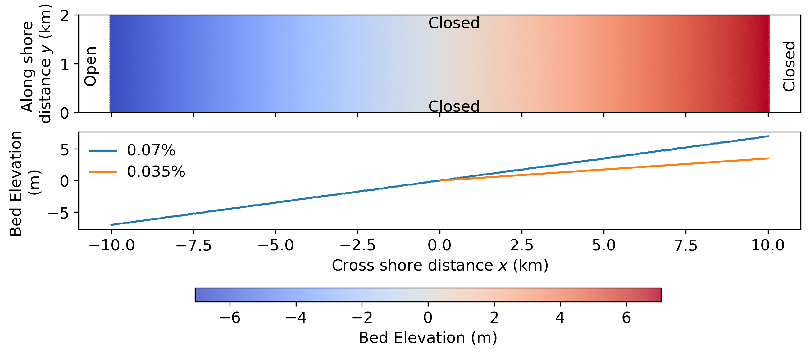
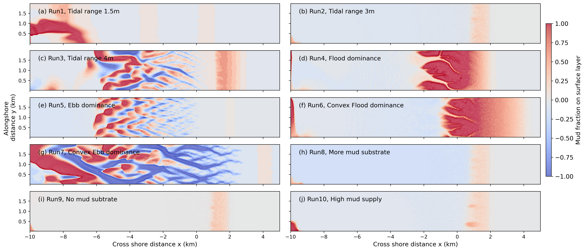
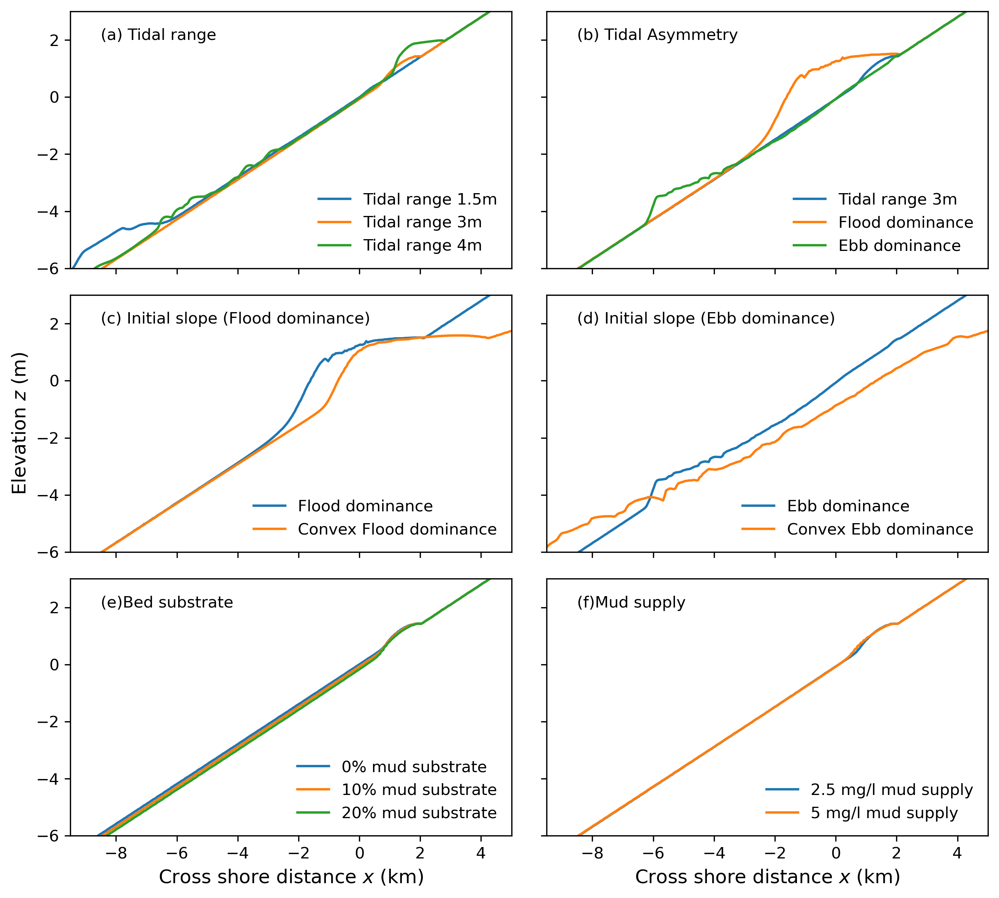
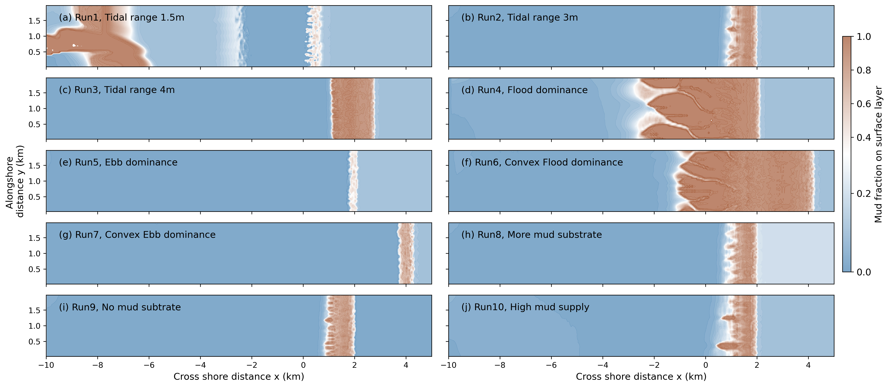

# Idealized Hydrpmorphological modeling

## Introduction

Intertidal flats form the transition between the ocean and the land and are periodically exposed between the lowest and highest astronomical tides. Their morphology is shaped by interactions among coastal hydrodynamics, sedimentary processes, and biological activity. The morphological evolution of tidal flats can be characterised in terms of profile shape, bed slope, and sediment properties, which vary systematically with sediment supply, wave conditions, and tidal forcing[@friedrichs2011]. When averaged over annual or longer timescales, tidal-flat morphology may approach a state of dynamic equilibrium with the prevailing external forcing. For example, tide-dominated environments generally favour convex-upward tidal-flat profiles, whereas wave-dominated environments tend to produce concave profiles [@Friedrichs2001].

The Pilbara coast of Western Australia is characterized by considerable spatial variability in tidal forcing, bed profiles, sediment composition, and sediment availability. To support the development and interpretation of regional morphodynamic models for sites along the Pilbara coast, including Giralia, Urala, and Cape Preston, it is necessary to understand how tidal-flat morphology responds to these environmental drivers. Therefore, this chapter applies an exploratory modeling approach using schematised bathymetry and tidal forcing to systematically investigate the morphological responses of tidal flats under different environmental conditions.

------------------------------------------------------------------------

## Model settings

The exploratory model was run by Delft3D Flexible Mesh, using the D-Flow and D-Morphology module to simulate hydrodynamics and sediment transport. The model was run in a two-dimensional (depth-averaged) domain $2\times 20\ \mathrm{km}$ with an offshore open boundary, using a rectangular grid size of $50 \times 50\ \mathrm{m}$. The offshore open boundary was driven by tidal constituents, e.g. M2 and M4, and the lateral and offshore boundaries were closed to ensure model stability. The model bathymetry was featured by alongshore uniform slope of 0.07%. An further mild slope of 0.035% on the high intertidal flat was applied to the model for initial bed profile sensitivity test. The initial bed level at the open boundary was set to-7m relative to mean sea level (MSL) to ensure that cross-shore tidal movement would not be obstructed by the landward boundary. Random perturbations of $5\ \mathrm{cm}$ were superimposed on the bathymetry to initiate simulations.

Both sand and mud were considered in the idealized model. Sand transport followed the formulation of [@vanrijn1993], with the median grain size of 0.25mm. Mud transport was computed using the Partheniades' equation [@sanford1993; @onthes2007], with settling velocity of 0.25 mm/s and critical erosion shear stress of 0.1Pa. Bed friction was represented by a uniform Manning's friction coefficient of 0.023 $s\ m^{-1/3}$ . A constant mud supply was imposed at the open boundary. To accelerate morphological response to hydrodynamics, a morphological accelerator Morfac of 50 was used in this model.

{width="707"}

## Scenarios design

The scenarios were designed to investigate morphological responses to variations in tidal range, tidal asymmetry, initial bed profile, sediment composition, and mud concentration. Runs 1–3 examined tidal ranges of 0.8, 1.5, and 3.0 m, representing microtidal, mesotidal, and macrotidal regimes, respectively. Because the study sites along the Pilbara coast of Western Australia are characterised by a mesotidal regime, a tidal range of 1.5 m was adopted for the subsequent scenarios.

Tidal asymmetry in Runs 4 and 5 was generated by combining the principal lunar semidiurnal constituent, M2, with its first overtide, M4. A relative phase difference of $2\varphi_{M4} - \varphi_{M2}=90 ^\circ$ represented flood-dominant conditions, whereas a phase difference of $270^\circ$ represented ebb-dominant condition. Here, $\varphi_{M4}$ and $\varphi_{M2}$ denote the phases of constituents M4 and M2, respectively. For simplicity, $\varphi_{M2}=0^\circ$ in all scenarios

A gentle upper-intertidal slope of 0.035%, representing a convex-upward profile, was applied to the flood- and ebb-dominated conditions in Runs 6 and 7, respectively. The influence of sediment composition was examined in Runs 8 and 9, in which the mud fraction was increased to 20% and reduced to 0%, respectively. Run 9 therefore represented a purely sandy substrate. In Run 10, the suspended mud concentration at the boundary was increased from 5 to 10 mg L$^{-1}$ to investigate the influence of sediment availability on tidal-flat morphology.

| Run | Tidal Range (m) | Tidal Asymmetry | Bed slope | Mud fraction (Volume) | Mud concentration (mg/l) |
|:----------:|:----------:|:----------:|:----------:|:----------:|:----------:|
| 1 | 1.5 | Symmetric M2 | 0.07% | 10% | 2.5 |
| 2 | 3 | Symmetric M2 | 0.07% | 10% | 2.5 |
| 3 | 4 | Symmetric M2 | 0.07% | 10% | 2.5 |
| 4 | 3 | Flood-dominated M2-M4 | 0.07% | 10% | 2.5 |
| 5 | 3 | Ebb-dominated M2-M4 | 0.07% | 10% | 2.5 |
| 6 | 3 | Flood-dominated M2-M4 | 0.07%+0.35% | 10% | 2.5 |
| 7 | 3 | Ebb-dominated M2-M4 | 0.07%+0.35% | 10% | 2.5 |
| 8 | 3 | Symmetric M2 | 0.07% | 20% | 2.5 |
| 9 | 3 | Symmetric M2 | 0.07% | 0% | 2.5 |
| 10 | 3 | Symmetric M2 | 0.07% | 10% | 5 |

: Table 8.1. Parameters for idealized model scenarios

## Results

### Morphology

Figure 8.2 presents the morphological changes after 200 years of simulation under different environmental forcing conditions. Panels (a)–(c) of Figure 8.2, together with Figure 8.3a, illustrate the influence of tidal range on morphological evolution and the mean cross-sectional profile. As the tidal range increased, the accretion zone in the upper intertidal area, where the bed elevation was above 0 m, extended farther landward. Both the width and magnitude of deposition also increased with tidal range. In contrast, deposition in the subtidal and lower-intertidal zones, where the bed elevation was below 0 m, gradually diminished. Under a tidal range of 4 m, erosion became more pronounced and braided channels developed within these zones.

When tidal asymmetry was introduced, substantial morphological differences developed despite only minor changes in tidal range. Compared with the tidally symmetric case, flood-dominant conditions produced a broad depositional zone extending across the entire intertidal platform, between low- and high-water levels, and promoted the formation of two distinct channels. In contrast, ebb-dominant conditions caused pronounced erosion in the subtidal zone and generated a more complex, braided channel network. Changes in the mean cross-sectional profiles were also consistent with previous studies [@pritchard2002], which showed that flood dominance accelerates the landward progradation of tidal-flat profiles, whereas ebb dominance promotes their recession.

The initial bathymetry plays a crucial role on morphological evolution. Compared with morphological changes in Run 5, reducing slopes in the upper intertidal results in more significant channel-shoal patterns grown in ebb dominance. However, tidal channels under flood dominance do not become longer with increased depositional extent. This is because when the upper slope becomes milder, the intertidal storage becomes larger. With larger intertidal storage, the filing and draining of intertidal areas will slow the landward propagation of high tide relative to low tide. Low tide will partially catch up with high tide and the temporal transition from high to low water will be shortened, resulting in a quicker falling tide and a tendency towards ebb dominance over the flats. Consequently, channels under flood dominance are shortened while under ebb dominance are enhanced.

Increasing or decreasing the mud fraction of the sediment substrate did not substantially alter the extent of the depositional zone. However, a more mud-rich substrate resulted in slightly greater erosion in the subtidal and lower-intertidal zones. A similar response was observed when the mud supply from the open boundary was varied. Increasing the suspended mud supply produced a wider and more elevated depositional zone in the upper intertidal area, while morphological changes in the subtidal and lower-intertidal zones remained limited.

{#ideal_morpho_results width="1069"}

{width="703"}

### Sediment redistribution

Muddy zones, defined as areas with a mud fraction greater than 30%, developed primarily in the upper intertidal zone. The only exception was the microtidal case (Run 1), in which weaker tidal currents allowed suspended mud to settle at lower elevations. As tidal range increased, the muddy zones expanded and their mud content generally increased.

Tidal asymmetry strongly influenced sediment redistribution. Under flood-dominant conditions, extensive muddy deposits developed across the upper intertidal zone, and the channels also contained a higher proportion of mud. In contrast, ebb-dominant conditions produced only limited muddy deposits and a more extensive sandy area in the subtidal and lower intertidal zones. The channel–shoal patterns observed in Figure 8.2 (e) were primarily associated with sand erosion. When a gentler initial upper-intertidal slope was applied, mud was transported farther landward, resulting in a broader depositional zone under both flood- and ebb-dominant conditions. However, the gentler slope also enhanced ebb-directed flow. Under ebb-dominant conditions, this caused greater sand erosion and produced the wider and deeper channel networks shown in Figure 8.2 (g).

Variations in the initial mud fraction of the sediment substrate produced similar muddy-zone distributions across the intertidal platform. This suggests that most of the deposited mud originated from the continuous suspended-sediment supply at the open boundary rather than from the initial bed composition. This interpretation is further supported by the comparison between Figures 8.4 (b) and 8.4 (j), in which doubling the mud concentration at the open boundary resulted in a substantially wider muddy zone.

### Implications for regional hydromorphodynamic modeling

Our sensitivity tests using the schematized idealized model demonstrate that external environmental drivers play a dominant role in controlling morphological evolution and sediment redistribution. The results show that tidal range, tidal asymmetry, and the initial bed profile strongly influence morphological development and mud distribution, whereas the effects of initial substrate sediment composition and mud supply at the open boundary are comparatively limited. Therefore, when applying the morphodynamic model to a tide-dominated real-world systems, accurate representation of local tidal conditions and bathymetry should be prioritized. Sediment composition and boundary mud supply can be considered secondary factors in model parameterization.

[@friedrichs2011] summarized the effects of different environmental drivers on tidal-flat profiles (Figure 8.5), showing that tide-dominated systems tend to develop convex-up profiles, whereas wave-dominated systems are more likely to exhibit concave-up profiles. Biological processes, such as bioturbation and bioadhesion, can further modify these profile shapes by either enhancing or reducing their convexity or concavity. As discussed previously, the Pilbara Coast is a well-sheltered, tide-dominated environment. Extensive mangrove forests occur along the fringing coast and tidal channels, where they act as natural buffers by reducing flow energy and stabilizing channel banks. Therefore, biological processes, particularly the effects of mangrove vegetation, need to be properly represented in morphodynamic modelling of the Pilbara Coast.

![Figure 8.5 Conceptual diagram summarizing the response of tidal flat shape and properties to a variety of independent forcing favoring either a convex-up or a concave-up profile [@friedrichs2011]](images/IdealModelSummary.png){width="706"}