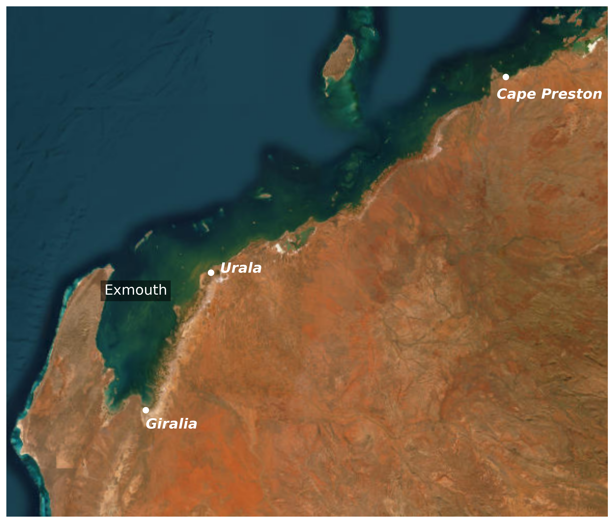

# Introduction

 

The intertidal communities and habitats across the West Pilbara Coast create a unique eco-geomorphic setting with extensive tidal creeks, tidal flats and other low-lying coastal landforms [@Brocx2015]. Such arid zone coastal wetlands are rare globally compared to analogous temperate or tropic zone systems [@Adame2021], due to how they are established by the complex zonation of salinity, sediments and habitat that are collectively shaped by tidal cycles.

In recent years, there has been a growing interest in establishing salt farms along the northwest coast of Western Australia. The region’s unique coastal characteristics, including its significant tidal range and the presence of naturally occurring salt flats, have made it an ideal location for solar-based salt production. Since 1967, numerous salt projects have been proposed, with many receiving approval and several already constructed. Given the increasing number of proposals for new large-scale salt ponds, the Department of Water and Environmental Regulation has sought expert analysis to better understand the potential environmental impacts. As part of this effort, the University of Western Australia has been contracted to conduct a modelling assessment of the Ashburton Salt Proposal, focusing on its potential influence on habitat extent and evolution.

## Region
The Pilbara region in Western Australia is home to unique intertidal ecosystems, where extensive tidal creeks, salt flats, and low-lying coastal landforms create a complex eco-geomorphic setting. These arid-zone coastal wetlands are rare globally, as they are shaped by intricate interactions between salinity, sediment transport, and habitat zonation, which are in turn influenced by tidal cycles.

{#fig-sites-interest}

@fig-sites-interest shows the primary sites of interest within the Pilbara region: **Giralia**, **Urala**, and **Cape Preston**. Across these sites, episodic inputs and flooding from the terrestrial edge interact dynamically with sea-level variability to create a complex inundation regime that redistributes salt, nutrients, and sediments across the intertidal landscape. However, despite the ecological significance of these environments, there remains limited data and significant gaps in our understanding of how different coastal units in this region behave, making it challenging for regulators and managers to assess the risks of coastal developments, guide conservation efforts, and respond to environmental change.

The intertidal areas of the West Pilbara Coast exhibit a distinct zonation of benthic coastal habitat (BCH) communities—transitioning from subtidal embayments to terrestrial margins across mangrove, samphire, and algal (cyanobacterial) mat environments. Broad salt-flat areas supporting algal mats experience an intricate ecohydrological regime governed by interactions between rainfall, evaporation, surface–groundwater exchange, and inundation frequencies driven by periodic tides and extreme events like tropical cyclones. These habitats likely provide substantial ecosystem subsidies to adjacent marine and terrestrial environments, yet the full extent of this support remains unknown.

Given the sensitivity of these BCH communities to altered inundation and salinity, abrupt shifts can easily trigger mortality and alter spatial distributions:

Case Study: Minor sea-level anomalies (on the order of 10 cm) during the 2015/16 El Niño event led to well-documented, widespread mangrove dieback across northern Australia [@Lovelock2017]. Furthermore, mangroves experiencing hypersalinity often have minimal adaptive capacity under severe stress, escalating tree mortality [@Dittmann2022].

Complex physical and ecological feedbacks govern how vegetation and landforms adapt to shifting sea levels and salinity regimes [@Sandi2018; @Wimmler2021]. Variations in vegetation canopy and structure alter flow attenuation [@Rodriguez2017], while inundation patterns control root-zone soil salinity, impacting plant growth and persistence [@Wimmler2021; @Dittmann2022]. By altering near-bed hydrodynamics, coastal vegetation strongly influences local sediment transport, erosion, and accretion, shaping long-term coastal landform evolution over years to decades. Consequently, vegetation health dictates a coastline's capacity to buffer against hazards such as extreme storms and sea-level rise [@Willemsen2022], as illustrated by historical mangrove losses in southern Asia that led directly to severe coastal erosion [@Mazda2002].

The potential for intertidal habitat disruption stems primarily from local coastal developments and salt production operations superimposed onto broader climate change drivers [@Guo2022], including sea-level rise, altered rainfall, shifting cyclone frequencies, and rising temperatures. While conceptual models [@Semeniuk1994; @Eliot2013] and localized site assessments exist, there remains a fundamental lack of baseline knowledge regarding the sensitivity of these habitats and their ecosystem services across the diverse landforms of the Pilbara Coast.

To address this gap, there is an urgent need to identify and quantify the potential effects of climate change and proposed salt farm infrastructure on the capacity of mangroves, samphire, and algal mats to adapt. Developing advanced conceptual and numerical models is essential for providing a holistic, predictive assessment of how these coupled ecological and morphological systems will respond to future environmental change.