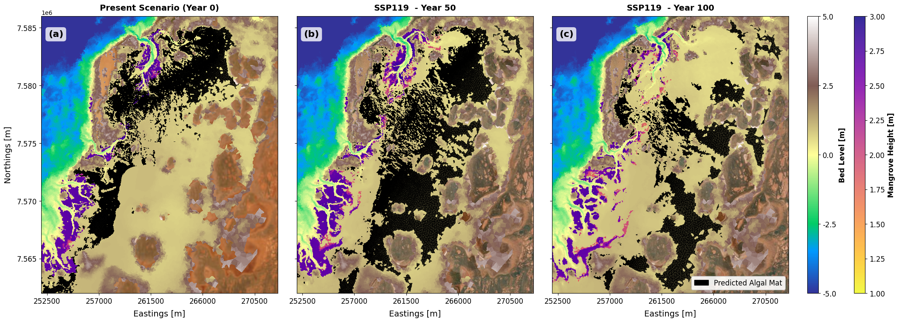
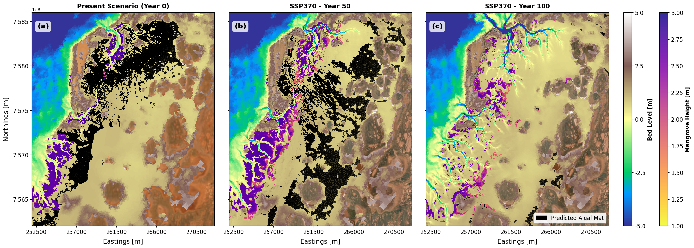
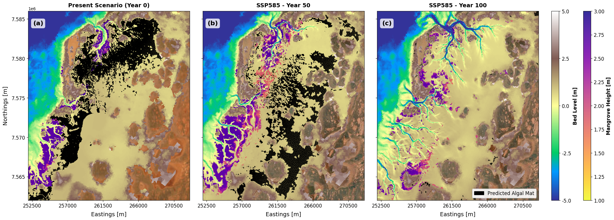
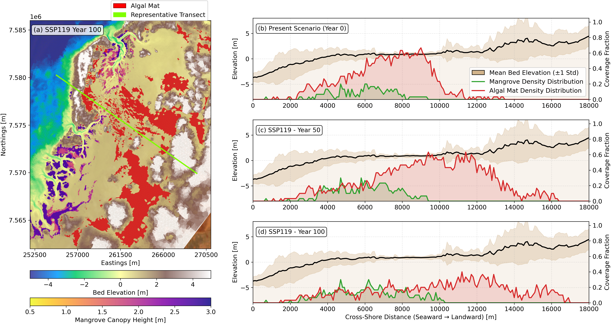
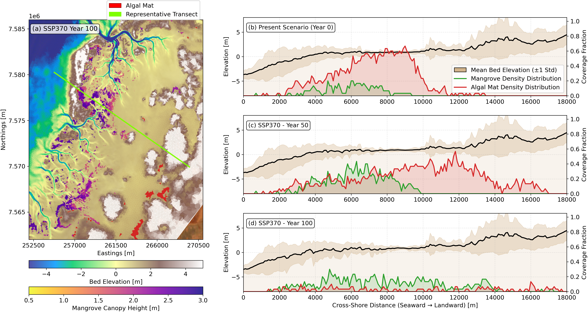
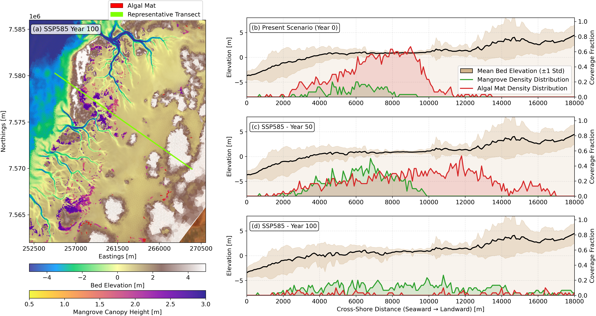

# Algal mat response to future sea level rise

Following the mangrove response to sea level rise predictions as described in @sec-urala-mangrove, we carried out additional only hydrodynamic simulations with various discrete time steps representing the 50 and 100-Year for different sea level rise scenarios. In these simulations, the bed level changes and mangrove distributions were fixed to the predicted values at the corresponding time steps. The hydrodynamic outputs were then used to predict the potential distribution of persistent algal mats under future sea level rise scenarios. 

## Projected Impact of Sea-Level Rise on Algal Mat Redistribution {#sec-algal-projections}

To evaluate the long-term response of algal mats under climate change, numerical simulations were carried out across three IPCC Shared Socioeconomic Pathways: **SSP119** (low emissions / low SLR), **SSP370** (medium-to-high emissions / moderate SLR), and **SSP585** (high emissions / extreme SLR). 

::: {#fig-urala-algal-ssp119}
{fig-align="center" width="95%"}

Modelled spatial distribution of persistent algal mats (black shading) across the Urala study site for the present baseline scenario at Year 0 (a), and future projections under SSP119 at Year 50 (b) and Year 100 (c).
:::

::: {#fig-urala-algal-ssp370}
{fig-align="center" width="95%"}

Modelled spatial distribution of persistent algal mats (black shading) across the Urala study site for the present baseline scenario at Year 0 (a), and future projections under SSP370 at Year 50 (b) and Year 100 (c).
:::

::: {#fig-urala-algal-ssp585}
{fig-align="center" width="95%"}

Modelled spatial distribution of persistent algal mats (black shading) across the Urala study site for the present baseline scenario at Year 0 (a), and future projections under SSP585 at Year 50 (b) and Year 100 (c).
:::

Furthermore, to illustrate the distributional changes of algal mats as well as the mangroves across the three SLR scenarios, we present a comparative analysis of the predicted spatial extent at Year 0, Year 50, and Year 100 for each scenario. The following sections provide a detailed description of the predicted trends and ecological implications associated with each SLR pathway.

::: {#fig-urala-algal-ssp119}
{fig-align="center" width="100%"}

Spatial distribution and cross-shore profile analysis of mangroves and algal mats across the Urala study site under scenario SSP119. (a) Spatial map showing predicted distribution of combined persistent algal mats (red) and mangroves (purple) overlaid on bed elevation at Year 100, with a representative seaward-to-landward transect line (chartreuse). (b–d) Along-shore averaged cross-shore profiles for Present Scenario (Year 0), Year 50, and Year 100, respectively. Solid black lines depict mean bed elevation ($\pm 1$ standard deviation shaded in tan), while secondary right axes display the spatial coverage fraction of mangrove density (green) and algal mat density (red) along the cross-shore continuum.
:::

::: {#fig-urala-algal-ssp370}
{fig-align="center" width="100%"}

Spatial distribution and cross-shore profile analysis of mangroves and algal mats across the Urala study site under scenario SSP370. (a) Spatial map showing predicted distribution of combined persistent algal mats (red) and mangroves (purple) overlaid on bed elevation at Year 100, with a representative seaward-to-landward transect line (chartreuse). (b–d) Along-shore averaged cross-shore profiles for Present Scenario (Year 0), Year 50, and Year 100, respectively. Solid black lines depict mean bed elevation ($\pm 1$ standard deviation shaded in tan), while secondary right axes display the spatial coverage fraction of mangrove density (green) and algal mat density (red) along the cross-shore continuum.
:::

::: {#fig-urala-algal-ssp585}
{fig-align="center" width="100%"}

Spatial distribution and cross-shore profile analysis of mangroves and algal mats across the Urala study site under scenario SSP585. (a) Spatial map showing predicted distribution of combined persistent algal mats (red) and mangroves (purple) overlaid on bed elevation at Year 100, with a representative seaward-to-landward transect line (chartreuse). (b–d) Along-shore averaged cross-shore profiles for Present Scenario (Year 0), Year 50, and Year 100, respectively. Solid black lines depict mean bed elevation ($\pm 1$ standard deviation shaded in tan), while secondary right axes display the spatial coverage fraction of mangrove density (green) and algal mat density (red) along the cross-shore continuum.
:::

## Comparative Dynamics Across Scenarios

At Year 0 (present condition), spatial mapping reveals an extensive, contiguous algal mat complex occupying high-elevation salt flats landward of the coastal mangrove fringe (panel a across all spatial figures). Under baseline hydrodynamic conditions, these expansive intertidal flats maintain low hydrodynamic shear stress ($\tau_{\text{max}} \le 0.7\text{ N m}^{-2}$), suitable inundation frequencies, and shallow water depths during high tides ($d_{98} \le 0.55\text{ m}$), allowing stable algal mats to flourish. 

The cross-shore transect profile at Year 0 (b) highlights distinct zonation between the two coastal ecosystems along the elevation gradient:
* **Mangrove Fringe ($3,000\text{ m} \le x \le 8,000\text{ m}$):** Mangroves achieve their highest alongshore coverage fraction ($\sim 0.40–0.50$) on intertidal mudflats where mean bed elevation ranges between $-1.0\text{ m}$ and $0.5\text{ m}$.
* **Algal Mat Zone ($6,000\text{ m} \le x \le 11,000\text{ m}$):** Algal mats dominate higher supratidal flats ($0.5\text{ m} \le z \le 1.8\text{ m}$), reaching peak alongshore coverage fractions exceeding $0.60–0.70$.

---

### SSP119 Projection
* **Year 50 (c):** Under mild sea-level rise, the algal mat footprint experiences minor fragmentation along its lower seaward margin ($x \sim 6,000–8,000\text{ m}$). However, the cross-shore profile shows that high coverage fractions ($\sim 0.40–0.60$) persist across the broad central supratidal flat ($10,000\text{ m} \le x \le 14,000\text{ m}$), while the mangrove fringe maintains stable coverage fractions ($\sim 0.20–0.30$) around $x = 4,000–8,000\text{ m}$.
* **Year 100 (d):** Increased inundation drives localised seaward retreat along outer boundaries. Despite this, a substantial portion of the algal mat profile remains viable across higher-elevation flats ($10,000\text{ m} \le x \le 16,000\text{ m}$) where coverage fractions remain around $0.20–0.40$. Mangrove distribution exhibits minimal cross-shore compression, holding steady low-density presence along channel edges.

---

### SSP370 Projection
* **Year 50 (c):** Moderate sea-level rise triggers drowning across low-lying algal mat habitat. The contiguous Year 0 mat fragments into isolated clusters near expanding tidal channels where inundation frequencies exceed tolerance limits ($> 0.95$). In the transect profile, the peak algal coverage fraction drops sharply from $> 0.60$ down to $\sim 0.30$, shifting landward toward $x = 10,000–14,000\text{ m}$. Simultaneously, mangroves expand slightly inland along creek banks, raising mangrove coverage fractions up to $\sim 0.35$ around $x = 6,000–8,000\text{ m}$.
* **Year 100 (d):** Significant loss of persistent algal mat coverage occurs across the central domain. As deeper tidal networks expand inland, water depth thresholds ($d_{98} > 0.55\text{ m}$) are exceeded, restricting viable mat habitat to narrow landward bands ($x > 12,000\text{ m}$) with low coverage fractions ($< 0.15$). While the mangrove distribution curve appears broadly distributed across the domain ($2,000\text{ m} \le x \le 12,000\text{ m}$), its alongshore coverage fraction remains low ($\le 0.15–0.20$). This indicates that rather than forming a dense forest, mangroves are restricted to narrow, highly dispersed bands along dissected channel networks.

---

### SSP585 Projection
* **Year 50 (c):** Accelerated sea-level rise triggers rapid ecological drowning across mid-to-high intertidal flats. The extensive northern mat complex collapses, causing the cross-shore algal coverage fraction to decline to $< 0.25$ beyond $x = 10,000\text{ m}$. Mangroves temporarily display an opportunistic inland pulse between $x = 5,000\text{ m}$ and $9,000\text{ m}$ (fractions reaching $\sim 0.40$) as higher water levels temporarily convert formerly hyper-saline salt flats into habitable intertidal zones.
* **Year 100 (d):** Extreme sea-level rise drives near-complete collapse of persistent algal mats across the Urala domain. Channel network enlargement increases maximum bed shear stress ($\tau_{\text{max}} > 0.7\text{ N m}^{-2}$) and causes permanent inundation, virtually eliminating the environmental window required for algal mat stability (coverage fractions $< 0.05$). Although the mangrove distribution curve spans continuously from $x = 2,000\text{ m}$ to $x = 15,000\text{ m}$, the alongshore coverage fraction stays under $0.15$ throughout. This demonstrates that mangroves do not form an expansive contiguous wetland, but rather survive as highly fragmented, low-density linear fringes fringing deep tidal creeks across an otherwise drowned landscape.

::: {.callout-note}

## Management Implications & Strategic Recommendations

The findings of this numerical modelling study provide process-based insights for coastal managers, regional planners, and environmental impact assessors operating along the Urala coastline. Earlier site assessments (e.g., @SeashoreEngineering2021) relied primarily on empirical morphometric relationships to infer habitat responses under generic sea-level rise allowances ($0.4\text{ m}$ by 2070 and $0.9\text{ m}$ by 2110). While those studies identified tidal creek network expansion as a key driver of habitat reorganization and long-term habitat loss, our process-based Delft3D-FM simulations reveal specific hydrodynamic thresholds and spatial nuances across different climate pathways.

### Habitat Migration Dynamics and Supratidal Buffer Corridors
Our results demonstrate that intertidal habitat response is highly scenario-dependent. Under lower emission pathways (SSP119), both mangrove and algal mat habitats demonstrate notable resilience, retaining spatial continuity through Year 100. Under moderate-to-high emission pathways (SSP370 and SSP585), both ecosystems attempt to migrate landward ($x > 10,000\text{ m}$), though algal mats experience significant landward compression compared to expanding channel-fringe mangroves. 

**Management Consideration:** To accommodate natural landward migration and reduce the risk of coastal squeeze, coastal management frameworks could identify and designate supratidal buffer zones behind current high-elevation salt flats. Planning future coastal infrastructure (such as solar salt evaporation ponds, access roads, pipelines, bund walls, or pastoral fencing) with these migration pathways in mind ($x = 10,000\text{ m}$ to $18,000\text{ m}$) would help preserve remaining intertidal accommodation space. Furthermore, proposed developments across the intertidal platform can directly obstruct or alter these migration trajectories, as detailed in @sec-urala-mangrove.

### Differentiating Spatial Extent from Ecosystem Quality and Density
Broad spatial mapping and remote sensing can obscure localized changes in habitat quality when evaluating coastal wetland response. Under SSP370 and SSP585 at Year 100, mangrove presence appears across a broad cross-shore zone ($2,000\text{ m}$ to $15,000\text{ m}$), which might initially resemble habitat expansion. However, cross-shore profile analysis indicates that alongshore coverage fractions remain low ($\le 0.15$).

**Management Consideration:** Environmental monitoring programs could incorporate metrics for canopy closure, structural continuity, and biomass density alongside spatial boundaries. Low-density, linear fringe mangroves along dissected creeks offer different ecosystem function profiles—such as altered wave attenuation, shoreline stabilization, and blue carbon capacity—compared to dense, contiguous forests. Monitoring metrics that reflect habitat fragmentation provide a clearer picture of ecological state.

### Recognition and Conservation of Cyanobacterial Algal Mats
In arid and semi-arid tropical environments like the Pilbara coast, cyanobacterial algal mats serve as primary producers and nitrogen fixers supporting intertidal food webs. Because they occupy high supratidal flats often categorized as salt flats, they are sometimes deprioritised in environmental evaluations relative to mangrove forests. Our results indicate that algal mats possess distinct hydrodynamic tolerance windows, experiencing structural fragmentation as maximum bed shear stress ($\tau_{\text{max}} > 0.7\text{ N m}^{-2}$) and inundation depths ($d_{98} > 0.55\text{ m}$) exceed physical suitability thresholds.

**Management Consideration:** Environmental assessments could explicitly evaluate persistent algal mat zones as sensitive intertidal habitats. Where coastal engineering works (such as channel dredging, culvert installations, or tidal barriers) are planned, evaluating their potential effects on shallow tidal inundation frequencies across supratidal flats would help mitigate premature disruption to these primary-producing communities.

### Scenario-Based Adaptive Management Thresholds
Comparative analysis across climate pathways demonstrates that habitat survival and zonation rely heavily on the rate of sea-level rise. Under SSP119, intertidal zonation remains largely stable through Year 100, whereas higher pathways (SSP370/SSP585) lead to progressive habitat reorganization between Year 50 and Year 100 as tidal creek networks expand.

**Management Consideration:** Regional management frameworks could consider Dynamic Adaptive Policy Pathways (DAPP), linking planning thresholds to observed local sea-level rise rates and channel network expansion rather than fixed calendar years. Where monitoring indicates sea-level rise approaching intermediate thresholds ($\sim 0.4\text{ m}$), proactive options—such as localized sediment management or living shoreline strategies—could be evaluated to assist high-value intertidal zones before extensive channel enlargement occurs.
:::