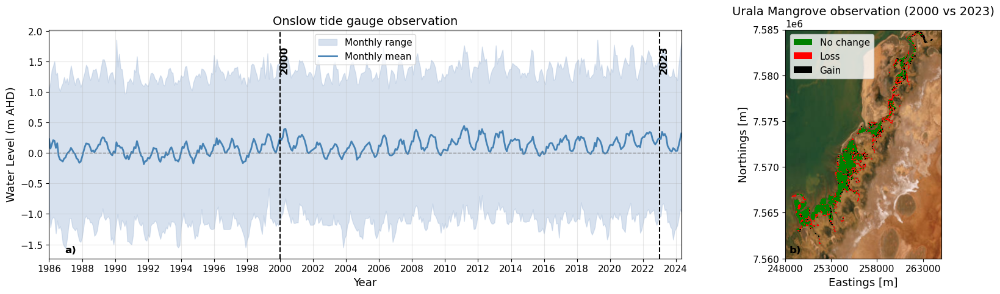

## Overview

Similar to the observations in the Giralia region, historical satellite observations across Urala reveal a highly stable mangrove system over recent decades, displaying only minor spatial fluctuations along fringe boundaries. To establish a baseline for present-day environmental conditions and assess future mangrove redistribution, we evaluated the performance of the mangrove dynamic model across the Urala region.

---

### Initial Model Transferability & Overprediction Issues

As a first attempt, we evaluated model transferability by applying the calibrated mangrove model coefficients directly from Giralia to Urala. However, this preliminary setup resulted in a **significant spatial overprediction** of mangrove extent, with the model predicting mangrove establishment across vast stretches of the high intertidal and supratidal salt flats where no mangroves exist.

This overprediction highlighted a key limitation: the initial model framework did not resolve substrate-level abiotic stressors—specifically, **groundwater and surface salinity dynamics**. In hyper-arid systems like Urala, extreme evaporation across shallow, infrequently inundated salt flats (sabkhas) generates hypersaline conditions ($> 60–80\text{ PSU}$) that severely constrain mangrove seedling establishment and survival. Without an explicit salinity stress mechanism, the hydro-morphological suitability criteria alone proved insufficient to constrain mangrove boundaries.

---

### Proxy Salinity Model Formulation

To address this limitation and improve spatial precision, we implemented a **proxy salinity mass-balance module**. This module dynamically tracks salinity accumulation, evaporation, and ocean flushing across each model cell based on inundation depth and tidal exchange frequency.

#### Water & Salt Mass Balance Equations

For each grid cell, the water depth $h(t)$ determines the active wetting state based on a minimum depth threshold $h_{\text{min}}$ (e.g., $0.05\text{ m}$). 

When a dry cell becomes inundated ($h(t) > h_{\text{min}}$ and $h(t-\Delta t) \le h_{\text{min}}$), the initial salt mass $M(t)$ is calculated from incoming seawater at ambient concentration $S_0$ (35 PSU), plus any residual salt mass $M_{\text{res}}$ left behind from previous drying cycles:

$$M(t) = h(t) \cdot S_0 + M_{\text{res}}$$

For continuously wet cells ($h(t) > h_{\text{min}}$ and $h(t-\Delta t) > h_{\text{min}}$), changes in water depth $\Delta h = h(t) - h(t-\Delta t)$ dictate salt flux and evaporative concentration:

*   **Rising Tide ($\Delta h > 0$):** Additional marine water enters the cell, increasing salt mass:
    $$M(t) = M(t-\Delta t) + \Delta h \cdot S_0$$

*   **Falling Tide ($\Delta h \le 0$):** Total water loss equals $-\Delta h$. Water loss is partitioned into evaporative loss ($E_{\text{evap}}$) driven by the pan evaporation rate $E$, and physical drainage/outflow loss ($L_{\text{drain}}$):
    $$E_{\text{evap}} = \min(E \cdot \Delta t, -\Delta h)$$
    $$L_{\text{drain}} = -\Delta h - E_{\text{evap}}$$

    Drainage removes salt proportional to the instantaneous ambient concentration $S_{\text{now}} = \frac{M(t-\Delta t)}{\max(h(t-\Delta t), h_{\text{min}})}$, while evaporation concentrates the remaining salt mass:
    $$M(t) = M(t-\Delta t) - L_{\text{drain}} \cdot S_{\text{now}}$$

#### Concentration Limits and Desiccation Accumulation

The instantaneous surface water salinity $S(t)$ is computed from the remaining salt mass and bounded by a physical capping limit $S_{\text{cap}}$ (250 PSU):

$$S(t) = \min\left( \frac{M(t)}{\max(h(t), h_{\text{min}})}, S_{\text{cap}} \right)$$

When a cell completely dries out ($h(t) \le h_{\text{min}}$), all remaining salt mass accumulates as residual deposit $M_{\text{res}}$ to be dissolved upon the next wetting cycle:

$$M_{\text{res}} = M_{\text{res}} + M(t)$$

#### Salinity Stress Function

The resulting 90th percentile salinity ($S_{p90}$) drives the non-dimensional vegetation stress coefficient $S_{\text{sal}} \in [0, 1]$:

$$S_{\text{sal}} = \text{clip}\left( \frac{S_{p90} - S_{\text{thres}}}{S_{\text{lethal}} - S_{\text{thres}}}, 0.0, 1.0 \right)$$

where $S_{\text{thres}}$ is the salinity threshold above which stress begins to impact growth, and $S_{\text{lethal}}$ is the upper lethal limit causing complete vegetation mortality.

### Historical Mangrove Observations (2000–2023)

To examine the temporal variability in mangrove distribution across the Urala region, monthly mangrove maps derived from Landsat imagery by @Hickey2025 were analyzed. The mangrove extents between 2000 and 2023 are compared in @fig-urala-obs to illustrate multi-decadal dynamics alongside long-term water-level variability recorded at the Onslow tide station—the closest operational tide gauge to the Urala domain.

While the broader mangrove footprint in Urala exhibits overall stability similar to the Giralia region over the 2000–2023 period, key localized structural differences emerge upon spatial inspection (@fig-urala-obs b). Unlike the core interior stability seen in Giralia, Urala displays more active dynamic shifts along its complex creek network and seaward fringes:

* **Fringing Loss and Retreat:** Notable localized mangrove dieback and retreat (indicated in red) are concentrated along the narrow, highly exposed tidal channels and seaward creek boundaries. This localized dieback aligns with regional observations of upper intertidal stress triggered during extended El Niño–Southern Oversight (ENSO) low water-level anomalies [@Lovelock2017].
* **Seaward Expansion and Colonization:** Concurrently, minor localized seaward expansion and gain (indicated in black) occur in sheltered intertidal zones, indicating ongoing localized geomorphic adjustments and dynamic colonization.

Despite these localized shifts along the tidal fringes, the core mangrove extent in Urala has remained largely resilient over the ~23-year observation window. This consistent baseline provides a reliable present-day benchmark against which future hydrodynamic modifications and climate-driven sea-level shifts can be evaluated.

::: {#fig-urala-obs}
{fig-align="center" width="95%"}

Water level observations and historical mangrove extent in the Urala region. **(a)** Water level recorded at the Onslow tide station ([WA Data Catalogue](https://catalogue.data.wa.gov.au/dataset/tide-stations)) displaying monthly range and monthly mean. **(b)** Comparison of Landsat-derived mangrove extents between 2000 and 2023 [@Hickey2025], highlighting areas of stability (no change), loss, and gain.
:::

### Model Initialization & Performance Evaluation

@fig-urala-val shows the modeled mangrove distribution across the Urala region under present environmental conditions. Because the objective was to reproduce the representative baseline mangrove extent, the model simulations were forced using optimized local tidal constituents.

The spatial agreement between the modeled and observed mangrove extents was evaluated by categorizing grid cells:
* **True Positives (Green):** Correctly predicted mangrove areas.
* **False Negatives (Black):** Observed mangrove areas missed by the model.
* **False Positives (Red):** Areas predicted as mangrove where none were observed.

To quantitatively evaluate spatial performance within the core analysis domain, precision, recall, and the $F_1$ score were computed:

| Statistic | Definition | Formula | Model Performance |
| :--- | :--- | :--- | :--- |
| **Precision** | Proportion of modeled mangrove cells corresponding to true observed mangroves | $\text{Precision} = \frac{TP}{TP + FP}$ | $0.680$ |
| **Recall** | Proportion of observed mangrove cells correctly reproduced by the model | $\text{Recall} = \frac{TP}{TP + FN}$ | $0.534$ |
| **$F_1$ Score** | Harmonic mean of precision and recall | $F_1 = 2 \cdot \frac{\text{Precision} \cdot \text{Recall}}{\text{Precision} + \text{Recall}}$ | $0.598$ |

The resulting statistics demonstrate good performance across the primary mangrove zones ($F_1 = 0.598$). High precision ($0.680$) indicates that where the model predicts mangroves, observed stands are consistently present. The lower recall ($0.534$) is primarily attributed to unmodeled, narrow fringing mangrove strips along smaller tidal channels (visible as black false negative areas in @fig-urala-val a), where extreme localized hydrodynamic gradients or micro-topographic variations are near the limit of model resolution.

---

### Modeled Vegetation Structural Parameters

In addition to spatial extent, the model captures key structural attributes of the mangrove canopy across the Urala domain:

* **Stem Diameter ($d$):** Predicted spatial distributions (@fig-urala-val b) range between $0.03\text{ m}$ and $0.07\text{ m}$. Larger diameters ($>0.05\text{ m}$) are concentrated within the well-established, sheltered tidal creek network, indicating that mature mangroves are forming in the true observed locations relatively well.
* **Stem Height ($h$):** Corresponding spatial distributions (@fig-urala-val c) show heights ranging predominantly between $1.8\text{ m}$ and $2.6\text{ m}$, displaying a clear structural gradient: taller, mature trees occupy the sheltered, frequently inundated main creek channels, while smaller, shorter trees ($<2.0\text{ m}$) form along the landward transitions and peripheral fringes.

This spatial coherence between mature stem dimensions and true positive observed zones confirms that the model accurately captures both the spatial extent and internal structural dynamics of the present-day Urala mangrove ecosystem.

::: {#fig-urala-val}
{fig-align="center" width="100%"}

Mangrove validation and vegetation structural parameter distributions across the Urala study area. **(a)** Spatial confusion map highlighting true positives, false negatives, and false positives alongside bounded performance metrics ($F_1$ score, precision, recall). **(b)** Spatial distribution of modeled stem diameter ($d$). **(c)** Spatial distribution of modeled stem height ($h$).
:::