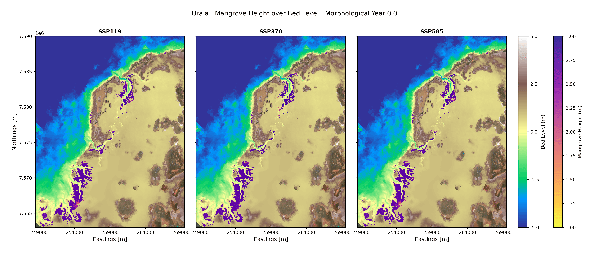
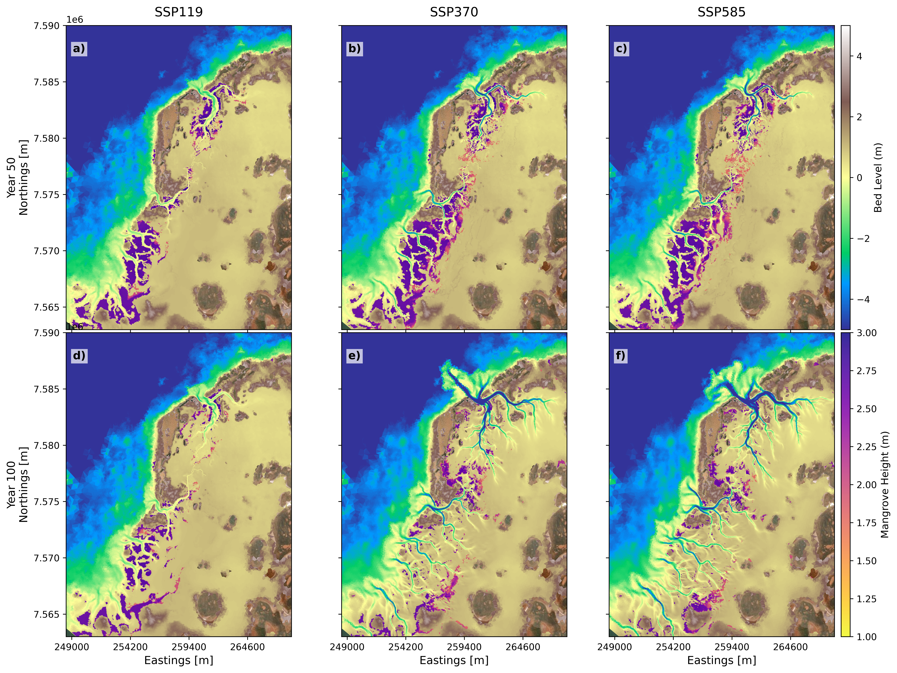
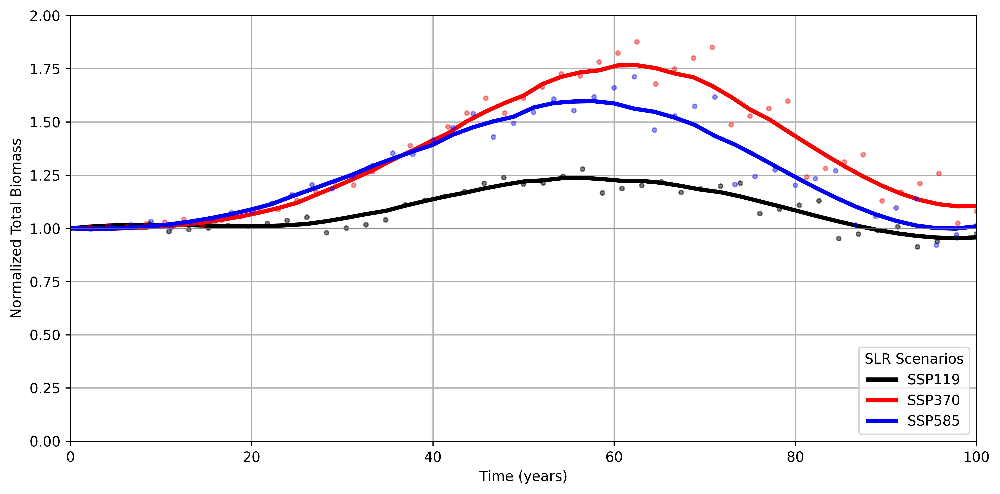
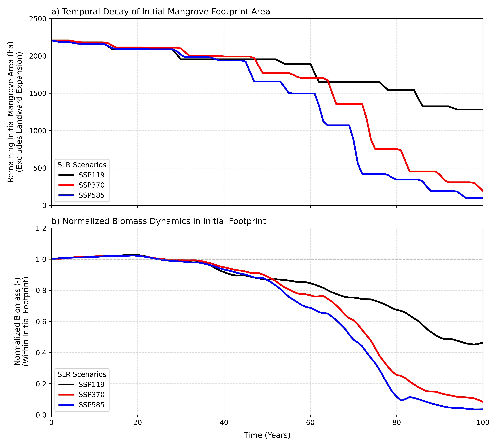
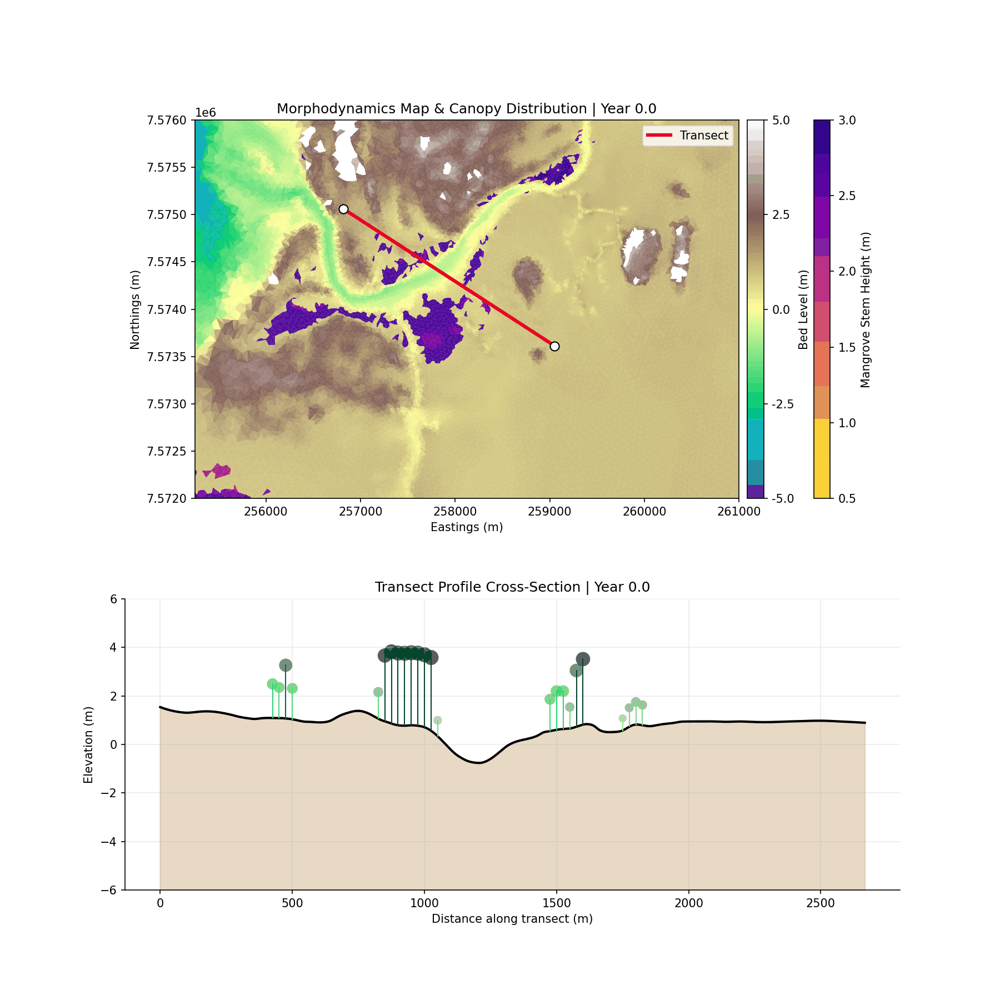
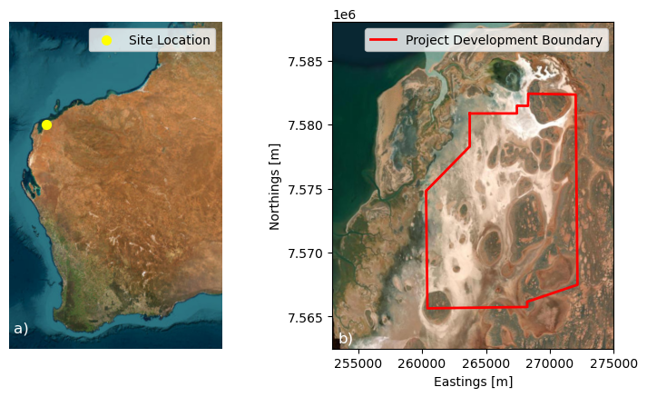
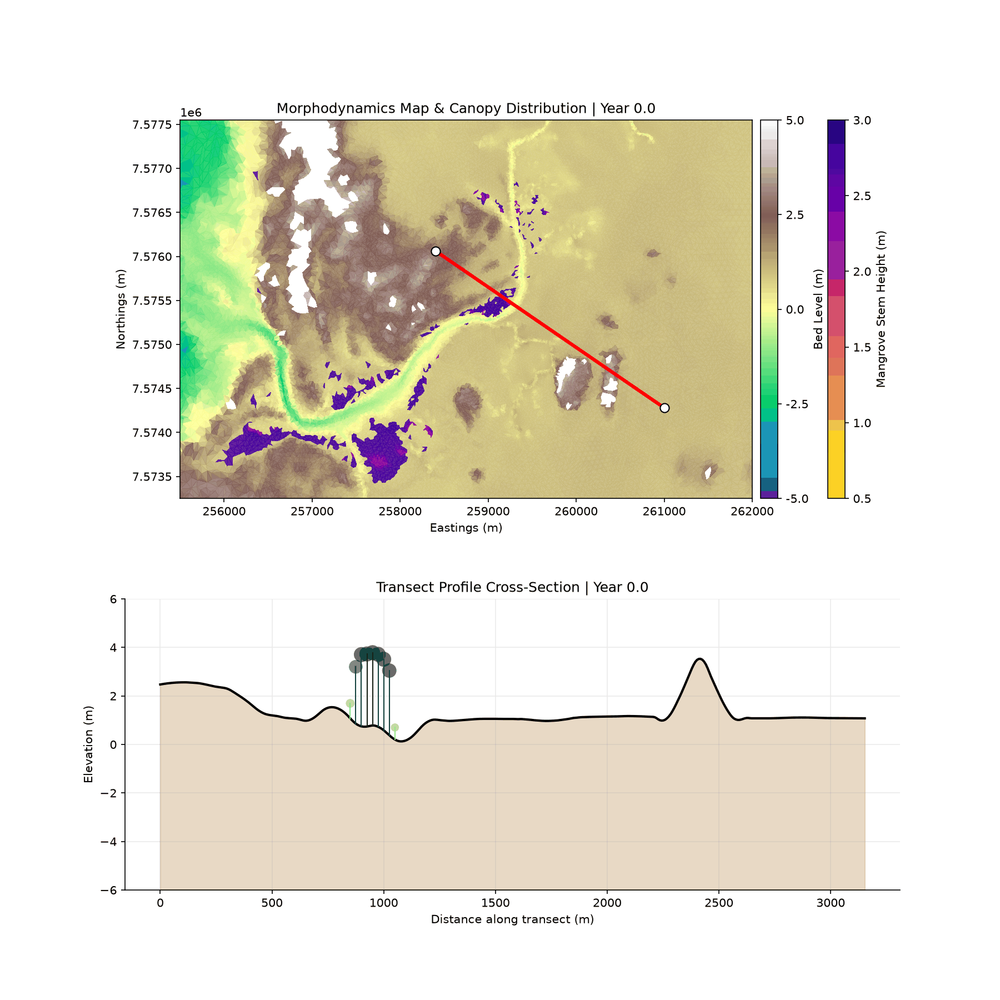
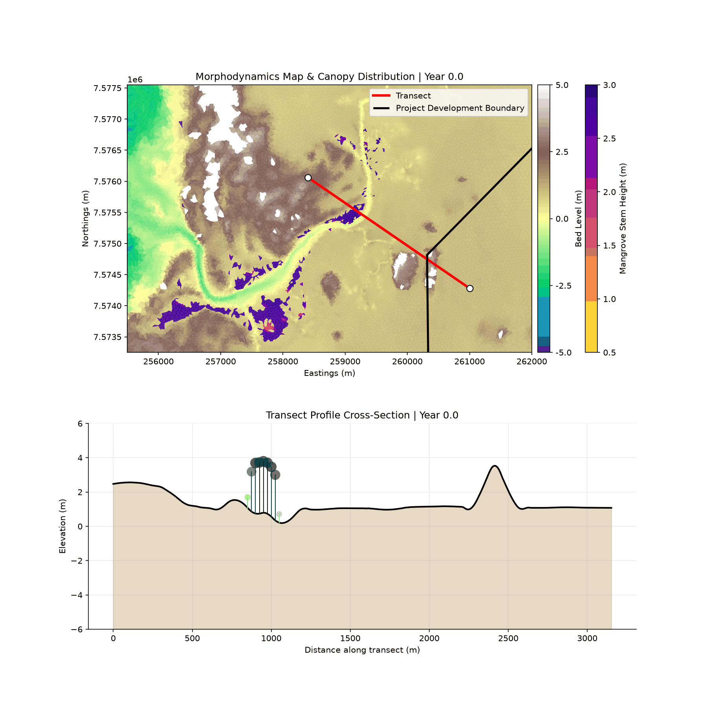

## Sea Level Rise Response

In this section, we present the response of mangroves and creek morphology to different sea-level-rise (SLR) scenarios for the Urala study site. Similar to the Giralia Bay simulations, we evaluated three distinct IPCC Shared Socioeconomic Pathway (SSP) SLR scenarios over a 100-year projection period (starting from Year 0.0, representing present-day initial conditions):

* **SSP119 (Low SLR – ~0.5 m):** Represents a optimistic, low-emissions pathway with moderate sea level rise.
* **SSP370 (Medium SLR – ~0.9 m):** Captures a high-emission, medium-to-high sea level rise trajectory.
* **SSP585 (High SLR – ~1.25 m):** Represents an extreme, high-emissions pathway resulting in severe sea level rise.

The predicted mangrove extent under present-day environmental conditions (Morphological Year 0.0) was used as the initial condition for all runs. The simulations were executed to assess long-term mangrove migration patterns, dieback, and the co-evolution of tidal creek channels under changing hydrodynamics.

@fig-urala-slr-response-animation illustrates the spatial co-evolution of mangrove canopy height ($h$) and bed level elevation ($z$) across the Urala domain under the three SLR scenarios over the 100-year simulation period.

### Mangrove Dynamics and Morphological Evolution

The simulations reveal a strong coupling between sea level rise, intertidal wetland encroachment, and tidal creek network extension across the Urala coastal plain:

1. **Low-SLR Scenario (SSP119):** Under SSP119, the rate of sea level rise remains low enough that tidal prism increases are modest. As a result, **the main tidal creeks in SSP119 show minimal expansion or deep headward incision**. The existing network geometry accommodates the minor increase in tidal volume without inducing substantial bed erosion or channel widening. Mangroves along the creek banks and within the main basin maintain dynamic equilibrium, experiencing subtle landward growth while keeping pace with water level changes without major dieback.

2. **Moderate to High-SLR Scenarios (SSP370 & SSP585):** As sea level rise accelerates in SSP370 and SSP585, larger volumes of water flood the expansive, low-lying supratidal flats behind the main coastal barrier during each tidal cycle. This dramatic increase in the **tidal prism** drives higher flow velocities within the main drainage arteries, initiating severe scour and progressive channel expansion. 
   
   * **Creek Evolution:** The main tidal channels migrate landward, widening and deepening into the upper intertidal basin to handle the increased flood/ebb volumes.
   * **Mangrove Migration & Dieback:** Concurrently, higher baseline water levels drown out the lowermost seaward fringe of mangroves due to prolonged hydroperiod inundation. However, the newly formed tidal channels and headward creek extensions deliver tidal flushing deeper inland, creating favorable hydrodynamics that allow mangroves to aggressively colonize new landward accommodation space.

::: {.callout-note}
## Key Findings: Urala SLR Response Dynamics
* **SSP119 (0.5 m):** Mangrove extents remain stable, and tidal creeks show negligible expansion due to minimal change in the overall tidal prism.
* **SSP370 (0.9 m):** Moderate seaward fringe drown-out, compensated by landward channel extension and inland mangrove encroachment.
* **SSP585 (1.25 m):** Pronounced morphological restructuring. Enhanced tidal prism drives significant tidal creek widening and inland incision, accompanied by broad landward shift and redistribution of mangrove canopy height ($h$).
:::

::: {#fig-urala-slr-response-animation}
{fig-align="center" width="95%"}

Spatial and temporal evolution of mangrove canopy height ($h$, right colorbar) overlaid on bed level elevation ($z$, left colorbar) across the Urala study site for three Sea Level Rise scenarios: SSP119 (0.5 m), SSP370 (0.9 m), and SSP585 (1.25 m) over a 100-year simulation period.
:::
@fig-Urala_mangrove_evolution shows the spatial distributions of mangroves and tidal channel evolution for Year 50 and Year 100 across the Urala domain, highlighting the diverging long-term trajectory of mangrove extent and bed morphodynamics across SSP119, SSP370, and SSP585 scenarios. Similar to the Giralia site, during the initial ~40–50 years of simulation across all climate projections, mangrove distributions remain relatively comparable, maintaining established populations along the lower intertidal margins and tidal creek networks.

Spatially, baseline mangrove distribution is heavily governed by tidal inundation and bed elevation. However, progressive sea-level rise (SLR) drives significant channel morphological changes alongside a distinct landward transgression and localized mangrove dieback:

* **SSP119 (Low Emission):** At Year 50 (@fig-Urala_mangrove_evolution a), mangroves remain well-established throughout the central and southern intertidal flats with tall canopy structures ($h > 2\text{ m}$). By Year 100 (@fig-Urala_mangrove_evolution d), mangrove coverage undergoes localized thinning and slight dieback along the middle channels, while lower-canopy mangroves ($h \approx 1\text{–}1.5\text{ m}$) establish along the landward boundaries. Creek structures in SSP119 undergo minor expansion, preserving the overall channel geometry.
* **SSP370 (Intermediate Emission):** By Year 50 (@fig-Urala_mangrove_evolution b), slight fragmentation and colonization are visible along the expanding creek channels. By Year 100 (@fig-Urala_mangrove_evolution e), tidal creeks evolve dramatically, deepening and incision-carving wide, branching channel networks deep into the landward supratidal flats. Mangroves dynamically track this channel incision, establishing dense, tall stands ($h > 2\text{ m}$) along the newly formed creek banks and migrating significantly inland into newly inundated tidal zones.
* **SSP585 (High Emission):** At Year 50 (@fig-Urala_mangrove_evolution c), channel enlargement and mangrove establishment mirror the intermediate scenario. By Year 100 (@fig-Urala_mangrove_evolution f), extreme SLR leads to severe tidal creek incision, mouth widening, and extensive channel network propagation far landward. Mangroves aggressively colonize these newly formed, deeply incised creek margins and landward margins; however, rapid sea-level rise causes significant drowning and dieback of lower intertidal mangroves, limiting total net spatial coverage compared to SSP370 due to coastal squeeze.

::: {.callout-note}
## Key Findings: Tidal Creek Incision and Mangrove Relocation
Overall, spatial modelling for the Urala domain demonstrates that under moderate-to-high SLR (**SSP370** and **SSP585**), **dramatic tidal creek network expansion and incision** serve as the primary pathways for landward mangrove migration. 

While deeper, incised channels facilitate significant inland colonization along creek banks, extreme SLR under **SSP585** outpaces lower-intertidal bed accretion, leading to seaward drowning and a restricted total habitat footprint.
:::

::: {#fig-Urala_mangrove_evolution}
{fig-align="center" width="95%"}

Modelled spatial evolution of bed elevation ($z$) and mangrove canopy height ($h$) across the Urala study site at Year 50 (top row) and Year 100 (bottom row) under three climate projections: (a, d) SSP119, (b, e) SSP370, and (c, f) SSP585.
:::

---

### Morphological Response

To isolate and track the morphological response of the tidal network to sea-level rise (SLR), the active creek network across the Urala domain was extracted using the $-0.5\text{ m}$ bed elevation contour at 25-year intervals (Years 1, 25, 50, 75, and 100) in @fig-Urala_creek_evolution. Driven by expanding tidal prism volumes under rising sea levels, severe channel scour, bed incision, and headward erosion push the primary tidal network landward into upper intertidal and supratidal flats over time.

The magnitude and planform complexity of headward channel propagation vary across the climate projections:

1. **SSP119:** Channel headward expansion is minor or near-trivial compared to moderate and extreme scenarios. Morphological alterations remain largely confined to minor widening of primary channels, with negligible headward extension into inland flats by Year 100.
2. **SSP370:** Driven by accelerated SLR, the creek network undergoes extensive landward extension. Primary and secondary tidal channels carve deep branching networks into the landward flats, extending $>5\text{ km}$ inland along main tributaries by Year 100.
3. **SSP585:** Demonstrates a remarkably similar spatial response and planform network footprint to SSP370, showing only marginal differences in network geometry and reach. Under both moderate (SSP370) and extreme (SSP585) forcings, headward incision reaches a structural plateau, suggesting that channel extension in the Urala domain becomes topographically constrained once tidal networks fully incise through the inland salt flats.

::: {#fig-Urala_creek_evolution}
{fig-align="center" width="95%"}

Spatiotemporal evolution of the tidal creek network over 100 years under (a) SSP119, (b) SSP370, and (c) SSP585 scenarios. Channels are delineated by extracting the $-0.5\text{ m}$ bed level contour at 25-year intervals (Years 1, 25, 50, 75, and 100).
:::

To evaluate the integrated hydro-morphodynamic and ecological trajectories of the Urala domain under sea-level rise (SLR), the normalized time series of total mangrove surface area and tidal creek planform footprint relative to initial conditions were tracked (@fig-Urala_temporal_evolution).

During the initial 40–50 years of simulation, both mangrove extent and channel planform footprint exhibit relative stability, maintaining normalized values near baseline ($1.0$). Early rate-of-rise metrics remain within threshold tolerances for local bed shear stress, allowing localized bed accretion and canopy retention to buffer hydrodynamic shifts without broad structural reorganization across SSP119, SSP370, and SSP585.

Beyond Year 50, non-linear hydro-morphodynamic bifurcation occurs across scenarios, driving coupled channel expansion (@fig-Urala_temporal_evolution b) and ecological redistribution (@fig-Urala_temporal_evolution a):

* **Convergence of High-Emission Morphological Expansion (SSP370 vs. SSP585):** Both SSP370 and SSP585 exhibit rapid, quasi-parallel acceleration in creek planform area past Year 50. Increasing tidal prism volume amplifies ebb-jet velocities, triggering widespread headward headcut erosion and lateral secondary branching. While SSP585 drives slightly greater initial incision depth, total planform network footprint expansion converges between SSP370 and SSP585 by Year 100, contrasting sharply with the stable, baseline-constrained trajectory of SSP119.
* **Eco-Morphodynamic Lag and Opportunistic Relocation:** Normalized mangrove area highlights a strong eco-geomorphic coupling with channel network evolution. Under SSP370 and SSP585, early landward extension of incised creeks provides newly inundated, sheltered drainage corridors that facilitate a temporal surge in canopy colonization between Years 50 and 80.
* **Coastal Squeeze and Asymmetric Non-Linear Decline:** Under extreme SLR (SSP585), rapid lower-intertidal bed drowning combined with steep inland elevation gradients eventually causes seaward fringe collapse after Year 80. Although channel networks remain fully expanded, net mangrove area under SSP585 suffers an asymmetric decline due to coastal squeeze, whereas SSP370 retains a higher overall mangrove footprint by maintaining a balance between channel-mediated migration and lower-edge survival.

::: {#fig-Urala_temporal_evolution}
{fig-align="center" width="95%"}

Temporal evolution of normalized (a) total mangrove area and (b) tidal creek planform footprint relative to initial conditions over a 100-year simulation under SSP119 (black), SSP370 (red), and SSP585 (blue) scenarios.
:::

### Total Biomass Dynamics Across SLR Scenarios

To quantify systemic ecological productivity under changing climate projections, total domain-wide mangrove biomass was calculated and normalized relative to initial baseline conditions ($t = 0$) over the 100-year simulation period (@fig-Urala_total_biomass).

Across all SLR scenarios, total normalized biomass exhibits an initial lag phase during the first 20–30 years, remaining close to baseline values ($1.0$). Following this initial lag, significant non-linear divergences occur:

* **SSP119 (Low Emission):** Total biomass experiences a gentle expansion, peaking at approximately $1.25\times$ baseline levels around Year 55–60. As sea-level rise rates stabilize, biomass gradually declines, returning close to initial levels ($\approx 1.0$) by Year 100.
* **SSP370 (Intermediate Emission):** Biomass surges rapidly past Year 30, reaching a peak of approximately $1.75\times$ initial biomass between Years 60 and 65. This rapid growth is driven by landward expansion along newly incised creek networks. However, after Year 65, increased submergence triggers a steep decline, settling at approximately $1.1\times$ baseline by Year 100.
* **SSP585 (High Emission):** Total biomass tracks closely with SSP370 during the expansion phase, reaching a secondary peak of $\approx 1.6\times$ baseline around Year 55–60. Beyond Year 60, extreme inundation outpaces accretion, initiating a sharp biomass contraction down to baseline levels ($\approx 1.0$) by Year 100.

::: {#fig-Urala_total_biomass}
{fig-align="center" width="95%"}

Temporal evolution of normalized total mangrove biomass relative to initial conditions over a 100-year simulation across SSP119 (black), SSP370 (red), and SSP585 (blue) scenarios. Points indicate raw simulated output; solid curves denote smoothed trendlines.
:::

---

### SLR Implications on the Initial Mangrove Footprint

To isolate the vulnerability of established forests from opportunistic landward colonization, the temporal decay of the initial mangrove footprint area and its corresponding biomass dynamics were tracked exclusively within the original baseline boundaries (@fig-Urala_initial_footprint). All metrics in this analysis were normalized relative to initial timestep values ($t = 0$).

#### Footprint Area Decay Dynamics
As shown in @fig-Urala_initial_footprint a, the initial mangrove footprint area ($\approx 2200\text{ ha}$) experiences progressive, step-wise losses across all scenarios as sea levels rise:

* **Lag Phase (Years 0–30):** All scenarios preserve $>90\%$ of their initial area ($\approx 2000\text{ ha}$), with minor step losses occurring due to localized seaward edge trimming.
* **Accelerated Loss (Years 30–70):** Under **SSP370** and **SSP585**, excessive inundation causes severe lower-intertidal drowning, accelerating habitat loss. By Year 70, initial footprint coverage drops below $1350\text{ ha}$ under SSP370 and plunges to $<500\text{ ha}$ under SSP585.
* **Terminal Collapse (Years 70–100):** By Year 100, the initial footprint area under **SSP585** is nearly eliminated ($<100\text{ ha}$, retaining $<5\%$ of original area). **SSP370** retains approximately $200\text{ ha}$ ($<10\%$), whereas **SSP119** retains over $1250\text{ ha}$ ($\approx 58\%$).

#### Normalized Biomass Dynamics within Initial Boundaries
Normalized biomass within the initial footprint (@fig-Urala_initial_footprint b) closely tracks the spatial decay of forest coverage, revealing clear stress mechanisms:

* **Threshold Stress Past Year 35:** Biomass remains stable ($1.0$) during the first 30 years. Beyond Year 35, hydrodynamic stress (increased hydroperiod and permanent inundation) impairs tree growth and triggers mortality.
* **Divergent Collapse Rates:** Past Year 50, normalized biomass in **SSP585** decays rapidly, dropping below $0.1$ ($10\%$ of initial biomass) by Year 80. **SSP370** exhibits a similar steep decline, reaching $\approx 0.08$ by Year 100. In contrast, **SSP119** maintains over $45\%$ of its initial biomass at Year 100.

#### Drivers of Initial Footprint Loss
The primary driver of this decay is **coastal squeeze and hydraulic drowning**. As sea levels rise, the lower-intertidal seaward margin experiences permanent inundation exceeding species hydroperiod tolerances. Because this analysis explicitly excludes landward expansion areas, it demonstrates that historical mangrove stands cannot survive in situ under moderate-to-high SLR rates. Survival of the overall mangrove ecosystem relies entirely on uninhibited landward migration along newly incised creek systems.

::: {#fig-Urala_initial_footprint}
{fig-align="center" width="95%"}

Temporal evolution of (a) remaining initial mangrove footprint area (ha) and (b) normalized biomass dynamics within the initial baseline footprint over 100 years across SSP119 (black), SSP370 (red), and SSP585 (blue) scenarios.
:::

### Comparative Transect and Localized Morphodynamics (SSP119 vs. SSP585)

To evaluate the fine-scale eco-geomorphic mechanisms governing mangrove survival and channel realignment, a high-resolution, zoomed-in dynamic comparison was conducted for a critical section within the Urala Creek South domain (@fig-Urala_transect_comparison). This detailed focus isolates how opposing SLR extremes (SSP119 vs. SSP585) alter cross-sectional bed profile evolution, creek incision rates, and canopy height distribution over the 100-year simulation.

The bottom cross-sectional transects highlight fundamentally diverging trajectories between low and high emission scenarios:

* **SSP119 Hydro-Geomorphic Stability:** Under SSP119 (@fig-Urala_transect_comparison a), tidal forcing remains well within ecological and morphodynamic threshold limits. Bed elevation profile shifts are minor, with localized vertical bed level equilibrium preventing channel drowning. Mangrove canopy heights along the cross-section remain stable, maintaining structural continuity without significant dieback or rapid migration.
* **SSP585 Non-Linear Scour and Landward Shift:** Under SSP585 (@fig-Urala_transect_comparison b), accelerated SLR triggers severe bed scour along the primary channel floor, deepening the creek bed while eroding intertidal banks. Concurrently, lower-intertidal mangrove stands undergo progressive canopy collapse due to excessive inundation frequency. However, higher-elevation intertidal margins along the transect experience opportunistic colonization, where juvenile trees ($h \approx 1\text{--}1.5\text{ m}$) establish as tidal boundaries retreat landward.

::: {#fig-Urala_transect_comparison layout="[[50, 50]]"}

{#fig-transect-ssp119 style="clip-path: inset(8% 4% 1.5% 4%); width: 100%; display: block;"}

{#fig-transect-ssp585 style="clip-path: inset(8% 4% 1.5% 4%); width: 100%; display: block;"}

Comparative spatiotemporal evolution of bed level ($z$) and mangrove canopy height ($h$) along a high-resolution zoomed transect in the Urala Creek South region under (a) SSP119 and (b) SSP585 scenarios.
:::

### Influence of Development Envelope

To assess the eco-morphodynamic impact of coastal infrastructure under sea-level rise (SLR), simulations were executed incorporating the proposed development footprint under intermediate (SSP370) and high-emission (SSP585) scenarios. Within the Delft3D Flexible Mesh (Delft3D FM) numerical model, the development boundary is parameterised as a rigid, impermeable thin dam wall structure. 

This numerical representation completely blocks mass and momentum transport across the boundary, preventing hydrodynamic flow, tidal inundation, and sediment flux from entering the landward interior of the development zone. Consequently, tidal flow and headward creek expansion are restricted, forcing hydrodynamics to dissipate within the remaining unconstrained intertidal footprint. @fig-Urala_Study_site_development_boundary shows the location of the study site in Western Australia (@fig-Urala_Study_site_development_boundary a), with the proposed development boundary envelope marked in @fig-Urala_Study_site_development_boundary b. 

::: {#fig-Urala_Study_site_development_boundary}
{fig-align="center" width="95%"}

Proposed Project location in Western Australia (panel a), with a zoomed-in view of the Urala Creek focus site in panel b, showing the project boundary envelope marked in red.
:::

To systematically evaluate the eco-geomorphic alterations induced by this physical barrier, the comparative analysis focuses on evaluating baseline (unconstrained) conditions against the development scenario under the high-emission forcing (SSP585), representing the most critical stress test for system resilience and spatial adaptation.

For illustrative purposes, we present the spatio-temporal evolution of mangrove height and bed morphodynamics under the SSP585 scenario with the proposed development boundary (@fig-Urala_dev_only). Numerical results indicate that as sea-level rise accelerates, mangroves actively attempt to migrate landward into newly inundated intertidal zones. However, the rigid and impermeable bund walls intercept this natural landward retreat pathway. Mangrove stands initially colonize and cluster along the immediate seaward edges of the bund walls. As sea levels continue to rise throughout the 100-year projection, the physical barrier prevents any further landward migration, forcing the vegetation into prolonged inundation stress, acute coastal squeeze, and eventual canopy dieback.

::: {#fig-Urala_dev_only}
{#fig-dev-fullview style= width: 100%; display: block; margin: 0 auto;"}

Spatiotemporal evolution of mangrove canopy height ($h$) overlaid on bed level ($z$) under the SSP585 scenario in the presence of the proposed development footprint bounded by rigid bund walls.
:::

To further isolate these eco-geomorphic alterations and evaluate the localized impact of the bund walls on mangrove height and channel profile evolution, we systematically compare the zoomed-in transect animations for the SSP585 scenario with and without the development footprint (@fig-Urala_development_transect_comparison).

::: {#fig-Urala_development_transect_comparison layout-ncol=2}

{#fig-transect-baseline style="clip-path: inset(8% 4% 1.5% 4%); width: 100%; display: block;"}

{#fig-transect-constrained style="clip-path: inset(8% 4% 1.5% 4%); width: 100%; display: block;"}

High-resolution zoomed transect evolution of bed level and mangrove canopy height under SSP585.
:::
---
## Eco-Geomorphic Impacts of Development Bund Walls

To evaluate the structural influence of coastal infrastructure, the normalized temporal evolution of mangrove extent and tidal creek footprints under baseline climate scenarios (SSP370 and SSP585) was systematically compared against their development-constrained counterparts (`DEV_SSP370` and `DEV_SSP585`) over a 100-year simulation period (@fig-Urala_temporal_evolution_devvsnodev). Both metrics are normalized relative to initial conditions at Year 1.

{#fig-Urala_temporal_evolution_devvsnodev width="100%"}

During the initial nine decades (Years 0–90), both baseline and development scenarios exhibit comparable growth patterns, expanding mangrove area up to 3.0–3.3 times the baseline footprint (@fig-Urala_temporal_evolution_devvsnodev a). Minor variance between years 50 and 75 reflects localized, transient hydro-period adjustments upstream of the bund walls. 

However, a critical threshold is reached around **Year 92–94**, where the development bund walls impose a severe physical barrier to landward retreat:
* **Baseline Scenarios (SSP370 & SSP585):** Endure late-stage sea-level stress but sustain a relative expansion factor between **2.05× and 2.35×** by Year 100.
* **Development Scenarios (DEV_SSP370 & DEV_SSP585):** Experience catastrophic canopy retreat and coastal squeeze, dropping sharply to **1.6×** (DEV_SSP370) and **1.2×** (DEV_SSP585) by Year 100. 

This divergence represents a **32% to 41% net reduction** in late-century mangrove habitat availability caused directly by the physical bund wall footprint.

### Tidal Creek Evolution
Unlike mangrove area loss, which manifests rapidly near the end of the century, tidal creek footprint expansion shows an earlier and sustained restriction due to development infrastructure (@fig-Urala_temporal_evolution_devvsnodev b):
* **Early Alignment (Years 0–35):** All scenarios follow nearly identical expansion curves, increasing channel network footprints by approximately 0.2% to 0.3%.
* **Divergence Point (~Year 35):** Development curves begin steadily decoupling from baseline trajectories as bund walls restrict lateral channel migration and tidal headward incision.
* **Late-Century Contrast (Year 100):** Baseline creek networks expand to **1.019×** (SSP370) and **1.0205×** (SSP585) relative to Year 1. In contrast, bund-constrained networks are restricted to **1.014×** and **1.015×**, respectively. 

The presence of bund walls inhibits natural channel branching, confining hydrodynamics within established pathways and preventing the formation of secondary tidal drainage networks.