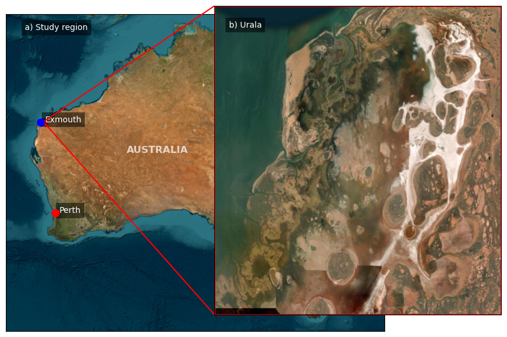
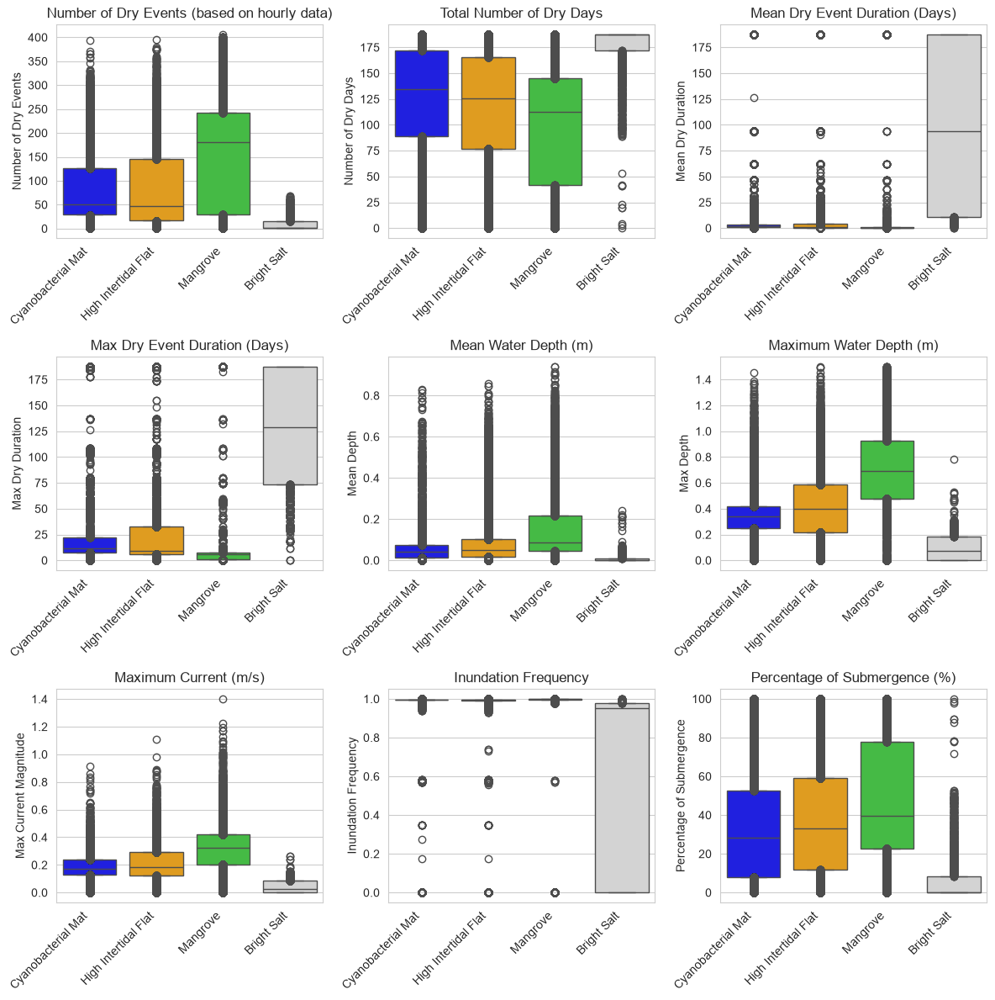

# Overview

Unlike Giralia Bay, the Urala study region does not exhibit a uniform intertidal zonation. While a distinct shore-normal zonation occurs across the southern area, the northern domain displays a complex morphology where the North Creek and South Creek systems converge and interconnect via a network of micro-creeks (@fig-urala-site). 

::: {#fig-urala-site}
{fig-align="center" width="95%"}

Study site at Urala within the West Pilbara coast, Northwestern Western Australia. **(a)** Regional setting. **(b)** Morphological overview showing intertidal habitat distribution, interconnected tidal creek systems, barrier spit networks, and broad landward salt flats.
:::

## Existing Conditions and Baseline Modeling

To understand the existing conditions, we carried out a 1-year hydrodynamic run for an ENSO-neutral year (2018) and used that to represent mean habitats from the satellite-derived map (Hickey et al., 2025). 

### Topography and Elevation Profile
The site exhibits a subtle, extremely low-relief topographic gradient characteristic of arid, hypersaline coastal environments. Elevation increases gently landward from the open water and tidal creek boundaries across distinct ecological zones:

* **Intertidal Zone:** Represents the lowest-lying vegetated and tidal areas, dissecting the landscape along creek channels and open water boundaries.
* **High Intertidal to Supratidal Zone:** Features a flat, broad, low-gradient platform immediately landward of the mangrove fringe. 
* **Upper Salt Flats & Dunes:** Extends further inland, transitioning into relict salt pans (bright salt) and terrestrial coastal vegetation/dune systems at higher relative land elevations.

### Spatial Habitat Distribution
Based on the habitat classification map, the coastal landscape is organized in clear zonation parallel to the shoreline and tidal networks:

{#fig-habitat width=85%}

* **Mangroves (Green):** Strictly fringing the primary tidal channels, creek mouths, and lower intertidal areas where direct marine influence is strongest, occupying the intertidal zone characterized by frequent flushing.
* **Cyanobacterial Mats (Black):** Form an extensive, continuous band situated directly landward of the mangroves. The high intertidal flat also displays widespread cyanobacterial mats under suitable hydrodynamic and environmental conditions.
* **High Intertidal Flats (Orange):** Border and intersperse with the cyanobacterial mats, forming the broader evaporative flat zone.
* **Salt Marsh (Grey) & Bright Salt (White):** Positioned further inland along the landward margin, representing hypersaline, highly evaporative basins.
* **Coastal Vegetation & Dunes (Red):** Define the landward boundary, occupying higher ground beyond typical tidal reach.

---

## Hydrodynamic and Environmental Exposure Metrics

To characterize the physical environment governing these zones, the hydrodynamic parameters were evaluated using the 25th to 75th quantile of their distribution. The selected predictors included key inundation-related parameters such as:

* inundation frequency, 
* percentage of submergence, 
* number of dry days, 
* number of consecutive dry days, 
* mean dry days, 
* total number of wet/dry events (based on hourly data), 
* depth-averaged mean and maximum currents, and 
* mean and maximum water depths. 

These hydrodynamic parameters were chosen to provide a comprehensive representation of habitat exposure to tidal and submersion dynamics, which are known to be critical determinants for predicting habitat migration patterns under changing environmental conditions.

### Hydrodynamic Regime Summary

* **Mangrove Zones:** Experience frequent wetting cycles with near-100% inundation frequency and high submergence percentages (median ~40–50%). They occupy areas with the highest mean water depths (~0.1–0.2 m) and maximum water depths (reaching up to ~0.7–1.5 m), alongside higher maximum currents (~0.3–0.4 m/s) required to prevent extreme salinity build-up.
* **Cyanobacterial Mats & High Intertidal Flats:** Share moderate submergence percentages (~30%) and shallow mean water depths (< 0.1 m). They endure frequent wetting-drying cycles with maximum dry event durations typically staying under 20–25 days, creating optimal moist, hypersaline windows.
* **Bright Salt Flats:** Characterized by minimal submergence percentages (median < 10%), near-zero mean water depths, and prolonged dry periods exceeding 120–175 days, leading to intense evaporation and crust formation.