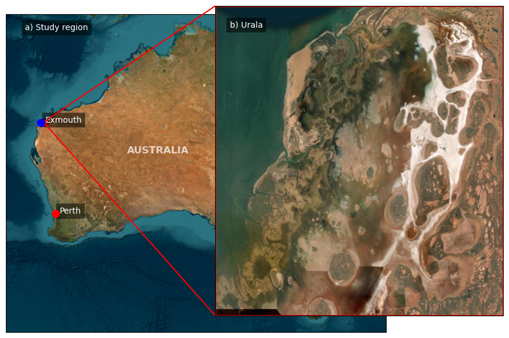
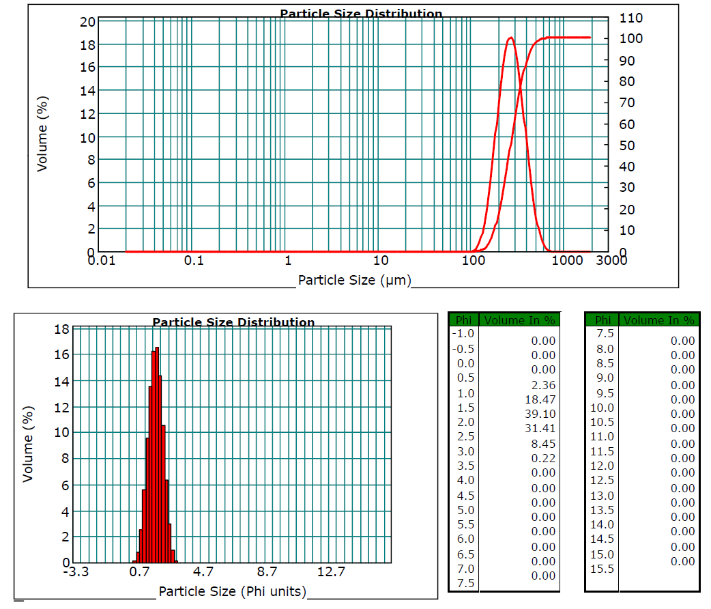
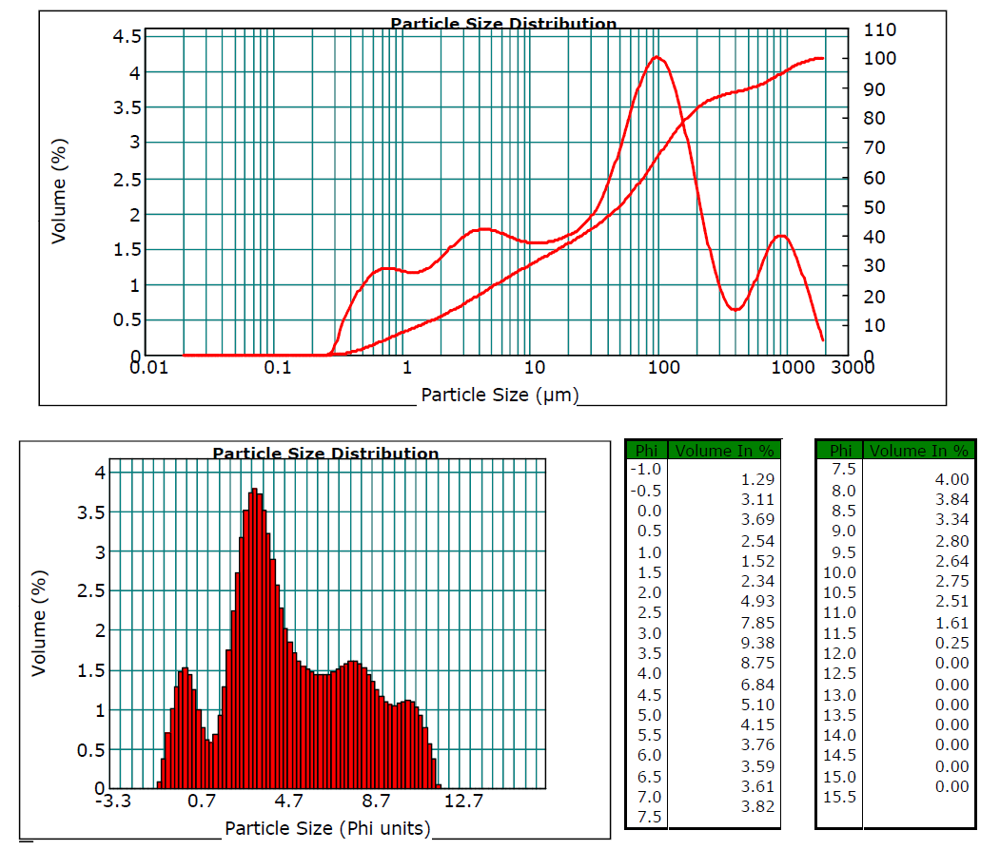
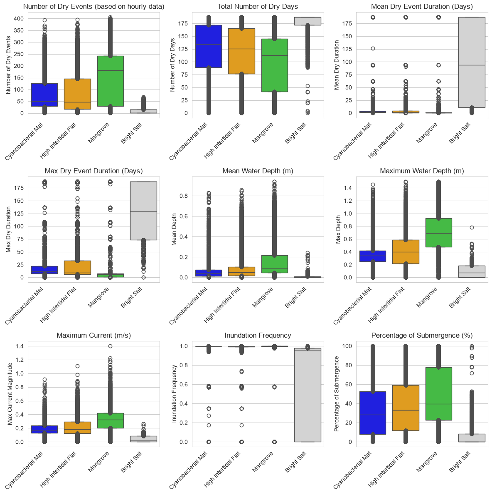

## Overview of the Urala Study Site

The Urala study site is located approximately $40\text{ km}$ south-east of Onslow, positioned along the eastern shoreline near the mouth of Exmouth Gulf. Unlike Giralia Bay, the Urala study region does not exhibit a uniform intertidal zonation. While a distinct shore-normal zonation occurs across the southern area, the northern domain displays a complex morphology where the North Creek and South Creek systems converge and interconnect via a network of micro-creeks (@fig-urala-site).

::: {#fig-urala-site}
{fig-align="center" width="95%"}

Study site at Urala within the West Pilbara coast, Northwestern Western Australia. **(a)** Regional setting. **(b)** Morphological overview showing intertidal habitat distribution, interconnected tidal creek systems, barrier spit networks, and broad landward salt flats.
:::

The site exhibits a subtle, extremely low-relief topographic gradient characteristic of arid, hypersaline coastal environments. Elevation increases gently landward from the open water and tidal creek boundaries across distinct ecological zones:

* **Intertidal Zone:** Represents the lowest-lying vegetated and tidal areas, dissecting the landscape along creek channels and open water boundaries.
* **High Intertidal to Supratidal Zone:** Features a flat, broad, low-gradient platform immediately landward of the mangrove fringe. 
* **Upper Salt Flats & Dunes:** Extends further inland, transitioning into relict salt pans (bright salt) and terrestrial coastal vegetation/dune systems at higher relative land elevations.

## Sediment Characteristics and Particle Size Distributions

Sediment sampling across the Urala intertidal landscape reveals two distinct sedimentary regimes: open sandy habitats (representing general shoreface and channel substrate) and sheltered mudflats (@fig-psd-urala and @fig-psd-urala-mud).

::: {#fig-psd-urala}
{fig-align="center" width="90%"}

Particle size distribution (PSD) representative of general sandy substrate across Urala, showing a narrow, unimodal distribution dominated by medium-to-fine sand fractions ($100\text{-}500\,\mu\text{m}$; $\Phi = 1.0\text{-}2.5$).
:::

::: {#fig-psd-urala-mud}
{fig-align="center" width="90%"}

Particle size distribution (PSD) representative of mudflat environments across Urala, displaying a broad, polymodal distribution spanning fine silts and clays ($< 10\,\mu\text{m}$) through fine sand ($100\,\mu\text{m}$) to coarse biogenic fragments ($800\text{-}1000\,\mu\text{m}$).
:::

The sedimentary signatures reflect contrasting hydro-geomorphic energy regimes:

1. **General Sandy Substrate (@fig-psd-urala):** Exhibits a highly sorted, well-defined unimodal distribution centered predominantly around fine-to-medium sand ($150\text{-}300\,\mu\text{m}$, corresponding to Phi values $\Phi = 1.0\text{-}2.5$, where $\Phi = 1.5\text{-}2.0$ comprises over $70\%$ of the sample volume). This narrow grain-size spectrum indicates an energetic, tide- and wave-dominated environment where fine silts and clays are continuously winnowed away, leaving a clean, well-sorted sandy substrate along channels and exposed flats.
2. **Mudflat Substrate (@fig-psd-urala-mud):** Displays a broad, complex polymodal distribution characteristic of low-energy depositional settings. The primary peak resides within the fine-sand and coarse-silt boundary ($\sim 80\text{-}100\,\mu\text{m}$), accompanied by a significant fine-grained tail extending into fine silts and clays ($< 10\,\mu\text{m}$; $\Phi = 4.0\text{-}11.0$, contributing over $45\%$ of total volume). Secondary coarse peaks ($\sim 800\text{-}1000\,\mu\text{m}$; $\Phi = -0.5\text{-}0.5$) reflect the accumulation of coarse shell hash and biogenic material. This wide grain spectrum highlights calm, baffled hydraulic conditions within sheltered tidal creeks and mangrove interiors that facilitate fine-sediment settling.

## Site Characteristics and Environmental Drivers

* **Geomorphology & Dynamic Creeks:** The site is defined by extensive barrier spit networks, dynamic creek mouths, and broad landward salt flats (sabkhas). The North and South Creek systems form interconnected drainage pathways that experience spatial adjustments during extreme discharge events.
* **Hydrodynamics & Tides:** Hydrodynamics are governed by a macro-to-mesotidal regime with semi-diurnal tides. Strong tidal currents dominate the primary creek channels, driving bed shear stresses that maintain open, sandy channels while steering fine sediment into adjacent sheltered bays and mangrove fringes.
* **Metocean Stressors:** Similar to Giralia Bay, Urala is subject to a hyper-arid climate with high evaporation rates and extremely variable annual rainfall. Periodic tropical cyclones deliver intense wave energy and catchment flooding, which temporarily override tidal forcing, reorganising barrier spits and driving episodic fine-sediment flux across the mudflats.

## Existing Conditions and Baseline Modelling

To further understand the existing hydrodynamicconditions, we carried out a 1-year hydrodynamic run for an ENSO-neutral year (2018) and used that to represent mean habitats from the satellite-derived map @Hickey2025. To characterise the physical environment governing these zones, the hydrodynamic parameters were evaluated using the 25th to 75th quantile of their distribution. The selected predictors included key inundation-related parameters such as:

* inundation frequency, 
* percentage of submergence, 
* number of dry days, 
* number of consecutive dry days, 
* mean dry days, 
* total number of wet/dry events (based on hourly data), 
* depth-averaged mean and maximum currents, and 
* mean and maximum water depths. 

These hydrodynamic parameters were chosen to provide a comprehensive representation of habitat exposure to tidal and submersion dynamics, which are known to be critical determinants for predicting habitat migration patterns under changing environmental conditions. @fig-habitat shows the hydrodynamic parameters for different habitats across the Urala study site, highlighting the distinct environmental conditions experienced by each habitat type.

{#fig-habitat width=85%}

### Hydrodynamic Regime Summary

* **Mangrove Zones:** Experience frequent wetting cycles with near-100% inundation frequency and high submergence percentages (median ~40–50%). They occupy areas with the highest mean water depths (~0.1–0.2 m) and maximum water depths (reaching up to ~0.7–1.5 m), alongside higher maximum currents (~0.3–0.4 m/s) required to prevent extreme salinity build-up.
* **Cyanobacterial Mats & High Intertidal Flats:** Share moderate submergence percentages (~30%) and shallow mean water depths (< 0.1 m). They endure frequent wetting-drying cycles with maximum dry event durations typically staying under 20–25 days, creating optimal moist, hypersaline windows.
* **Bright Salt Flats:** Characterised by minimal submergence percentages (median < 10%), near-zero mean water depths, and prolonged dry periods exceeding 120–175 days, leading to intense evaporation and crust formation.

## Prediction approach

Following the methodology established for Giralia Bay (@sec-giralia-approach), an integrated numerical model was developed for the Urala region. The hydrodynamic model was calibrated first to establish accurate flow and tidal dynamics. Subsequently, the mangrove vegetation module was coupled to simulate and calibrate baseline present-day mangrove distributions across the domain.

Once present-day mangrove boundaries were initialised, cyanobacterial (algal) mat distributions were calibrated using an offline (decoupled) predictive approach based on hydrodynamic and mangrove spatial outputs. The calibrated, coupled modelling framework was then applied to simulate future sea-level rise scenarios for both mangrove ecosystems and algal mats. 

Detailed calibration and validation procedures for the hydrodynamic model, as well as the mangrove and algal mat modules, are provided in [@sec-hydro-calibration] and [@sec-urala-calibration], respectively.