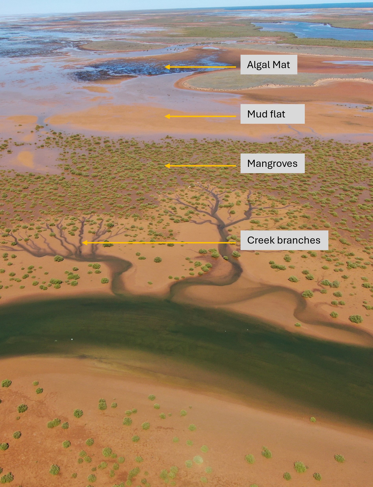

 

## Scope of the Project {.unnumbered}

::: columns

::: {.column width="50%"}

### Project Aim {.unnumbered}

As part of Project B of the WAMSI Mardie Intertidal Research Offset Program, this project aims to improve understanding of how intertidal habitats along the West Pilbara coast may respond to future environmental change. The project develops an integrated modelling framework to investigate the potential effects of sea-level rise, hydrodynamic variability, and coastal development pressures on key intertidal benthic communities and habitats, including mangroves, cyanobacterial mats, and salt-flat environments.

The project focuses on understanding how changes in inundation patterns, water depth, salinity conditions, and coastal processes may influence the future distribution and persistence of intertidal habitats. The modelling framework provides a tool to explore potential future scenarios and assess the capacity of these ecosystems to adapt under changing environmental conditions.

:::

::: {.column width="50%"}

{width="100%"}

:::

:::

 

## Major Findings {.unnumbered}

  <video autoplay loop muted playsinline style="width: 100%; max-width: 900px; display: block; margin: 0 auto; border-radius: 6px;">
    <source src="animations/Urala_drone.mp4" type="video/mp4">
    Your browser does not support the video tag.
  </video>

The modelling assessment indicates that rising sea levels are likely to drive changes in the distribution and extent of intertidal habitats through shifts in inundation regimes. Habitats respond differently depending on their environmental requirements, with cyanobacterial mats showing high sensitivity to changes in water level conditions, while mangrove communities generally remain more stable under moderate sea-level rise scenarios but become increasingly vulnerable under more extreme conditions.

The results highlight the importance of considering interactions between physical processes and ecological responses when assessing future coastal change. While coastal development footprints may influence local habitat availability and migration pathways, the modelling provides a broader understanding of potential habitat trajectories and supports improved planning and management strategies for the long-term protection of Pilbara coastal ecosystems.